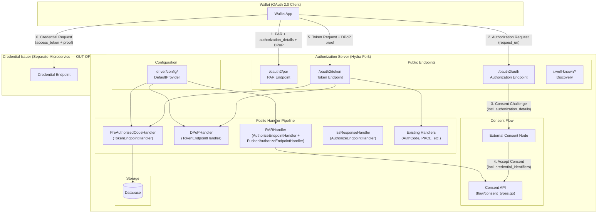

# Design Document: OIDC4VCI Authorization Server Capabilities

## Overview

This design extends the Ory Hydra Authorization Server (AS) to support the OIDC4VCI (OpenID for Verifiable Credential Issuance) specification and the HAIP (High Assurance Interoperability Profile). The scope is strictly the AS role — the Credential Issuer is a separate microservice that consumes access tokens issued by this AS.

The implementation follows Hydra's existing handler-based architecture in the embedded Fosite library. Each new capability maps to one or more of:
- New `TokenEndpointHandler` implementations registered via the `compose.Factory` pattern
- New `PushedAuthorizeEndpointHandler` extensions for PAR validation
- New `Configurator` interface providers for feature-flag configuration
- Extensions to the `Session` struct and consent flow types for `authorization_details` propagation
- Metadata additions in `discoverOidcConfiguration()`

The Credential Issuer is an external Resource Server that validates access tokens via introspection. The AS never handles Credential Requests, Credential Endpoints, or Credential Issuer metadata — those belong to the separate Credential Issuer microservice.

### Key Design Decisions

1. **Handler-per-grant-type**: The Pre-Authorized Code grant gets its own `TokenEndpointHandler` in `fosite/handler/preauth/`, following the pattern of `fosite/handler/rfc8628/` for device flow.
2. **DPoP as middleware-style handler**: DPoP proof validation is a cross-cutting `TokenEndpointHandler` that decorates all grant types, similar to how `fosite/handler/verifiable/` decorates token responses.
3. **RAR as session data**: `authorization_details` flows through the existing consent challenge/response mechanism via new fields on `OAuth2ConsentRequest` and `AcceptOAuth2ConsentRequest`, stored in the session `Extra` map.
4. **Configuration-driven feature flags**: All new capabilities are gated behind config keys in `driver/config/`, following the existing `KeyXxx` pattern.
5. **No Credential Issuer logic**: The AS issues access tokens with appropriate claims/bindings. The Credential Issuer validates them independently.

## Architecture



### Data Flow: Authorization Code + RAR + DPoP

1. Wallet sends PAR with `authorization_details` (type `openid_credential`) + DPoP proof → PAR handler validates and stores
2. Wallet redirects user to `/oauth2/auth?request_uri=...` → existing PAR resolution
3. Consent challenge includes `authorization_details` → Consent Node renders credential-specific UI
4. Consent Node accepts with `credential_identifiers` → stored in session
5. Wallet exchanges auth code at `/oauth2/token` with DPoP proof → DPoP handler binds token, RAR data flows into response
6. Token response includes `authorization_details` with `credential_identifiers` + `token_type: DPoP`
7. Wallet uses DPoP-bound access token at external Credential Issuer

### Data Flow: Pre-Authorized Code

1. Credential Issuer creates Pre-Authorized Code via admin API (out of scope for AS, but AS stores the grant)
2. Wallet sends Token Request with `grant_type=urn:ietf:params:oauth:grant-type:pre-authorized_code` + `pre-authorized_code` + optional `tx_code`
3. `PreAuthorizedCodeHandler.HandleTokenEndpointRequest()` validates code, tx_code, expiry, single-use
4. `PreAuthorizedCodeHandler.PopulateTokenEndpointResponse()` issues access token with credential scope bindings
5. DPoP handler (if DPoP proof present) binds the token
6. Token response includes `authorization_details` with `credential_identifiers`

## Components and Interfaces

### 1. Pre-Authorized Code Handler

**Location**: `fosite/handler/preauth/`

**Implements**: `fosite.TokenEndpointHandler`

```
PreAuthorizedCodeHandler struct {
    Config   PreAuthorizedCodeConfigProvider
    Storage  PreAuthorizedCodeStorage
    Strategy CoreStrategy
}
```

**Interface methods**:
- `CanHandleTokenEndpointRequest()` → returns `true` when `grant_type == "urn:ietf:params:oauth:grant-type:pre-authorized_code"`
- `CanSkipClientAuth()` → returns `true` when `pre-authorized_grant_anonymous_access_supported` is enabled in config
- `HandleTokenEndpointRequest()` → validates `pre-authorized_code` from form, checks `tx_code` if required, enforces single-use and expiry
- `PopulateTokenEndpointResponse()` → issues access token, sets `authorization_details` with `credential_identifiers` in response extras

**Storage interface**:
```
PreAuthorizedCodeStorage interface {
    GetPreAuthorizedCodeSession(ctx, code) (*PreAuthorizedCodeData, error)
    InvalidatePreAuthorizedCode(ctx, code) error
}
```

**Factory**: `fosite/compose/compose_preauth.go` → `PreAuthorizedCodeFactory`

**Registration**: Added to handler list in `driver/registry_sql.go` (or equivalent), gated by config flag.

### 2. DPoP Handler

**Location**: `fosite/handler/dpop/`

**Implements**: `fosite.TokenEndpointHandler`, `fosite.PushedAuthorizeEndpointHandler`

This is a cross-cutting handler that processes DPoP proofs for any grant type. It does not "own" a grant type — it decorates token responses. It also handles `dpop_jkt` binding at the PAR endpoint per RFC 9449 §10.1.

```
DPoPHandler struct {
    Config    DPoPConfigProvider
    NonceStore DPoPNonceStorage
}
```

**TokenEndpointHandler methods**:
- `CanHandleTokenEndpointRequest()` → returns `true` when request contains a `DPoP` header
- `CanSkipClientAuth()` → returns `false` (never skips)
- `HandleTokenEndpointRequest()` → validates DPoP proof JWT per RFC 9449 §4.3 checklist: single header (#1), well-formed JWT (#2), required claims (#3), `typ=dpop+jwt` (#4), asymmetric `alg` not `none` (#5), signature (#6), no private key in `jwk` (#7), `htm` (#8), `htu` with normalization (#9), `nonce` (#10), `iat` freshness (#11), `jti` uniqueness. Also validates `dpop_jkt` binding if present in session. For `use_dpop_nonce` errors, sets `DPoP-Nonce` header before returning error.
- `PopulateTokenEndpointResponse()` → binds access token to DPoP public key (stores `jkt` confirmation), sets `token_type` to `DPoP`, optionally sets `DPoP-Nonce` header. For public clients, also binds refresh token to DPoP key.

**PushedAuthorizeEndpointHandler methods**:
- `HandlePushedAuthorizeEndpointRequest()` → if `DPoP` header present on PAR request, validates the proof and stores `jkt` as implicit `dpop_jkt`. If `dpop_jkt` parameter also present, verifies they match. Stores `dpop_jkt` alongside PAR session for later verification at token endpoint.

**Config provider interface**:
```
DPoPConfigProvider interface {
    GetDPoPEnabled(ctx) bool
    GetDPoPSigningAlgValuesSupported(ctx) []string
    GetDPoPNonceEnabled(ctx) bool
    GetDPoPNonceLifespan(ctx) time.Duration
}
```

**Storage interface**:
```
DPoPNonceStorage interface {
    IsJTIUsed(ctx, jti string) (bool, error)
    MarkJTIUsed(ctx, jti string, expiry time.Time) error
    CreateDPoPNonce(ctx) (string, error)
    ValidateDPoPNonce(ctx, nonce string) (bool, error)
}
```

### 3. RAR (Rich Authorization Requests) Handler

**Location**: `fosite/handler/rar/`

**Implements**: `fosite.AuthorizeEndpointHandler` + `fosite.PushedAuthorizeEndpointHandler`

Parses and validates `authorization_details` parameter on authorize/PAR requests. Does NOT implement `TokenEndpointHandler` — the token-side propagation happens via session data set during consent.

```
RARHandler struct {
    Config  RARConfigProvider
    Storage RARStorage
}
```

**Key behaviors**:
- `HandleAuthorizeEndpointRequest()` → parses `authorization_details` from request form, validates `type == "openid_credential"`, validates `credential_configuration_id`, stores alongside authorize request
- `HandlePushedAuthorizeEndpointRequest()` → same validation for PAR requests

**Consent integration**: The parsed `authorization_details` is added to the `OAuth2ConsentRequest` so the Consent Node can see it. The Consent Node returns `credential_identifiers` in the consent accept response, which gets stored in the session.

### 4. Authorization Response Issuer (RFC 9207)

**Location**: Inline modification in `fosite/authorize_response_writer.go` or a lightweight handler.

Adds `iss` parameter to all authorization responses (success and error). This is a small change to the authorize response writer, not a full handler.

### 5. Wallet Attestation Client Authentication

**Location**: `fosite/client_authentication.go` extension or `fosite/handler/wallet_attestation/`

Adds a new client authentication method `attest_jwt_client_auth` that:
- Reads `OAuth-Client-Attestation` and `OAuth-Client-Attestation-PoP` headers
- Validates the attestation JWT signature via `x5c` certificate chain
- Validates the PoP JWT
- Matches `sub` claim to `client_id`

Registered as a `ClientAuthenticationStrategy` extension in the `Configurator`.

### 6. Discovery Metadata Extensions

**Location**: `oauth2/handler.go` → `discoverOidcConfiguration()`

New fields added to `oidcConfiguration` struct:
- `pre_authorized_grant_anonymous_access_supported` (bool)
- `authorization_details_types_supported` ([]string)
- `dpop_signing_alg_values_supported` ([]string)
- `authorization_response_iss_parameter_supported` (bool)

Populated conditionally based on config flags.

### 7. Configuration Extensions

**Location**: `driver/config/`

New config keys (following existing `KeyXxx` pattern):
- `KeyPreAuthorizedCodeEnabled` / `KeyPreAuthorizedCodeLifespan` / `KeyPreAuthorizedCodeAnonymousAccess`
- `KeyDPoPEnabled` / `KeyDPoPSigningAlgValues` / `KeyDPoPNonceEnabled` / `KeyDPoPNonceLifespan`
- `KeyRAREnabled` / `KeyRARTypesSupported`
- `KeyHAIPEnforced` (gates PAR enforcement + PKCE S256 enforcement)
- `KeyWalletAttestationEnabled` / `KeyWalletAttestationTrustAnchors`
- `KeyAuthResponseIssParameterEnabled`

New provider interfaces added to `fosite.Configurator`:
- `PreAuthorizedCodeConfigProvider`
- `DPoPConfigProvider`
- `RARConfigProvider`
- `HAIPConfigProvider`
- `WalletAttestationConfigProvider`

## Data Models

### PreAuthorizedCodeData (new)

Stored in a new database table `hydra_oauth2_preauth_code`.

| Field | Type | Description |
|---|---|---|
| `signature` | string (PK) | HMAC signature of the pre-authorized code |
| `nid` | uuid | Network ID (multi-tenancy) |
| `request_id` | string | Request identifier |
| `client_id` | string | OAuth 2.0 client ID |
| `requested_scope` | JSON | Scopes requested |
| `granted_scope` | JSON | Scopes granted |
| `authorization_details` | JSON | RAR authorization_details array |
| `credential_configuration_ids` | JSON | Credential configuration IDs from the offer |
| `tx_code_hash` | string (nullable) | Hashed transaction code (if required) |
| `tx_code_input_mode` | string (nullable) | `numeric` or `text` |
| `tx_code_length` | int (nullable) | Expected length of tx_code |
| `session_data` | JSON | Serialized session |
| `redeemed` | bool | Single-use flag |
| `requested_at` | timestamp | When the code was created |
| `expires_at` | timestamp | Expiry time |

### DPoP JTI Replay Cache (new)

Stored in a new table `hydra_oauth2_dpop_jti` or an in-memory cache with TTL.

| Field | Type | Description |
|---|---|---|
| `jti` | string (PK) | The `jti` claim from the DPoP proof |
| `nid` | uuid | Network ID |
| `used_at` | timestamp | When the JTI was first seen |
| `expires_at` | timestamp | TTL for cleanup |

### DPoP Nonce (new, optional)

If DPoP nonces are enabled, stored in `hydra_oauth2_dpop_nonce` or generated statelessly via HMAC.

### Authorization Details on Session

The existing `Session.Extra` map (`oauth2/session.go`) carries `authorization_details` through the token lifecycle:

```
session.Extra["authorization_details"] = []AuthorizationDetail{
    {
        Type:                      "openid_credential",
        CredentialConfigurationID: "UniversityDegree_jwt_vc_json",
        CredentialIdentifiers:     []string{"cred-id-1", "cred-id-2"},
    },
}
```

### Consent Flow Extensions

**`OAuth2ConsentRequest`** (`flow/consent_types.go`) — new field:
- `AuthorizationDetails sqlxx.JSONRawMessage` — raw `authorization_details` from the authorize request

**`AcceptOAuth2ConsentRequest`** (`flow/consent_types.go`) — new field:
- `AuthorizationDetails sqlxx.JSONRawMessage` — enriched `authorization_details` from the Consent Node (may include `credential_identifiers`)

### Token Hook Extension

The existing `TokenHookRequest` (`oauth2/token_hook.go`) already sends the full `Session` to the hook. The `authorization_details` in `Session.Extra` is automatically available to token hooks, allowing external services to modify credential identifiers before the token response is finalized.

### Discovery Metadata Struct Extension

`oidcConfiguration` (`oauth2/handler.go`) — new fields:
- `PreAuthorizedGrantAnonymousAccessSupported bool`
- `AuthorizationDetailsTypesSupported []string`
- `DPoPSigningAlgValuesSupported []string`
- `AuthorizationResponseIssParameterSupported bool`


## Correctness Properties

*A property is a characteristic or behavior that should hold true across all valid executions of a system — essentially, a formal statement about what the system should do. Properties serve as the bridge between human-readable specifications and machine-verifiable correctness guarantees.*

### Property 1: Pre-Authorized Code Valid Redemption

*For any* valid pre-authorized code with associated credential configuration IDs and (optionally) a matching tx_code, exchanging it at the token endpoint should produce an access token whose session contains `authorization_details` matching the credential configurations from the original offer.

**Validates: Requirements 1.1, 1.4**

### Property 2: Pre-Authorized Code tx_code Validation

*For any* pre-authorized code that requires a tx_code, the token endpoint should accept the request only when the provided tx_code matches the stored value, and reject with `invalid_grant` when the tx_code is missing or incorrect.

**Validates: Requirements 1.2, 1.3**

### Property 3: Pre-Authorized Code Anonymous Access

*For any* pre-authorized code token request without client authentication, the token endpoint should permit the request if and only if `pre-authorized_grant_anonymous_access_supported` is true in the AS configuration.

**Validates: Requirements 1.5**

### Property 4: Pre-Authorized Code Single-Use Enforcement

*For any* valid pre-authorized code, redeeming it once should succeed, and any subsequent redemption attempt with the same code should be rejected.

**Validates: Requirements 1.6**

### Property 5: Pre-Authorized Code Expiry Enforcement

*For any* pre-authorized code whose `expires_at` is in the past, the token endpoint should reject the redemption request.

**Validates: Requirements 1.7**

### Property 6: RAR Parsing and Validation

*For any* authorization or PAR request containing an `authorization_details` parameter with `type=openid_credential`, the handler should successfully parse the payload and validate that each object contains a valid `credential_configuration_id`. Malformed payloads or missing required fields should be rejected.

**Validates: Requirements 2.1**

### Property 7: RAR Token Request Subset Validation

*For any* token request containing `authorization_details`, the set of `credential_configuration_id` values must be a subset of those previously authorized during the authorization phase. Any `credential_configuration_id` not in the authorized set should cause rejection.

**Validates: Requirements 2.2**

### Property 8: RAR Round-Trip Persistence

*For any* `authorization_details` stored during the authorization phase, the same data should be retrievable during token issuance without loss or mutation.

**Validates: Requirements 2.3**

### Property 9: Token Response Contains credential_identifiers

*For any* token response where `authorization_details` of type `openid_credential` was used, the response must include an `authorization_details` array where each object contains a non-empty `credential_identifiers` array with unique string values.

**Validates: Requirements 2.4, 3.1, 3.2**

### Property 10: RAR Flow-Through to Consent Node

*For any* authorization request containing `authorization_details`, the consent challenge payload sent to the Consent Node must include the same `authorization_details` data.

**Validates: Requirements 2.5, 13.1**

### Property 11: RAR and Scope Precedence

*For any* request containing both `authorization_details` of type `openid_credential` and a `scope` value mapping to the same credential type, the `authorization_details` should take precedence, and both should be processed independently without conflict.

**Validates: Requirements 2.6**

### Property 12: DPoP Binding and Token Type

*For any* token request that includes a valid DPoP proof JWT, the issued access token must be bound to the public key from the DPoP proof (via `jkt` confirmation), and the `token_type` in the response must be `DPoP`.

**Validates: Requirements 4.1, 4.2**

### Property 13: DPoP Proof Validation

*For any* DPoP proof JWT, the token endpoint should accept it only when the signature is valid, the `jti` has not been seen before, and the `htm`, `htu`, and `iat` claims are correct. A proof with any invalid field should be rejected with `invalid_dpop_proof`.

**Validates: Requirements 4.3, 4.4**

### Property 14: DPoP Nonce Exchange

*For any* token endpoint configured to require DPoP nonces, the response must include a `DPoP-Nonce` header, and a subsequent DPoP proof missing or containing an invalid `nonce` claim should be rejected with `use_dpop_nonce` and a fresh nonce.

**Validates: Requirements 4.5, 4.6**

### Property 15: issuer_state Round-Trip

*For any* authorization or PAR request containing an `issuer_state` parameter, the value must be preserved through the consent flow and be available to the Consent Node in the consent challenge.

**Validates: Requirements 5.1, 5.2**

### Property 16: Scope-Based Credential Request

*For any* authorization request containing a `scope` value that maps to a known credential configuration, the AS should treat it as a valid credential issuance request and process it accordingly.

**Validates: Requirements 6.1**

### Property 17: Unknown Scope Tolerance

*For any* authorization request containing an unknown scope value related to credential issuance, the AS should silently ignore it without returning an error.

**Validates: Requirements 6.2**

### Property 18: HAIP PAR Enforcement

*For any* authorization request for a credential issuance flow when HAIP enforcement is enabled, the request must have been submitted via PAR. Direct authorization requests (without `request_uri` from PAR) should be rejected with `invalid_request`.

**Validates: Requirements 7.1, 7.2**

### Property 19: Authorization Response iss Parameter

*For any* authorization response (success or error) when RFC 9207 support is enabled, the response must include an `iss` parameter whose value matches the AS Issuer Identifier.

**Validates: Requirements 8.1, 8.2**

### Property 20: Wallet Attestation Validation

*For any* PAR or token request containing `OAuth-Client-Attestation` and `OAuth-Client-Attestation-PoP` headers, the AS should authenticate the client only when the attestation JWT signature is valid against the `x5c` certificate chain, the certificate chain is trusted, the PoP JWT is valid, and the `sub` claim matches the `client_id`. Invalid attestations should be rejected with `invalid_client`.

**Validates: Requirements 9.1, 9.2, 9.3, 9.4**

### Property 21: HAIP PKCE S256 Enforcement

*For any* authorization code flow when HAIP enforcement is enabled, the request must include a PKCE code challenge with `code_challenge_method=S256`. Requests missing PKCE or using a method other than S256 should be rejected with `invalid_request`.

**Validates: Requirements 11.1, 11.2**

### Property 22: Refresh Token Preserves authorization_details

*For any* refresh token exchange where the original token was issued with `authorization_details`, the new access token must retain the same `authorization_details` and credential scope bindings.

**Validates: Requirements 12.2**

### Property 23: Consent Node Can Enrich authorization_details

*For any* consent accept response that includes modified `authorization_details` (e.g., with added `credential_identifiers`), the AS must propagate the enriched data into the token session.

**Validates: Requirements 13.2**

### Property 24: Refresh Token Issuance in Credential Flows

*For any* credential issuance flow where the client is authorized for the `refresh_token` grant type, the token response must include a refresh token alongside the access token.

**Validates: Requirements 12.1**

## Error Handling

### Pre-Authorized Code Errors
- **Invalid code**: `invalid_grant` — code not found, expired, or already redeemed
- **Missing tx_code**: `invalid_grant` — tx_code required but not provided
- **Wrong tx_code**: `invalid_grant` — tx_code does not match stored value
- **Unauthorized client**: `invalid_client` — client auth required but anonymous access not enabled

### DPoP Errors
- **Invalid proof**: `invalid_dpop_proof` — signature invalid, claims malformed, or `jti` replayed
- **Missing nonce**: `use_dpop_nonce` — nonce required but not present; response includes `DPoP-Nonce` header
- **Unsupported algorithm**: `invalid_dpop_proof` — signing algorithm not in `dpop_signing_alg_values_supported`

### RAR Errors (RFC 9396 §5 — `invalid_authorization_details`)
- **Malformed authorization_details**: `invalid_authorization_details` — JSON parse failure or missing required fields
- **Unknown type**: `invalid_authorization_details` — `type` is not in supported types (e.g., `openid_credential`)
- **Invalid credential_configuration_id**: `invalid_authorization_details` — ID not recognized
- **Subset violation**: `invalid_authorization_details` — token request contains credential_configuration_id not previously authorized

### Wallet Attestation Errors
- **Invalid attestation**: `invalid_client` — signature verification failed
- **Untrusted provider**: `invalid_client` — certificate chain does not chain to a configured trust anchor
- **sub/client_id mismatch**: `invalid_client` — `sub` claim does not match `client_id`
- **Expired attestation**: `invalid_client` — attestation JWT `exp` is in the past

### HAIP Enforcement Errors
- **Missing PAR**: `invalid_request` — direct authorization request when PAR is enforced
- **Missing PKCE S256**: `invalid_request` — PKCE not present or wrong method under HAIP

### General
- All errors follow RFC 6749 error response format via `fosite.RFC6749Error`
- Debug information is only sent to clients when `GetSendDebugMessagesToClients()` returns true
- All error paths are logged with structured logging via `x.LogError()`

## Testing Strategy

### Dual Testing Approach

Both unit tests and property-based tests are required for comprehensive coverage.

**Unit tests** cover:
- Specific examples: valid pre-authorized code redemption with known inputs, DPoP proof with a specific ES256 key
- Edge cases: expired codes, replayed JTIs, missing tx_code, malformed JSON in authorization_details
- Integration points: consent flow round-trip, token hook interaction, discovery metadata rendering
- Error conditions: all error codes listed in Error Handling section

**Property-based tests** cover:
- Universal properties (Properties 1–24 above) across randomized inputs
- Each property test generates random valid/invalid inputs and verifies the property holds

### Property-Based Testing Configuration

- **Library**: Use `pgregory.net/rapid` (Go property-based testing library, well-suited for Hydra's Go codebase)
- **Minimum iterations**: 100 per property test
- **Tag format**: Each test must include a comment referencing the design property:
  ```
  // Feature: oidc4vci-as-capabilities, Property {N}: {property title}
  ```
- **Each correctness property is implemented by a single property-based test**

### Test Organization

- `fosite/handler/preauth/handler_test.go` — Properties 1–5 (pre-authorized code)
- `fosite/handler/dpop/handler_test.go` — Properties 12–14 (DPoP)
- `fosite/handler/rar/handler_test.go` — Properties 6–11 (RAR)
- `fosite/handler/wallet_attestation/handler_test.go` — Property 20 (wallet attestation)
- `oauth2/handler_test.go` — Properties 15, 16, 17, 19 (issuer_state, scope, iss parameter)
- `oauth2/consent_rar_test.go` — Properties 10, 23 (consent flow-through)
- `oauth2/token_refresh_test.go` — Properties 22, 24 (refresh token)
- `oauth2/haip_test.go` — Properties 18, 21 (HAIP enforcement)

### Generators

Property tests require generators for:
- Random `credential_configuration_id` strings
- Random `authorization_details` JSON payloads (valid and invalid)
- Random EC P-256 key pairs for DPoP proofs
- Random DPoP proof JWTs with configurable valid/invalid fields
- Random pre-authorized codes with configurable expiry and tx_code
- Random Wallet Attestation JWTs with configurable certificate chains
- Random `issuer_state` opaque strings
- Random scope value sets (known and unknown)
