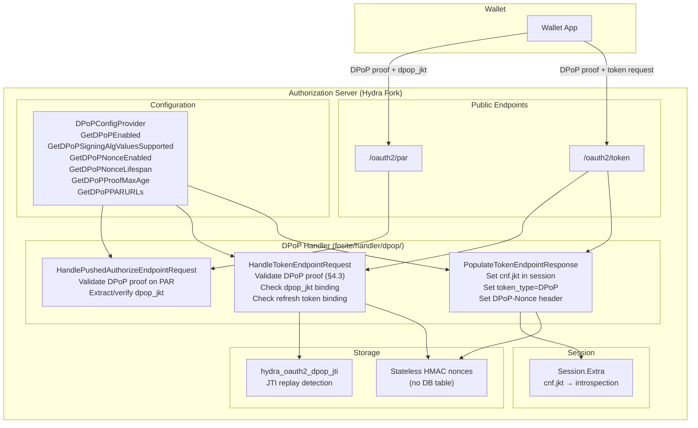

# Design Document: OIDC4VCI DPoP Token Binding (RFC 9449)

## Overview

This design implements DPoP (Demonstrating Proof of Possession — RFC 9449) token binding for the Hydra AS fork. DPoP is a cross-cutting `TokenEndpointHandler` that decorates all grant types — it does not own a grant type. When a `DPoP` HTTP header is present on a token request, the handler validates the proof JWT per the full RFC 9449 §4.3 checklist (12 checks), binds the issued access token to the client's public key via `cnf.jkt`, and sets `token_type=DPoP`. The handler also implements `PushedAuthorizeEndpointHandler` for `dpop_jkt` authorization code binding at the PAR endpoint (RFC 9449 §10).

The scope is strictly the Authorization Server role. The Credential Issuer validates DPoP proofs against `cnf.jkt` from introspection independently — out of scope.

This spec depends on Spec 1 (oidc4vci-rar-consent) which established the config provider interface pattern, factory registration pattern, error constant pattern, `Session.Extra` propagation, introspection path, `PopulateTokenEndpointResponse` pattern, `fositex.Config` compile-time checks, and `PushedAuthorizeEndpointHandler` registration in `LoadDefaultHandlers`.

### Key Design Decisions

1. **DPoP header via request form injection**: The Hydra endpoint handler (`oauth2/handler.go`) extracts the raw `DPoP` HTTP header and injects it into the request form as `dpop_proof` before calling Fosite's `NewAccessRequest`. This follows the same pattern used for other HTTP headers that Fosite handlers need — the handler receives `AccessRequester` which wraps the parsed form, not the raw HTTP request. For PAR, the same injection happens in the PAR endpoint handler before calling `NewPushedAuthorizeRequest`.
2. **DPoP-Nonce via RFC6749Error header map**: The `DPoP-Nonce` response header is delivered by attaching it to the `fosite.RFC6749Error` via a `Header` map field. Fosite's error response writer (`fosite/write_error.go`) already writes HTTP headers from error objects. For success responses, the handler sets the header on the `AccessResponder` via `SetExtra("dpop_nonce_header", nonce)` and the endpoint handler reads it to set the HTTP header. Alternatively, a simpler approach: store the nonce in the request context and have the endpoint handler read it after `NewAccessResponse` returns.
3. **Stateless HMAC-based nonces**: `CreateDPoPNonce` and `ValidateDPoPNonce` use HMAC-SHA256 over `timestamp || random` with the global secret. This allows validation without a database lookup — the nonce is self-verifying. The timestamp embedded in the nonce is checked against `GetDPoPNonceLifespan`. No nonce table needed.
4. **PAR endpoint URL via DPoPConfigProvider**: A new `GetDPoPPARURLs(ctx) []string` method on `DPoPConfigProvider` provides the PAR endpoint URLs for `htu` validation on PAR requests, mirroring the existing `GetTokenURLs(ctx) []string` pattern.
5. **go-jose/v4 for JWT parsing**: Use `github.com/go-jose/go-jose/v4` (already a transitive dependency via fosite) for DPoP proof JWT parsing, signature verification, and JWK Thumbprint computation. No new JWT library needed.
6. **Public client detection via client interface**: The handler checks `requester.GetClient()` and inspects the token endpoint auth method. Fosite's `Client` interface has `GetTokenEndpointAuthMethod() string` — `none` and `attest_jwt_client_auth` indicate public clients.
7. **dpop_jkt stored in request form**: The `dpop_jkt` value is stored in the request form during PAR processing. When `authorizeRequestFromPAR()` resolves the `request_uri`, the PAR session's form data (including `dpop_jkt`) is merged into the authorize request and carried into the authorization session. At the token endpoint, the handler reads `dpop_jkt` from the session's request form.

## Architecture



### Data Flow: DPoP Token Binding

1. Wallet sends `POST /oauth2/token` with `DPoP` HTTP header containing a signed JWT proof
2. Hydra endpoint handler extracts `DPoP` header, injects as `dpop_proof` form parameter
3. `DPoPHandler.HandleTokenEndpointRequest` validates the proof per §4.3 checklist (12 checks)
4. If `dpop_jkt` is in the authorization session (from PAR), handler verifies the proof's public key matches
5. For refresh token requests from public clients, handler verifies the proof's key matches the stored binding
6. `DPoPHandler.PopulateTokenEndpointResponse` computes JKT, stores `cnf.jkt` in `Session.Extra`, sets `token_type=DPoP`
7. If nonces enabled, handler generates a fresh nonce and signals the endpoint handler to set `DPoP-Nonce` header
8. `cnf.jkt` flows to introspection at `ext.cnf.jkt` via existing `Session.Extra` propagation

### Data Flow: dpop_jkt at PAR

1. Wallet sends `POST /oauth2/par` with optional `dpop_jkt` parameter and/or `DPoP` header
2. Hydra PAR endpoint handler extracts `DPoP` header, injects as `dpop_proof` form parameter
3. `DPoPHandler.HandlePushedAuthorizeEndpointRequest` validates the proof (if present), computes JKT
4. If both `dpop_jkt` param and `DPoP` header present, handler verifies thumbprints match
5. Handler stores `dpop_jkt` in the request form → persisted as part of PAR session
6. `authorizeRequestFromPAR()` merges PAR form into authorize request → `dpop_jkt` carried to token endpoint


## Components and Interfaces

### 1. DPoP Handler (`fosite/handler/dpop/`)

The central component. A single struct implementing two Fosite handler interfaces.

**Struct:**
```go
type Handler struct {
    Config     DPoPConfigProvider
    NonceStore DPoPNonceStorage
}
```

**Interfaces implemented:**
- `fosite.TokenEndpointHandler` — validates DPoP proofs on token requests, binds tokens to public keys
- `fosite.PushedAuthorizeEndpointHandler` — extracts/validates `dpop_jkt` on PAR requests

**Compile-time checks:**
```go
var _ fosite.TokenEndpointHandler = (*Handler)(nil)
var _ fosite.PushedAuthorizeEndpointHandler = (*Handler)(nil)
```

**File layout:**
- `fosite/handler/dpop/handler.go` — `Handler` struct, `HandlePushedAuthorizeEndpointRequest`, shared proof validation logic
- `fosite/handler/dpop/token_handler.go` — `CanHandleTokenEndpointRequest`, `CanSkipClientAuth`, `HandleTokenEndpointRequest`, `PopulateTokenEndpointResponse`
- `fosite/handler/dpop/errors.go` — `ErrInvalidDPoPProof`, `ErrUseDPoPNonce` constants
- `fosite/handler/dpop/storage.go` — `DPoPNonceStorage` interface
- `fosite/handler/dpop/handler_test.go` — unit tests and property-based tests

#### TokenEndpointHandler

**`CanHandleTokenEndpointRequest(ctx, requester)`**
- Returns `true` when `requester.GetRequestForm().Get("dpop_proof") != ""` OR `requester.GetRequestForm().Get("dpop_proof_error") != ""`
- The `dpop_proof` form parameter is injected by the endpoint handler from the raw `DPoP` HTTP header (see Design Decision 1)
- The `dpop_proof_error` form parameter is set when multiple `DPoP` headers are present — the handler must activate to reject this case

**`CanSkipClientAuth(ctx, requester)`**
- Always returns `false` — DPoP is a token binding mechanism, not a client authentication method

**`HandleTokenEndpointRequest(ctx, requester)`**

Validates the DPoP proof JWT per RFC 9449 §4.3:

1. **Single header check** (§4.3 #1): Check for `dpop_proof_error == "multiple_headers"` in the request form. If present → `ErrInvalidDPoPProof`. Then read `dpop_proof` from the form.
2. **Well-formed JWT** (§4.3 #2): Parse the `dpop_proof` value using `go-jose/v4`. If parsing fails → `ErrInvalidDPoPProof`.
3. **Required claims** (§4.3 #3): Verify `jti`, `htm`, `htu`, `iat` claims are present. If any missing → `ErrInvalidDPoPProof`.
4. **typ header** (§4.3 #4): Verify `typ` JOSE header is `dpop+jwt`. If missing or different → `ErrInvalidDPoPProof`.
5. **alg header** (§4.3 #5): Verify `alg` is a registered asymmetric algorithm, not `none`, not symmetric (HS*), and in `GetDPoPSigningAlgValuesSupported()`. If unsupported → `ErrInvalidDPoPProof`.
6. **Signature verification** (§4.3 #6): Extract public key from `jwk` JOSE header, verify JWT signature. If invalid → `ErrInvalidDPoPProof`.
7. **No private key material** (§4.3 #7): Check `jwk` does not contain private key fields (`d`, `p`, `q`, `dp`, `dq`, `qi` for RSA; `d` for EC/OKP). If present → `ErrInvalidDPoPProof`.
8. **htm claim** (§4.3 #8): Verify `htm == "POST"`. If mismatch → `ErrInvalidDPoPProof`.
9. **htu claim** (§4.3 #9): Verify `htu` matches one of `Config.GetTokenURLs(ctx)` after URI normalization per RFC 3986 §6.2.2–6.2.3 (lowercase scheme/host, remove default port, normalize path). If mismatch → `ErrInvalidDPoPProof`.
10. **nonce claim** (§4.3 #10): If `Config.GetDPoPNonceEnabled(ctx)`, verify `nonce` claim via `NonceStore.ValidateDPoPNonce(ctx, nonce)`. If missing/invalid → generate fresh nonce via `NonceStore.CreateDPoPNonce(ctx)`, store in request context for header delivery, return `ErrUseDPoPNonce`.
11. **iat freshness** (§4.3 #11): Verify `iat` is within `[now - GetDPoPProofMaxAge(ctx), now + 5s]`. The 5-second future tolerance is hardcoded for clock skew. If out of range → `ErrInvalidDPoPProof`.
12. **jti uniqueness** (§4.3 #12): Check `NonceStore.IsJTIUsed(ctx, jti)`. If used → `ErrInvalidDPoPProof`. If unique → `NonceStore.MarkJTIUsed(ctx, jti, time.Now().Add(GetDPoPProofMaxAge(ctx)))`.

After proof validation:
- **dpop_jkt binding check**: Read `dpop_jkt` from the authorization session (via `requester.GetSession()` → session extra or request form). If present, compute JKT from the proof's public key and verify it matches. If mismatch → `ErrInvalidDPoPProof`.
- **Refresh token DPoP binding check**: If `grant_type=refresh_token`, read the existing DPoP JKT binding from the session (`session.Extra["dpop_jkt_binding"]`). If present, compute JKT from the proof's public key and verify it matches. If mismatch → `ErrInvalidDPoPProof`.

**`PopulateTokenEndpointResponse(ctx, requester, responder)`**

1. Read `dpop_proof` from the request form. If absent → return `fosite.ErrUnknownRequest` (handler not responsible).
2. Read the validated JKT from the request context (stored by `HandleTokenEndpointRequest` during proof validation). This avoids re-parsing the proof JWT — the validated public key and computed JKT are passed via context from the validation phase.
3. Get session via `requester.GetSession()`, type-assert to `fosite.ExtraClaimsSession`.
4. Store confirmation: `session.GetExtraClaims()["cnf"] = map[string]interface{}{"jkt": thumbprint}`.
5. Set token type: `responder.SetTokenType("DPoP")`.
6. **Refresh token binding for public clients**: Check if the client is public (see Design Decision 6). If public, store the JKT in the session for refresh token binding: `session.GetExtraClaims()["dpop_jkt_binding"] = thumbprint`. If confidential, do not bind.
7. **DPoP-Nonce on success**: If `Config.GetDPoPNonceEnabled(ctx)`, generate a fresh nonce via `NonceStore.CreateDPoPNonce(ctx)` and store it in the request context for the endpoint handler to set as the `DPoP-Nonce` response header.

Note: The `HandleTokenEndpointRequest` method stores the validated JKT and public key in the request context using a package-level context key (e.g., `dpopValidatedJKTContextKey`). This ensures `PopulateTokenEndpointResponse` does not re-parse the proof, avoiding both wasted computation and potential inconsistency between the two phases.

#### PushedAuthorizeEndpointHandler

**`HandlePushedAuthorizeEndpointRequest(ctx, requester, responder)`**

1. Read `dpop_jkt` from the request form and `dpop_proof` from the request form (injected from `DPoP` header by the PAR endpoint handler).
2. If neither is present → return `nil` (not responsible).
3. If `dpop_proof` is present:
   a. Validate the proof per §4.3 checklist, adapted for PAR: `htm=POST`, `htu` matches one of `Config.GetDPoPPARURLs(ctx)`.
   b. Compute JKT from the proof's public key.
   c. If `dpop_jkt` parameter is also present, verify it matches the computed JKT. If mismatch → `ErrInvalidDPoPProof`.
   d. Store the computed JKT as `dpop_jkt` in the request form: `requester.GetRequestForm().Set("dpop_jkt", computedJKT)`.
4. If only `dpop_jkt` parameter is present (no `DPoP` header):
   a. Validate `dpop_jkt` is a non-empty string (basic format check).
   b. It's already in the request form — no action needed.
5. The `dpop_jkt` value in the request form is persisted as part of the PAR session. When `authorizeRequestFromPAR()` resolves the `request_uri`, the form data is merged into the authorize request.

### 2. DPoP HTTP Header Access (Design Question 1 Resolution)

**Problem**: Fosite handlers receive `AccessRequester` / `AuthorizeRequester` which wrap the parsed form — not the raw HTTP request. The `DPoP` header is not a form parameter.

**Solution**: Inject the `DPoP` header value into the request form at the endpoint handler level, before Fosite processes the request.

**Token endpoint** (`oauth2/handler.go` → `tokenHandler` or equivalent):
```go
// Before calling NewAccessRequest:
dpopHeader := r.Header.Get("DPoP")
dpopHeaderValues := r.Header.Values("DPoP")
if len(dpopHeaderValues) > 1 {
    // Multiple DPoP headers — inject sentinel for handler to reject
    r.PostForm.Set("dpop_proof", "")
    r.PostForm.Set("dpop_proof_error", "multiple_headers")
} else if dpopHeader != "" {
    r.PostForm.Set("dpop_proof", dpopHeader)
}
```

**PAR endpoint** (`oauth2/handler.go` → PAR handler):
```go
// Before calling NewPushedAuthorizeRequest:
dpopHeader := r.Header.Get("DPoP")
dpopHeaderValues := r.Header.Values("DPoP")
if len(dpopHeaderValues) > 1 {
    r.PostForm.Set("dpop_proof", "")
    r.PostForm.Set("dpop_proof_error", "multiple_headers")
} else if dpopHeader != "" {
    r.PostForm.Set("dpop_proof", dpopHeader)
}
```

The handler checks for `dpop_proof_error` to detect the multiple-headers case and rejects accordingly. This approach:
- Requires minimal changes to upstream-touching files (two small blocks in `oauth2/handler.go`)
- Follows the pattern of how other HTTP data is made available to Fosite handlers via the request form
- Keeps the DPoP handler itself clean — it reads from the form like any other handler

### 3. DPoP-Nonce Response Header Delivery (Design Question 2 Resolution)

**Problem**: The DPoP handler needs to set the `DPoP-Nonce` HTTP response header on both success and error responses. For errors, Fosite's error writer controls the HTTP response. For success, the endpoint handler writes the response.

**Solution**: Use `context.Context` to carry the nonce value from the handler to the endpoint handler.

```go
// Context key in fosite/handler/dpop/
type contextKey string
const DPoPNonceContextKey contextKey = "dpop_nonce"

// In the handler, when a nonce needs to be set:
ctx = context.WithValue(ctx, DPoPNonceContextKey, nonce)
```

**For error responses** (`use_dpop_nonce`): The handler stores the nonce in the context before returning the error. The endpoint handler's error path reads the nonce from the context and sets the `DPoP-Nonce` header before writing the error response:

```go
// In oauth2/handler.go error handling:
if nonce, ok := ctx.Value(dpop.DPoPNonceContextKey).(string); ok && nonce != "" {
    w.Header().Set("DPoP-Nonce", nonce)
}
// Then write the error response
```

**For success responses**: The handler stores the nonce in the context during `PopulateTokenEndpointResponse`. The endpoint handler reads it after `NewAccessResponse` returns and sets the header before writing the success response:

```go
// In oauth2/handler.go success path:
if nonce, ok := ctx.Value(dpop.DPoPNonceContextKey).(string); ok && nonce != "" {
    w.Header().Set("DPoP-Nonce", nonce)
}
// Then write the token response
```

Note: The `HandleTokenEndpointRequest` and `PopulateTokenEndpointResponse` methods receive `ctx context.Context` — but context is immutable (values added via `context.WithValue` create a new context). To propagate the nonce back to the caller, we use a pointer-based approach: store a `*string` in the context before calling the handler, and the handler writes to it:

```go
// Before calling NewAccessRequest / NewAccessResponse:
var dpopNonce string
ctx = context.WithValue(ctx, dpop.DPoPNonceContextKey, &dpopNonce)

// After the call:
if dpopNonce != "" {
    w.Header().Set("DPoP-Nonce", dpopNonce)
}
```

This is clean, requires no changes to Fosite interfaces, and works for both success and error paths.

### 4. Stateless Nonce Mechanism (Design Question 7 Resolution)

**Problem**: `CreateDPoPNonce` and `ValidateDPoPNonce` need to work without a database lookup per nonce verification.

**Solution**: HMAC-based stateless nonces.

**Nonce format**: `base64url(timestamp_bytes || random_bytes || hmac_signature)`

- `timestamp_bytes`: 8 bytes, big-endian Unix timestamp (seconds) of nonce creation
- `random_bytes`: 16 bytes of cryptographic randomness (128 bits entropy)
- `hmac_signature`: HMAC-SHA256 over `timestamp_bytes || random_bytes` using the global secret

**`CreateDPoPNonce(ctx)`**:
1. Get current Unix timestamp, encode as 8 big-endian bytes
2. Generate 16 random bytes
3. Compute HMAC-SHA256 over `timestamp || random` using `GlobalSecret`
4. Concatenate `timestamp || random || hmac[0:16]` (truncate HMAC to 16 bytes for compactness)
5. Base64url-encode the result (40 bytes → 54 characters)
6. Return the encoded string

**`ValidateDPoPNonce(ctx, nonce)`**:
1. Base64url-decode the nonce
2. If length != 40 bytes (8 + 16 + 16) → return `false, nil`
3. Extract `timestamp`, `random`, `provided_hmac`
4. Recompute HMAC-SHA256 over `timestamp || random` using `GlobalSecret`
5. Compare `provided_hmac` with `recomputed_hmac[0:16]` using `crypto/subtle.ConstantTimeCompare`
6. If HMAC mismatch → return `false, nil`
7. Parse timestamp, check `time.Now().Unix() - timestamp <= GetDPoPNonceLifespan(ctx).Seconds()`
8. If expired → return `false, nil`
9. Return `true, nil`

This approach:
- Requires no database table for nonces
- Is stateless — any AS instance can validate nonces created by any other instance (they share the global secret)
- Provides 128 bits of randomness to prevent guessing
- Includes a timestamp for expiry enforcement
- Uses HMAC for integrity — nonces cannot be forged without the secret

The `DPoPNonceStorage` interface is implemented on `persistence/sql/Persister` which has access to the global secret via the registry (`p.r.Config().GlobalSecret(ctx)`) and the nonce lifespan via `p.r.Config().GetDPoPNonceLifespan(ctx)`. The `Persister` already follows this pattern for other config-dependent operations — it holds a reference to the registry (`r InternalRegistry`) which provides access to the config provider. No changes to the `DPoPNonceStorage` interface signatures are needed; the persister accesses config internally.

### 5. PAR Endpoint URL for htu Validation (Design Question 6 Resolution)

**Problem**: The DPoP handler needs the PAR endpoint URL to validate the `htu` claim on PAR requests.

**Solution**: Add `GetDPoPPARURLs(ctx) []string` to `DPoPConfigProvider`, mirroring the existing `GetTokenURLs(ctx) []string` pattern.

Implementation on `DefaultProvider`:
```go
func (p *DefaultProvider) GetDPoPPARURLs(ctx context.Context) []string {
    return stringslice.Unique([]string{
        urlx.AppendPaths(p.PublicURL(ctx), "/oauth2/par").String(),
        urlx.AppendPaths(p.IssuerURL(ctx), "/oauth2/par").String(),
    })
}
```

This follows the same pattern as `fositex.Config.GetTokenURLs` which builds URLs from `PublicURL` and `IssuerURL`.

### 6. JWT Library (Design Question 5 Resolution)

Use `github.com/go-jose/go-jose/v4` which is already a transitive dependency in the project (used by fosite's JWT handling). Specifically:

- `jose.ParseSigned(proofString, allowedAlgs)` — parse the DPoP proof JWT
- `jwt.Claims` — extract standard claims (`jti`, `iat`)
- `jwk.Thumbprint(crypto.SHA256)` — compute JWK Thumbprint per RFC 7638
- `jws.Verify(publicKey)` — verify signature with the embedded public key

No new dependencies needed.

### 7. Public vs Confidential Client Detection (Design Question 4 Resolution)

The handler detects public clients by checking the client's token endpoint authentication method:

```go
func isPublicClient(client fosite.Client) bool {
    method := client.GetTokenEndpointAuthMethod()
    return method == "none" || method == "attest_jwt_client_auth"
}
```

Fosite's `Client` interface includes `GetTokenEndpointAuthMethod() string`. Clients using `none` (no authentication) or `attest_jwt_client_auth` (Wallet Attestation — application-level proof, not a registered credential) are treated as public for DPoP refresh token binding purposes. Clients using `client_secret_post`, `client_secret_basic`, or `private_key_jwt` are confidential.

### 8. Error Constants (`fosite/handler/dpop/errors.go`)

```go
var ErrInvalidDPoPProof = &fosite.RFC6749Error{
    DescriptionField: "The DPoP proof is invalid.",
    ErrorField:       "invalid_dpop_proof",
    CodeField:        http.StatusBadRequest,
}

var ErrUseDPoPNonce = &fosite.RFC6749Error{
    DescriptionField: "Authorization server requires nonce in DPoP proof.",
    ErrorField:       "use_dpop_nonce",
    CodeField:        http.StatusBadRequest,
}
```

Context is added via `.WithHint()` and `.WithDebugf()` at each call site, following the RAR handler pattern.

### 9. DPoPNonceStorage Interface (`fosite/handler/dpop/storage.go`)

```go
type DPoPNonceStorage interface {
    IsJTIUsed(ctx context.Context, jti string) (bool, error)
    MarkJTIUsed(ctx context.Context, jti string, expiry time.Time) error
    CreateDPoPNonce(ctx context.Context) (string, error)
    ValidateDPoPNonce(ctx context.Context, nonce string) (bool, error)
}
```

Added to `persistence.Persister` aggregate interface. `RegistrySQL` provides a `DPoPNonceStorage()` accessor with lazy initialization, returning the `Persister` cast to `DPoPNonceStorage`.

### 10. DPoPConfigProvider (`fosite/config.go`)

```go
// OIDC4VCI extension
type DPoPConfigProvider interface {
    GetDPoPEnabled(ctx context.Context) bool
    GetDPoPSigningAlgValuesSupported(ctx context.Context) []string
    GetDPoPNonceEnabled(ctx context.Context) bool
    GetDPoPNonceLifespan(ctx context.Context) time.Duration
    GetDPoPProofMaxAge(ctx context.Context) time.Duration
    GetDPoPPARURLs(ctx context.Context) []string
}
```

Embedded in `Configurator` interface in `fosite/fosite.go`. Implemented on `driver/config/DefaultProvider`. `fositex.Config` inherits via embedded `*config.DefaultProvider`. Compile-time check: `var _ fosite.DPoPConfigProvider = (*Config)(nil)` in `fositex/config.go`.

### 11. Config Keys (`driver/config/provider.go`)

| Key | Type | Default | Description |
|-----|------|---------|-------------|
| `KeyDPoPEnabled` | `bool` | `false` | Enable DPoP handler registration |
| `KeyDPoPSigningAlgValues` | `[]string` | `["ES256"]` | Supported DPoP proof signing algorithms |
| `KeyDPoPNonceEnabled` | `bool` | `false` | Enable DPoP nonce exchange |
| `KeyDPoPNonceLifespan` | `duration` | `5m` | Nonce validity window |
| `KeyDPoPProofMaxAge` | `duration` | `60s` | Maximum age for DPoP proof `iat` claim |

Config schema properties in `spec/config.json`:
- `dpop.enabled` (boolean)
- `dpop.signing_alg_values_supported` (array of strings)
- `dpop.nonce_enabled` (boolean)
- `dpop.nonce_lifespan` (string, duration format)
- `dpop.proof_max_age` (string, duration format)

`GetDPoPPARURLs` is computed from `PublicURL` and `IssuerURL` (no separate config key needed).

### 12. DPoPFactory (`fosite/compose/compose_dpop.go`)

```go
func DPoPFactory(config fosite.Configurator, storage fosite.Storage, _ interface{}) interface{} {
    return &dpop.Handler{
        Config:     config.(dpop.DPoPConfigProvider),
        NonceStore: storage.(dpop.DPoPNonceStorage),
    }
}
```

Registered in `driver/registry_sql.go` via `ExtraFositeFactories()`, gated by `KeyDPoPEnabled`. `LoadDefaultHandlers` in `fositex/config.go` type-asserts the returned `*dpop.Handler` to both `TokenEndpointHandler` and `PushedAuthorizeEndpointHandler`, registering it in both handler lists.

### 13. Registry Wiring (`driver/registry_sql.go`)

In `ExtraFositeFactories()`:
```go
if m.Config().GetDPoPEnabled(ctx) {
    factories = append(factories, compose.DPoPFactory)
}
```

New storage accessor:
```go
func (m *RegistrySQL) DPoPNonceStorage() dpop.DPoPNonceStorage {
    return m.Persister()
}
```

### 14. Database Migration

**Migration file:** `persistence/sql/migrations/YYYYMMDDHHMMSS_oidc4vci_create_dpop_jti.up.sql`

```sql
CREATE TABLE IF NOT EXISTS hydra_oauth2_dpop_jti (
    jti         VARCHAR(255) NOT NULL,
    nid         UUID         NOT NULL,
    used_at     TIMESTAMP    NOT NULL DEFAULT CURRENT_TIMESTAMP,
    expires_at  TIMESTAMP    NOT NULL,
    PRIMARY KEY (jti, nid)
);

CREATE INDEX idx_dpop_jti_expires_at ON hydra_oauth2_dpop_jti (nid, expires_at);
```

**Down migration:** `YYYYMMDDHHMMSS_oidc4vci_create_dpop_jti.down.sql`
```sql
DROP TABLE IF EXISTS hydra_oauth2_dpop_jti;
```

Supports PostgreSQL, MySQL, CockroachDB, and SQLite. The composite primary key `(jti, nid)` ensures JTI uniqueness per network (multi-tenancy). The `expires_at` index enables efficient cleanup queries.

### 15. SQL Persistence Implementation

**`IsJTIUsed(ctx, jti)`**: Query `hydra_oauth2_dpop_jti` for the given `jti` and current `nid`. Returns `true` if a row exists.

**`MarkJTIUsed(ctx, jti, expiry)`**: Insert a row with `jti`, current `nid`, `time.Now()` as `used_at`, and `expiry` as `expires_at`. Uses `INSERT ... ON CONFLICT DO NOTHING` (or equivalent) to handle race conditions gracefully.

**`CreateDPoPNonce(ctx)`**: Stateless HMAC-based nonce generation (see Section 4 above). Accesses the global secret via the registry.

**`ValidateDPoPNonce(ctx, nonce)`**: Stateless HMAC-based nonce validation (see Section 4 above). No database lookup.

### 16. Endpoint Handler Changes (`oauth2/handler.go`)

Minimal changes to the token and PAR endpoint handlers:

**Token endpoint** — add DPoP header injection and nonce header delivery:
```go
// Before NewAccessRequest:
var dpopNonce string
ctx = context.WithValue(ctx, dpop.DPoPNonceContextKey, &dpopNonce)
dpop.InjectDPoPHeader(r)

// After NewAccessResponse (success path):
if dpopNonce != "" {
    w.Header().Set("DPoP-Nonce", dpopNonce)
}

// Error path:
if dpopNonce != "" {
    w.Header().Set("DPoP-Nonce", dpopNonce)
}
```

**PAR endpoint** — add DPoP header injection:
```go
// Before NewPushedAuthorizeRequest:
dpop.InjectDPoPHeader(r)
```

**Shared helper** (defined in `fosite/handler/dpop/inject.go`, called from `oauth2/handler.go`):
```go
// InjectDPoPHeader extracts the DPoP HTTP header and injects it into the request form
// for consumption by the DPoP handler. Exported so oauth2/handler.go can call it.
func InjectDPoPHeader(r *http.Request) {
    dpopValues := r.Header.Values("DPoP")
    if len(dpopValues) > 1 {
        r.PostForm.Set("dpop_proof_error", "multiple_headers")
    } else if len(dpopValues) == 1 {
        r.PostForm.Set("dpop_proof", dpopValues[0])
    }
}
```

### 17. Feature Documentation (`docs/features/dpop.md`)

A documentation file covering:
- Feature overview and RFC 9449 reference
- Configuration options (all 5 config keys)
- Full §4.3 proof validation checklist with all 12 checks
- Error codes (`invalid_dpop_proof`, `use_dpop_nonce`)
- Nonce exchange flow
- `dpop_jkt` authorization code binding (PAR integration)
- Refresh token DPoP binding rules (public vs confidential clients)
- `cnf.jkt` introspection path (`ext.cnf.jkt`)
- References to RFC 9449, design docs, and architecture docs


## Data Models

### DPoP JTI Replay Cache (`hydra_oauth2_dpop_jti`)

| Column | Type | Description |
|---|---|---|
| `jti` | `VARCHAR(255)` | The `jti` claim from the DPoP proof JWT |
| `nid` | `UUID NOT NULL` | Network ID (multi-tenancy) |
| `used_at` | `TIMESTAMP NOT NULL` | When the JTI was first seen |
| `expires_at` | `TIMESTAMP NOT NULL` | TTL for cleanup — rows past this time can be purged |

Primary key: `(jti, nid)`. Index: `idx_dpop_jti_expires_at` on `(nid, expires_at)`.

### Session.Extra Layout After DPoP Binding

After `PopulateTokenEndpointResponse`, `Session.Extra` contains:

```go
session.Extra = map[string]interface{}{
    "cnf": map[string]interface{}{
        "jkt": "0ZcOCORZNYy-DWpqq30jZyJGHTN0d2HglBV3uiguA4I",
    },
    "dpop_jkt_binding": "0ZcOCORZNYy-DWpqq30jZyJGHTN0d2HglBV3uiguA4I", // only for public clients
    "authorization_details": [...], // from RAR handler (Spec 1)
}
```

The `cnf.jkt` value flows to introspection at `ext.cnf.jkt` via existing `Session.Extra` propagation (Path 1 from introspection-context doc). The Credential Issuer reads `ext.cnf.jkt` to validate DPoP proofs from the Wallet.

The `dpop_jkt_binding` value is used internally for refresh token DPoP binding validation. It is not exposed in the token response or introspection — it is a Hydra-internal mechanism for tracking refresh token DPoP bindings, not part of any RFC or OIDC4VCI specification. It lives in the session alongside the refresh token.

### Token Response with DPoP

```json
{
  "access_token": "...",
  "token_type": "DPoP",
  "expires_in": 3600,
  "refresh_token": "...",
  "authorization_details": [...]
}
```

HTTP headers on the response:
```
DPoP-Nonce: eyJ0aW1lc3RhbXAi... (when nonces are enabled)
```

### Config Schema Properties (`spec/config.json`)

```json
{
  "dpop": {
    "type": "object",
    "properties": {
      "enabled": {
        "type": "boolean",
        "default": false,
        "description": "Enable DPoP (RFC 9449) token binding support."
      },
      "signing_alg_values_supported": {
        "type": "array",
        "items": { "type": "string" },
        "default": ["ES256"],
        "description": "Supported JWS algorithms for DPoP proof JWTs."
      },
      "nonce_enabled": {
        "type": "boolean",
        "default": false,
        "description": "Enable DPoP nonce exchange for replay protection."
      },
      "nonce_lifespan": {
        "type": "string",
        "default": "5m",
        "description": "Lifespan of DPoP nonces."
      },
      "proof_max_age": {
        "type": "string",
        "default": "60s",
        "description": "Maximum age for DPoP proof iat claim."
      }
    }
  }
}
```

## File-Level Change Map

### New Files

| File | Description |
|---|---|
| `fosite/handler/dpop/handler.go` | Handler struct, `HandlePushedAuthorizeEndpointRequest`, shared proof validation |
| `fosite/handler/dpop/token_handler.go` | `TokenEndpointHandler` implementation |
| `fosite/handler/dpop/errors.go` | `ErrInvalidDPoPProof`, `ErrUseDPoPNonce` constants |
| `fosite/handler/dpop/storage.go` | `DPoPNonceStorage` interface |
| `fosite/handler/dpop/inject.go` | `InjectDPoPHeader` helper (exported, called from `oauth2/handler.go`) |
| `fosite/handler/dpop/handler_test.go` | Unit tests and property-based tests |
| `fosite/compose/compose_dpop.go` | `DPoPFactory` function |
| `persistence/sql/migrations/YYYYMMDDHHMMSS_oidc4vci_create_dpop_jti.up.sql` | JTI table migration |
| `persistence/sql/migrations/YYYYMMDDHHMMSS_oidc4vci_create_dpop_jti.down.sql` | JTI table down migration |
| `persistence/sql/persister_dpop.go` | SQL implementation of `DPoPNonceStorage` |
| `docs/features/dpop.md` | Feature documentation |

### Modified Files

| File | Change |
|---|---|
| `fosite/config.go` | Add `DPoPConfigProvider` interface |
| `fosite/fosite.go` | Embed `DPoPConfigProvider` in `Configurator` |
| `fositex/config.go` | Add compile-time check `var _ fosite.DPoPConfigProvider = (*Config)(nil)` |
| `driver/config/provider.go` | Add `KeyDPoP*` constants and `GetDPoP*` methods on `DefaultProvider` |
| `driver/registry_sql.go` | Add `DPoPNonceStorage()` accessor, register `DPoPFactory` in `ExtraFositeFactories()` |
| `persistence/definitions.go` | Embed `dpop.DPoPNonceStorage` in `Persister` |
| `oauth2/handler.go` | Add DPoP header injection and `DPoP-Nonce` header delivery in token and PAR endpoints |
| `spec/config.json` | Add `dpop.*` config schema properties |


## Correctness Properties

*A property is a characteristic or behavior that should hold true across all valid executions of a system — essentially, a formal statement about what the system should do. Properties serve as the bridge between human-readable specifications and machine-verifiable correctness guarantees.*

### Property 1: DPoP Proof Validation (§4.3 Checklist)

*For any* DPoP proof JWT, the `validateDPoPProof` function should accept it if and only if: the `typ` header is `dpop+jwt`, the `alg` header is a supported asymmetric algorithm, the `jwk` header contains no private key material, all required claims (`jti`, `htm`, `htu`, `iat`) are present, the `htm` claim matches `POST`, the `htu` claim matches a configured endpoint URL after RFC 3986 normalization, and the `iat` claim is within `[now - maxAge, now + 5s]`. A proof violating any of these conditions should be rejected with `invalid_dpop_proof`.

**Validates: Requirements 1.1, 1.3, 1.4, 1.5, 1.7, 1.8, 1.9, 1.11**

### Property 2: DPoP Signature Verification

*For any* EC or RSA key pair and any DPoP proof JWT, the handler should accept the proof if and only if the JWT signature verifies with the public key embedded in the `jwk` JOSE header. A proof signed with a different private key than the one whose public key is in the `jwk` header should be rejected with `invalid_dpop_proof`.

**Validates: Requirements 1.2, 1.6**

### Property 3: JTI Replay Detection

*For any* unique `jti` value, the first DPoP proof submission with that `jti` should be accepted (assuming all other checks pass), and any subsequent submission with the same `jti` should be rejected with `invalid_dpop_proof`. After the JTI's expiry time has passed, the `jti` may be reused.

**Validates: Requirements 1.12, 10.1, 10.2**

### Property 4: DPoP Token Binding (cnf.jkt)

*For any* valid DPoP proof JWT with a public key in the `jwk` header, after `PopulateTokenEndpointResponse`, the session should contain `Extra["cnf"]["jkt"]` equal to the JWK SHA-256 Thumbprint (RFC 7638) of that public key, and the response `token_type` should be `DPoP`. Conversely, when no DPoP proof is present (no `dpop_proof` in the request form), `PopulateTokenEndpointResponse` should return `fosite.ErrUnknownRequest` without modifying the session's `cnf` claim or the response's `token_type` (leaving the default `Bearer` unchanged).

**Validates: Requirements 2.1, 2.2, 2.3, 2.4**

### Property 5: DPoP Nonce Exchange

*For any* DPoP proof when nonces are enabled, the handler should accept the proof only when the `nonce` claim contains a valid server-issued nonce. When the nonce is missing or invalid, the handler should reject with `use_dpop_nonce` and produce a fresh nonce for the `DPoP-Nonce` response header. On successful token issuance with nonces enabled, a fresh nonce should be produced for the response header.

**Validates: Requirements 1.10, 3.1, 3.2, 3.3**

### Property 6: Nonce Round-Trip Integrity

*For any* nonce created by `CreateDPoPNonce`, calling `ValidateDPoPNonce` with that nonce before its lifespan expires should return `true`. A nonce with any byte tampered should return `false`. A nonce past its lifespan should return `false`.

**Validates: Requirements 10.3, 10.4**

### Property 7: dpop_jkt PAR Storage

*For any* PAR request containing a `dpop_jkt` parameter or a valid `DPoP` proof header (or both with matching thumbprints), after `HandlePushedAuthorizeEndpointRequest`, the request form should contain a `dpop_jkt` value equal to the JWK Thumbprint of the client's public key. When both are present with mismatching thumbprints, the handler should reject with `invalid_dpop_proof`.

**Validates: Requirements 4.1, 4.2, 4.3, 4.5**

### Property 8: dpop_jkt Binding Verification at Token Endpoint

*For any* token request with a valid DPoP proof where the authorization session contains a stored `dpop_jkt` value, the handler should accept the request if and only if the JWK Thumbprint of the DPoP proof's public key matches the stored `dpop_jkt`. A mismatch should produce `invalid_dpop_proof`.

**Validates: Requirements 4.4**

### Property 9: Refresh Token DPoP Binding (Public vs Confidential)

*For any* client presenting a valid DPoP proof, the handler should bind the refresh token to the DPoP public key (by storing the JKT in the session) if and only if the client is public (token endpoint auth method is `none` or `attest_jwt_client_auth`). For confidential clients, no refresh token DPoP binding should be stored. On subsequent refresh token exchanges for public clients with a stored binding, the DPoP proof must use the same public key — a different key should produce `invalid_dpop_proof`.

**Validates: Requirements 5.1, 5.2, 5.3, 5.4**

### Property 10: DPoP Header Injection

*For any* HTTP request with zero, one, or multiple `DPoP` header values, the `injectDPoPHeader` function (defined in `fosite/handler/dpop/` as a shared helper, called from `oauth2/handler.go`) should: set `dpop_proof` form parameter to the header value when exactly one header is present; set `dpop_proof_error=multiple_headers` when more than one header is present; and leave both form parameters unset when no header is present.

**Validates: Requirements 12.1, 12.2**

## Error Handling

### DPoP Proof Validation Errors
- **Invalid proof structure**: `invalid_dpop_proof` — JWT malformed, missing required claims, wrong `typ`, unsupported `alg`, private key in `jwk`, signature invalid
- **Claim mismatch**: `invalid_dpop_proof` — `htm` not `POST`, `htu` doesn't match endpoint URL, `iat` too old or too far in future
- **Replay detected**: `invalid_dpop_proof` — `jti` already used
- **Key binding mismatch**: `invalid_dpop_proof` — DPoP proof key doesn't match stored `dpop_jkt` or refresh token binding

### DPoP Nonce Errors
- **Missing/invalid nonce**: `use_dpop_nonce` — nonce required but proof doesn't contain a valid nonce. Response includes `DPoP-Nonce` header with a fresh nonce.

### PAR Errors
- **dpop_jkt mismatch**: `invalid_dpop_proof` — both `dpop_jkt` parameter and `DPoP` header present but thumbprints don't match

### General
- All errors use `fosite.RFC6749Error` with HTTP 400 status code per RFC 9449
- Context added via `.WithHint()` and `.WithDebugf()` at each call site
- Debug information only sent to clients when `GetSendDebugMessagesToClients()` returns true

## Testing Strategy

### Dual Testing Approach

Both unit tests and property-based tests are required for comprehensive coverage.

**Unit tests** cover:
- Specific examples: valid DPoP proof with ES256 key, proof with RS256 key
- Edge cases: expired `iat`, future `iat` beyond tolerance, empty `jti`, `htm=GET`, malformed JWT string
- Error conditions: all error codes listed in Error Handling section
- Integration points: DPoP-Nonce header delivery via context, dpop_jkt propagation through PAR → authorize → token
- Configuration: default values, ES256 in supported algorithms

**Property-based tests** cover:
- Universal properties (Properties 1–10 above) across randomized inputs
- Each property test generates random valid/invalid inputs and verifies the property holds

### Property-Based Testing Configuration

- **Library**: `pgregory.net/rapid`
- **Minimum iterations**: 100 per property test
- **Tag format**: Each test must include a comment referencing the design property:
  ```
  // Feature: oidc4vci-dpop, Property {N}: {property title}
  ```
- **Each correctness property is implemented by a single property-based test**

### Test Organization

- `fosite/handler/dpop/handler_test.go` — Properties 1–5, 7–10 (proof validation, binding, nonce exchange, PAR, refresh binding, header injection)
- `persistence/sql/persister_dpop_test.go` — Properties 3, 6 (JTI persistence, nonce round-trip)

### Generators

Property tests require generators for:
- Random EC P-256 key pairs (primary) and RSA 2048 key pairs (secondary) for DPoP proofs
- Random DPoP proof JWTs with configurable valid/invalid fields (typ, alg, htm, htu, iat, jti, nonce, jwk)
- Random `dpop_jkt` strings (valid JWK Thumbprints and invalid strings)
- Random token endpoint auth methods for public/confidential client classification
- Random nonce strings (valid HMAC-based and tampered)
- Random `jti` strings (UUID v4 format)
- Random timestamps within and outside the `iat` validity window
- Random URL variations for `htu` normalization testing (scheme casing, default ports, path normalization)
