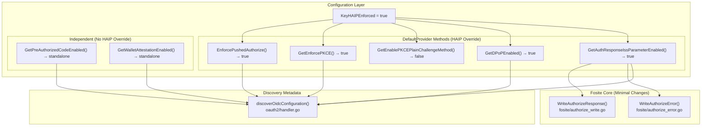
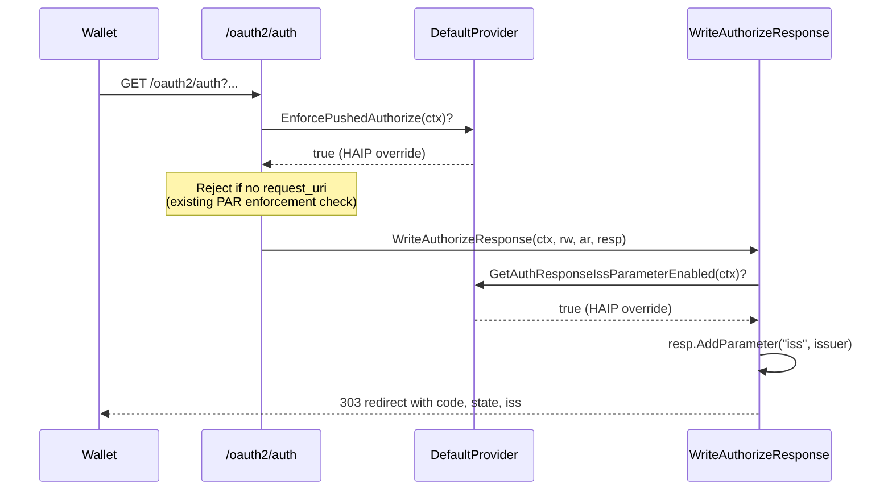

# Design Document: HAIP Enforcement, RFC 9207, and Discovery Metadata Extensions

## Overview

This design covers the capstone wiring for the OIDC4VCI Hydra AS fork: connecting the `KeyHAIPEnforced` config flag to override individual feature settings (PAR, PKCE S256, DPoP, RFC 9207), implementing RFC 9207 `iss` parameter injection into authorization responses, and extending the discovery metadata endpoint to advertise all OIDC4VCI capabilities.

All foundational infrastructure (RAR, DPoP, Pre-Auth, Wallet Attestation handlers) is already implemented by Specs 1–4. This spec makes no new Fosite handlers — it modifies existing `DefaultProvider` config methods, the two authorize response-writing functions in Fosite core, and the `discoverOidcConfiguration()` function in `oauth2/handler.go`.

### Key Design Decisions

1. **HAIP override via config methods (Option A)**: Each `DefaultProvider` getter checks `KeyHAIPEnforced` as a fallback — e.g., `GetDPoPEnabled` returns `true` if either `KeyDPoPEnabled` or `KeyHAIPEnforced` is true. This reuses existing enforcement paths without modifying Fosite handler code.
2. **RFC 9207 as inline modification**: The `iss` parameter is injected directly into `WriteAuthorizeResponse()` and `WriteAuthorizeError()` rather than creating a new handler. Error responses only get `iss` on redirect errors (not JSON-rendered errors).
3. **AuthResponseIssConfigProvider as separate interface**: Follows the single-responsibility config provider pattern established by `DPoPConfigProvider`, `HAIPConfigProvider`, etc.
4. **Pre-Auth and Wallet Attestation are HAIP-independent**: `GetPreAuthorizedCodeEnabled` and `GetWalletAttestationEnabled` do NOT check `KeyHAIPEnforced` — they remain independently configurable.
5. **Metadata changes grouped in OIDC4VCI extension section**: All new `oidcConfiguration` struct fields and conditional population logic are grouped in a clearly delimited section to minimize merge conflict surface.

## Architecture



### Data Flow: HAIP Override Pattern

When `KeyHAIPEnforced` is `true`, the config provider methods return hardcoded values that enforce the HAIP security profile. The existing Fosite handlers (PAR enforcement in `authorize_request_handler.go`, PKCE handler in `fosite/handler/pkce/`, DPoP handler in `fosite/handler/dpop/`) already read these config values — no handler modifications are needed.



## Components and Interfaces

### 1. HAIP Override on DefaultProvider Methods

**Location**: `driver/config/provider.go`

Six existing methods are modified to check `KeyHAIPEnforced` as a fallback. One new method (`GetAuthResponseIssParameterEnabled`) is added. One new method (`EnforcePushedAuthorize`) is added to implement `PushedAuthorizeRequestConfigProvider`.

**Modified methods**:

| Method | Standalone Key | HAIP Override |
|--------|---------------|---------------|
| `EnforcePushedAuthorize(ctx)` | (new — PAR enforcement key) | Returns `true` if `KeyHAIPEnforced` is true |
| `GetEnforcePKCE(ctx)` | `KeyPKCEEnforced` | Returns `true` if `KeyHAIPEnforced` is true |
| `GetEnablePKCEPlainChallengeMethod(ctx)` | (standalone plain method key) | Returns `false` if `KeyHAIPEnforced` is true |
| `GetDPoPEnabled(ctx)` | `KeyDPoPEnabled` | Returns `true` if `KeyHAIPEnforced` is true |
| `GetDPoPSigningAlgValuesSupported(ctx)` | `KeyDPoPSigningAlgValues` | Ensures `ES256` is included when `KeyHAIPEnforced` is true |
| `GetAuthResponseIssParameterEnabled(ctx)` | `KeyAuthResponseIssParameterEnabled` | Returns `true` if `KeyHAIPEnforced` is true |

**Unmodified methods (HAIP-independent)**:

| Method | Reason |
|--------|--------|
| `GetPreAuthorizedCodeEnabled(ctx)` | Pre-Auth is not mandated by HAIP |
| `GetWalletAttestationEnabled(ctx)` | Wallet Attestation is not mandated by HAIP |

**Implementation pattern** (same for all HAIP-overridden methods):

```go
func (p *DefaultProvider) GetAuthResponseIssParameterEnabled(ctx context.Context) bool {
    return p.getProvider(ctx).BoolF(KeyAuthResponseIssParameterEnabled, false) ||
           p.getProvider(ctx).BoolF(KeyHAIPEnforced, false)
}
```

For `GetEnablePKCEPlainChallengeMethod`, the logic is inverted — HAIP forces `false`:

```go
func (p *DefaultProvider) GetEnablePKCEPlainChallengeMethod(ctx context.Context) bool {
    if p.getProvider(ctx).BoolF(KeyHAIPEnforced, false) {
        return false
    }
    return p.getProvider(ctx).BoolF(KeyPKCEPlainChallengeMethod, false)
}
```

**Note on `fositex/config.go`**: The `fositex.Config` struct embeds `*config.DefaultProvider`, so the HAIP-overridden methods on `DefaultProvider` are automatically inherited. The existing hardcoded `GetEnablePKCEPlainChallengeMethod` on `fositex.Config` (which returns `false`) must be removed so the `DefaultProvider` method with HAIP logic takes effect. Similarly, `GetEnforcePKCE` on `fositex.Config` (if it exists as a hardcoded override) must delegate to `DefaultProvider`.

### 2. PushedAuthorizeRequestConfigProvider Implementation

**Location**: `driver/config/provider.go` + `fositex/config.go`

The `PushedAuthorizeRequestConfigProvider` interface (defined in `fosite/config.go`) is not currently part of the `Configurator` interface — it is checked via type assertion in `fosite/authorize_request_handler.go` and `fosite/handler/par/`. The `DefaultProvider` needs to implement all three methods:

```go
func (p *DefaultProvider) GetPushedAuthorizeRequestURIPrefix(ctx context.Context) string {
    return "urn:ietf:params:oauth:request_uri:"
}

func (p *DefaultProvider) GetPushedAuthorizeContextLifespan(ctx context.Context) time.Duration {
    return p.getProvider(ctx).DurationF(KeyPushedAuthorizeContextLifespan, 5*time.Minute)
}

func (p *DefaultProvider) EnforcePushedAuthorize(ctx context.Context) bool {
    return p.getProvider(ctx).BoolF(KeyEnforcePushedAuthorize, false) ||
           p.getProvider(ctx).BoolF(KeyHAIPEnforced, false)
}
```

The `fositex.Config` already embeds `*config.DefaultProvider`, so these methods are inherited. A compile-time check should be added:

```go
var _ fosite.PushedAuthorizeRequestConfigProvider = (*Config)(nil)
```

### 3. AuthResponseIssConfigProvider Interface

**Location**: `fosite/config.go` (interface definition), `fosite/fosite.go` (Configurator embedding)

```go
// AuthResponseIssConfigProvider returns the provider for configuring RFC 9207
// authorization response issuer identifier.
type AuthResponseIssConfigProvider interface {
    // GetAuthResponseIssParameterEnabled returns whether the iss parameter
    // should be included in authorization responses per RFC 9207.
    GetAuthResponseIssParameterEnabled(ctx context.Context) bool
}
```

Embedded in `Configurator`:

```go
type Configurator interface {
    // ... existing providers ...
    AuthResponseIssConfigProvider
}
```

**Compile-time check** in `fositex/config.go`:

```go
var _ fosite.AuthResponseIssConfigProvider = (*Config)(nil)
```

### 4. RFC 9207 iss Parameter Injection

**Location**: `fosite/authorize_write.go`, `fosite/authorize_error.go`

#### Success Responses — `WriteAuthorizeResponse()`

Before the `switch` on response mode, inject `iss` into the response parameters:

```go
// Inject RFC 9207 iss parameter
if f.Config.GetAuthResponseIssParameterEnabled(ctx) {
    resp.AddParameter("iss", f.Config.GetIDTokenIssuer(ctx))
}
```

This is placed after the cache-control headers and before the response mode switch. All three response modes (query, fragment, form_post) read from `resp.GetParameters()`, so a single injection point covers all modes. The custom `ResponseModeHandler` extension path also benefits because `iss` is already in the parameters before delegation.

#### Error Responses — `WriteAuthorizeError()`

After constructing the `errors` (`url.Values`) from `rfcerr.ToValues()` and setting `state`, inject `iss` — but only for redirect errors:

```go
errors := rfcerr.ToValues()
errors.Set("state", ar.GetState())

// Inject RFC 9207 iss parameter (only for redirect errors)
if f.Config.GetAuthResponseIssParameterEnabled(ctx) {
    errors.Set("iss", f.Config.GetIDTokenIssuer(ctx))
}
```

This code is placed inside the redirect error path — after the `!ar.IsRedirectURIValid()` early return that renders JSON directly. Non-redirect errors (invalid redirect URI, missing client) are rendered as JSON to the user-agent and do NOT get `iss` per RFC 9207.

The `ResponseModeHandler` extension path for errors is handled separately — the `iss` injection happens before the response mode handler check at the top of `WriteAuthorizeError`. Since the response mode handler path returns early, we need to ensure `iss` is injected there too. The cleanest approach: check if the response mode handler handles the error, and if so, inject `iss` into the error values before delegating. However, the current code delegates to the response mode handler before constructing `errors`. The response mode handler receives the raw `err` and constructs its own values. For the response mode handler path, `iss` injection must happen inside the response mode handler or be passed via context. Given that the default `ResponseModeHandler` (`fosite/response_handler.go`) constructs its own error values, the simplest approach is to also inject `iss` in the response mode handler's `WriteAuthorizeError` implementation. Since `fositex` provides the `DefaultResponseModeHandler`, this can be handled there.

**Practical approach**: The response mode handler check at the top of `WriteAuthorizeError` only fires for non-standard response modes. For the standard modes (query, fragment, form_post), the injection point after `errors.Set("state", ...)` covers everything. For the custom response mode handler path, the `iss` parameter can be injected by modifying the `DefaultResponseModeHandler` in `fositex/` to check the config and add `iss` — or by accepting that custom response modes are an edge case and documenting the limitation.

### 5. Discovery Metadata Extensions

**Location**: `oauth2/handler.go` — `oidcConfiguration` struct + `discoverOidcConfiguration()`

#### New Struct Fields

```go
// --- OIDC4VCI Extensions (custom fork) ---

// PAR endpoint URL (RFC 9126 §5)
PushedAuthorizationRequestEndpoint string `json:"pushed_authorization_request_endpoint,omitempty"`

// Whether PAR is required (RFC 9126 §5)
RequirePushedAuthorizationRequests bool `json:"require_pushed_authorization_requests,omitempty"`

// Pre-Authorized Code anonymous access (OIDC4VCI §12.3)
PreAuthorizedGrantAnonymousAccessSupported bool `json:"pre-authorized_grant_anonymous_access_supported,omitempty"`

// DPoP signing algorithms (RFC 9449 §5)
DPoPSigningAlgValuesSupported []string `json:"dpop_signing_alg_values_supported,omitempty"`

// RFC 9207 iss parameter support
AuthorizationResponseIssParameterSupported bool `json:"authorization_response_iss_parameter_supported,omitempty"`
```

The existing `AuthorizationDetailsTypesSupported` field is already present.

#### Modified Existing Fields

Three existing hardcoded arrays become dynamic:

1. **`GrantTypesSupported`** — append `urn:ietf:params:oauth:grant-type:pre-authorized_code` when Pre-Auth is enabled
2. **`TokenEndpointAuthMethodsSupported`** — append `attest_jwt_client_auth` when Wallet Attestation is enabled
3. **`CodeChallengeMethodsSupported`** — restrict to `["S256"]` when HAIP is enforced

#### Conditional Population Logic

```go
// Build dynamic lists
grantTypes := []string{"authorization_code", "implicit", "client_credentials",
    "refresh_token", "urn:ietf:params:oauth:grant-type:device_code"}
authMethods := []string{"client_secret_post", "client_secret_basic", "private_key_jwt", "none"}
codeChallengeMethodsSupported := []string{"plain", "S256"}

// Pre-Authorized Code grant
if h.c.GetPreAuthorizedCodeEnabled(ctx) {
    grantTypes = append(grantTypes, "urn:ietf:params:oauth:grant-type:pre-authorized_code")
}

// Wallet Attestation
if h.c.GetWalletAttestationEnabled(ctx) {
    authMethods = append(authMethods, "attest_jwt_client_auth")
}

// HAIP enforcement — restrict code challenge methods
if h.c.GetHAIPEnforced(ctx) {
    codeChallengeMethodsSupported = []string{"S256"}
}

// PAR endpoint (always populated — PAR is always available)
parEndpoint := urlx.AppendPaths(h.c.IssuerURL(ctx), PushedAuthorizePath).String()
requirePAR := h.c.EnforcePushedAuthorize(ctx)

// DPoP
var dpopAlgs []string
if h.c.GetDPoPEnabled(ctx) {
    dpopAlgs = h.c.GetDPoPSigningAlgValuesSupported(ctx)
}

// RFC 9207
issParamSupported := h.c.GetAuthResponseIssParameterEnabled(ctx)

// Pre-Auth anonymous access
var preAuthAnonymousAccess bool
if h.c.GetPreAuthorizedCodeEnabled(ctx) {
    preAuthAnonymousAccess = h.c.GetPreAuthorizedCodeAnonymousAccess(ctx)
}
```

These values are then set on the `oidcConfiguration` struct literal.

#### `omitempty` Behavior

All new fields use `omitempty` JSON tags:
- `bool` with `omitempty`: omitted when `false` — disabled features produce no metadata field
- `[]string` with `omitempty`: omitted when `nil` — disabled features produce no metadata field
- `string` with `omitempty`: omitted when empty

This conforms to RFC 8414: optional metadata parameters are absent when not applicable.

### 6. New Config Keys

**Location**: `driver/config/provider.go`

| Constant | Config Path | Type | Default |
|----------|------------|------|---------|
| `KeyAuthResponseIssParameterEnabled` | `rfc9207.iss_parameter_enabled` | `bool` | `false` |
| `KeyEnforcePushedAuthorize` | `oauth2.par.enforced` | `bool` | `false` |
| `KeyPushedAuthorizeContextLifespan` | `oauth2.par.context_lifespan` | `duration` | `5m` |

The `KeyPKCEPlainChallengeMethod` key may need to be added if it doesn't already exist as a standalone config key (currently `fositex.Config` hardcodes `false`).

### 7. Config Schema Updates

**Location**: `spec/config.json`

New properties under the `oauth2` and `rfc9207` sections:

```json
"rfc9207": {
  "type": "object",
  "properties": {
    "iss_parameter_enabled": {
      "type": "boolean",
      "default": false,
      "description": "Enable RFC 9207 iss parameter in authorization responses."
    }
  }
}
```

PAR enforcement under `oauth2.par`:

```json
"par": {
  "type": "object",
  "properties": {
    "enforced": {
      "type": "boolean",
      "default": false,
      "description": "Require all authorization requests to use PAR."
    },
    "context_lifespan": {
      "$ref": "#/definitions/duration",
      "default": "5m",
      "description": "Lifespan of PAR request contexts."
    }
  }
}
```

## Data Models

No new database tables or migrations are required for this spec. All changes are config-driven overrides and response modifications.

### Config Key Summary

| Key | Type | Default | HAIP Override | Description |
|-----|------|---------|---------------|-------------|
| `KeyHAIPEnforced` | `bool` | `false` | N/A (source) | Master HAIP enforcement flag |
| `KeyAuthResponseIssParameterEnabled` | `bool` | `false` | → `true` | RFC 9207 iss in auth responses |
| `KeyEnforcePushedAuthorize` | `bool` | `false` | → `true` | Require PAR for all auth requests |
| `KeyPKCEEnforced` | `bool` | `false` | → `true` | Require PKCE on all auth code flows |
| `KeyDPoPEnabled` | `bool` | `false` | → `true` | Enable DPoP token binding |
| `KeyPreAuthorizedCodeEnabled` | `bool` | `false` | No override | Pre-Auth grant type |
| `KeyWalletAttestationEnabled` | `bool` | `false` | No override | Wallet Attestation auth method |


## Correctness Properties

*A property is a characteristic or behavior that should hold true across all valid executions of a system — essentially, a formal statement about what the system should do. Properties serve as the bridge between human-readable specifications and machine-verifiable correctness guarantees.*

### Property 1: HAIP OR-Override for Config Methods

*For any* pair of boolean values `(haipEnforced, standaloneValue)`, the following DefaultProvider methods SHALL return `haipEnforced || standaloneValue`:
- `EnforcePushedAuthorize(ctx)` (standalone: `KeyEnforcePushedAuthorize`)
- `GetEnforcePKCE(ctx)` (standalone: `KeyPKCEEnforced`)
- `GetDPoPEnabled(ctx)` (standalone: `KeyDPoPEnabled`)
- `GetAuthResponseIssParameterEnabled(ctx)` (standalone: `KeyAuthResponseIssParameterEnabled`)

When HAIP is true, all four return true regardless of standalone. When HAIP is false, all four return the standalone value.

**Validates: Requirements 1.1, 1.2, 2.1, 2.3, 3.1, 3.3, 4.1, 4.2**

### Property 2: HAIP PKCE Plain Method Suppression

*For any* pair of boolean values `(haipEnforced, standalonePlainEnabled)`, the DefaultProvider `GetEnablePKCEPlainChallengeMethod(ctx)` method SHALL return `false` when `haipEnforced` is true, and SHALL return `standalonePlainEnabled` when `haipEnforced` is false. Equivalently: `result == !haipEnforced && standalonePlainEnabled`.

**Validates: Requirements 2.2, 2.4**

### Property 3: HAIP Independence of Pre-Auth and Wallet Attestation

*For any* pair of boolean values `(haipEnforced, featureEnabled)`, the DefaultProvider methods `GetPreAuthorizedCodeEnabled(ctx)` and `GetWalletAttestationEnabled(ctx)` SHALL return `featureEnabled` regardless of the value of `haipEnforced`.

**Validates: Requirements 15.1, 16.1**

### Property 4: RFC 9207 iss in Success Responses

*For any* authorization success response with a random issuer URL and random response parameters, when `GetAuthResponseIssParameterEnabled(ctx)` returns true, the response parameters SHALL contain an `iss` parameter whose value equals `GetIDTokenIssuer(ctx)`. When disabled, the response parameters SHALL NOT contain an `iss` parameter.

**Validates: Requirements 6.1, 6.2, 6.4**

### Property 5: RFC 9207 iss in Error Redirect Responses

*For any* authorization error that is a redirect error (valid redirect URI), when `GetAuthResponseIssParameterEnabled(ctx)` returns true, the error redirect URL parameters SHALL contain an `iss` parameter whose value equals `GetIDTokenIssuer(ctx)`. When the error is a non-redirect error OR when `GetAuthResponseIssParameterEnabled(ctx)` returns false, the error response SHALL NOT contain an `iss` parameter.

**Validates: Requirements 7.1, 7.2, 7.3, 7.4**

### Property 6: Discovery Metadata Reflects Config State

*For any* combination of feature flags `(haipEnforced, preAuthEnabled, preAuthAnonymous, dpopEnabled, dpopAlgs, issParamEnabled, walletAttestationEnabled, rarEnabled, rarTypes)`, the discovery metadata output SHALL satisfy all of the following simultaneously:
- `pushed_authorization_request_endpoint` is always present and equals `issuerURL + "/oauth2/par"`
- `require_pushed_authorization_requests` is true iff `EnforcePushedAuthorize(ctx)` is true, omitted otherwise
- `grant_types_supported` contains `urn:ietf:params:oauth:grant-type:pre-authorized_code` iff `preAuthEnabled` is true
- `pre-authorized_grant_anonymous_access_supported` is present iff `preAuthEnabled` is true, with value `preAuthAnonymous`
- `dpop_signing_alg_values_supported` is present iff `dpopEnabled` is true, with value `dpopAlgs`
- `authorization_response_iss_parameter_supported` is true iff `issParamEnabled` is true, omitted otherwise
- `token_endpoint_auth_methods_supported` contains `attest_jwt_client_auth` iff `walletAttestationEnabled` is true
- `code_challenge_methods_supported` is `["S256"]` when `haipEnforced` is true, `["plain", "S256"]` otherwise
- `authorization_details_types_supported` is present iff `rarEnabled` is true, with value `rarTypes`

**Validates: Requirements 8.1, 8.2, 8.3, 9.1, 9.2, 9.3, 10.1, 10.2, 11.1, 11.2, 12.1, 12.2, 13.1, 13.2, 14.1, 14.3**

### Property 7: Session.Extra authorization_details Round-Trip

*For any* valid `authorization_details` JSON array (containing objects with `type`, `credential_configuration_id`, and `credential_identifiers` fields), storing it in `Session.Extra["authorization_details"]`, serializing the session to JSON, and deserializing it back SHALL produce an identical `authorization_details` structure.

**Validates: Requirements 17.1, 17.2**

## Error Handling

This spec introduces no new error codes. All error behavior comes from existing Fosite mechanisms:

### PAR Enforcement (Existing)
- **`invalid_request`** — Direct authorization request when `EnforcePushedAuthorize(ctx)` returns true. Already implemented in `fosite/authorize_request_handler.go`. HAIP wiring makes this fire when `KeyHAIPEnforced` is true.

### PKCE Enforcement (Existing)
- **`invalid_request`** — Missing PKCE code challenge or wrong method when `GetEnforcePKCE(ctx)` returns true and `GetEnablePKCEPlainChallengeMethod(ctx)` returns false. Already implemented in `fosite/handler/pkce/handler.go`.

### RFC 9207 iss Parameter
- No error conditions. The `iss` parameter is purely additive to existing responses. If `GetIDTokenIssuer(ctx)` returns an empty string (misconfiguration), the `iss` parameter will be empty — but this is a pre-existing configuration issue, not a new error path.

### Discovery Metadata
- No error conditions. All new fields are conditionally populated from config. If a config provider method panics (e.g., nil pointer), the existing error handling in `discoverOidcConfiguration()` catches it.

## Testing Strategy

### Dual Testing Approach

**Unit tests** cover:
- Specific examples: HAIP=true with all standalone flags false, HAIP=false with all standalone flags true
- Edge cases: empty issuer URL, empty DPoP alg list, all features disabled
- Integration points: discovery metadata JSON serialization with `omitempty` behavior
- Error conditions: non-redirect error without `iss`, direct auth request under HAIP

**Property-based tests** cover:
- Properties 1–7 above across randomized config combinations
- Each property test generates random boolean/string config values and verifies the property holds

### Property-Based Testing Configuration

- **Library**: `pgregory.net/rapid`
- **Minimum iterations**: 100 per property test
- **Tag format**: Each test includes a comment referencing the design property:
  ```
  // Feature: oidc4vci-haip-metadata, Property {N}: {property title}
  ```
- **Each correctness property is implemented by a single property-based test**

### Test Organization

- `driver/config/provider_haip_test.go` — Properties 1, 2, 3 (HAIP config overrides and independence)
- `fosite/authorize_write_test.go` — Property 4 (RFC 9207 iss in success responses)
- `fosite/authorize_error_test.go` — Property 5 (RFC 9207 iss in error responses)
- `oauth2/handler_discovery_test.go` — Property 6 (discovery metadata reflects config)
- `oauth2/session_roundtrip_test.go` — Property 7 (Session.Extra round-trip)

### Generators

Property tests require generators for:
- Random boolean pairs `(haipEnforced, standaloneValue)` for config override tests
- Random issuer URL strings (valid HTTPS URLs)
- Random `authorization_details` JSON arrays with varying structure
- Random feature flag combinations for discovery metadata tests
- Random DPoP signing algorithm string slices
- Random RAR type string slices
