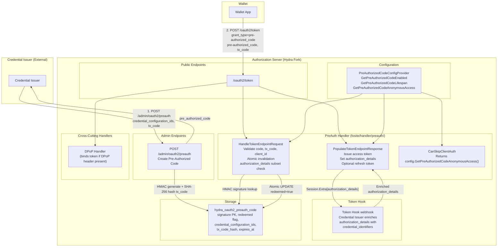

# Design Document: OIDC4VCI Pre-Authorized Code Grant Type

## Overview

This design implements the Pre-Authorized Code grant type (`urn:ietf:params:oauth:grant-type:pre-authorized_code`) for the Hydra AS fork. This grant allows Wallets to exchange a pre-authorized code for an access token without going through the authorization endpoint — the Credential Issuer prepares everything upfront and the Wallet goes directly to the token endpoint.

The handler lives in `fosite/handler/preauth/` as a `TokenEndpointHandler`. It follows the same structural patterns established by Spec 1 (RAR) and Spec 2 (DPoP): compile-time interface checks, `compose.Factory` registration gated by config, error constants with `.WithHint()` chaining, and `Session.Extra` propagation for `authorization_details`.

The scope is strictly the Authorization Server role. The Credential Issuer creates pre-authorized codes via the admin API and resolves `credential_identifiers` via the Token Hook — both are out of scope for the handler itself.

### Key Design Decisions

1. **`client_id` is nullable**: Unbound codes allow any client (or anonymous) to redeem. The handler only checks `client_id` match when the stored value is non-empty AND client auth was performed.
2. **`authorization_details` NOT stored at code creation**: The admin API accepts `credential_configuration_ids` (the authorization envelope). At the token endpoint, `authorization_details` are either constructed from stored config IDs (default) or validated from the Wallet's token request (subset selection). The Token Hook enriches them with `credential_identifiers`.
3. **Admin API accepts `tx_code` in plaintext, AS hashes with SHA-256**: The plaintext is never stored. Constant-time comparison (`subtle.ConstantTimeCompare`) at validation.
4. **Atomic invalidation**: `InvalidatePreAuthorizedCode` uses `UPDATE ... SET redeemed=true WHERE signature=? AND redeemed=false` and returns an error if no rows affected. This prevents the TOCTOU race between `GetPreAuthorizedCodeSession` and `InvalidatePreAuthorizedCode`.
5. **Refresh tokens prohibited in anonymous mode**: A refresh token without client binding is a security risk. Refresh token eligibility requires a bound client.
6. **HAIP is independent**: `KeyPreAuthorizedCodeEnabled` is independent of `KeyHAIPEnforced`. HAIP does not profile the pre-authorized code flow.
7. **HMAC signature as DB lookup key**: The raw pre-authorized code has format `base64(key).base64(sig)`. The signature portion (extracted via `HMACStrategy.Signature(code)`) is the DB primary key. Same pattern as authorization codes.
8. **CoreStrategy for token issuance**: The handler receives a `CoreStrategy` (the HMAC or JWT strategy for access/refresh tokens) via the compose factory's `strategy` parameter, same as the authorization code handler.

## Architecture



### Token Endpoint Data Flow

1. Wallet sends `POST /oauth2/token` with `grant_type=urn:ietf:params:oauth:grant-type:pre-authorized_code`, `pre-authorized_code`, optional `tx_code`, optional `authorization_details`, optional `DPoP` header
2. Fosite core calls `AuthenticateClient()` (may fail; deferred check)
3. `PreAuthorizedCodeHandler.CanHandleTokenEndpointRequest()` returns `true` (grant type match)
4. `PreAuthorizedCodeHandler.CanSkipClientAuth()` returns config value — if `false` and client auth failed, Fosite returns `invalid_client`
5. `PreAuthorizedCodeHandler.HandleTokenEndpointRequest()`:
   - Extracts `pre-authorized_code` from form
   - Computes HMAC signature via `HMACStrategy.Signature(code)`
   - Loads stored grant data via `Storage.GetPreAuthorizedCodeSession(ctx, signature)`
   - Validates: not redeemed, not expired, client_id match (if bound), tx_code match (if required)
   - Atomically invalidates via `Storage.InvalidatePreAuthorizedCode(ctx, signature)`
   - Validates `authorization_details` from token request (subset check) or constructs default set
   - Populates requester session with scopes, `authorization_details` in `Session.Extra`
6. Token Hook fires — Credential Issuer enriches `authorization_details` with `credential_identifiers`. **Important: The Token Hook uses full-replacement semantics** — `session.Extra = respBody.Session.AccessToken`. The Credential Issuer's webhook receives the full session (including `Session.Extra` with `authorization_details`) in the request body. It must return the complete `session.access_token` map including `authorization_details` with `credential_identifiers` added. If it returns only `credential_identifiers` without the rest of `Session.Extra`, all other session extras are lost. A `204 No Content` response leaves the session unchanged (no-op).
7. DPoP handler runs (if `DPoP` header present) — binds token to public key
8. `PreAuthorizedCodeHandler.PopulateTokenEndpointResponse()`:
   - Issues access token via `CoreStrategy.GenerateAccessToken()`
   - Sets `token_type=bearer` (DPoP handler overrides to `DPoP` if active)
   - Copies `Session.Extra["authorization_details"]` to response extras
   - Optionally issues refresh token (if eligible)

## Components and Interfaces

### 1. PreAuthorizedCodeHandler (`fosite/handler/preauth/`)

The central component. A single struct implementing `fosite.TokenEndpointHandler`.

**Struct:**
```go
type Handler struct {
    Config   PreAuthorizedCodeConfigProvider
    Storage  PreAuthorizedCodeStorage
    Strategy CoreStrategy
}
```

**Compile-time check:**
```go
var _ fosite.TokenEndpointHandler = (*Handler)(nil)
```

**File layout:**
- `fosite/handler/preauth/handler.go` — `Handler` struct, `CanHandleTokenEndpointRequest`, `CanSkipClientAuth`, `HandleTokenEndpointRequest`, `PopulateTokenEndpointResponse`
- `fosite/handler/preauth/storage.go` — `PreAuthorizedCodeStorage` interface, `PreAuthorizedCodeData` struct
- `fosite/handler/preauth/errors.go` — error variable definitions
- `fosite/handler/preauth/handler_test.go` — unit tests and property-based tests

**`CanHandleTokenEndpointRequest(ctx, requester)`**
- Returns `true` when `requester.GetGrantTypes().ExactOne("urn:ietf:params:oauth:grant-type:pre-authorized_code")`

**`CanSkipClientAuth(ctx, requester)`**
- Returns `Config.GetPreAuthorizedCodeAnonymousAccess(ctx)`

**`HandleTokenEndpointRequest(ctx, requester)`**

1. Extract `pre-authorized_code` from `requester.GetRequestForm().Get("pre-authorized_code")`
2. If missing/empty → return `fosite.ErrInvalidRequest.WithHint("pre-authorized_code parameter is required")`
3. Compute HMAC signature: `signature := h.Strategy.AuthorizeCodeSignature(ctx, code)` — same method the authorization code flow uses, delegates to `HMACStrategy.Signature(token)` which splits on `.` and returns the second part
4. Call `h.Storage.GetPreAuthorizedCodeSession(ctx, signature)`
5. If `fosite.ErrNotFound` → return `fosite.ErrInvalidGrant.WithHint("pre-authorized code not found")`
6. If `data.Redeemed` → return `fosite.ErrInvalidGrant.WithHint("pre-authorized code already redeemed")`
7. If `data.ExpiresAt.Before(time.Now())` → return `fosite.ErrInvalidGrant.WithHint("pre-authorized code expired")`
8. Client ID validation: if `data.ClientID != ""` and client auth was performed, verify `requester.GetClient().GetID() == data.ClientID`. Mismatch → `fosite.ErrInvalidGrant.WithHint("client_id mismatch")`
9. Transaction code validation (see below)
10. Call `h.Storage.InvalidatePreAuthorizedCode(ctx, signature)` — atomic, returns error if already redeemed
11. `authorization_details` validation from token request (see below)
12. Populate requester session: deserialize `data.SessionData` into `*oauth2.Session`, set granted scopes from `data.GrantedScope`, set `Session.Extra["authorization_details"]`

**`PopulateTokenEndpointResponse(ctx, requester, responder)`**

1. If grant type is not pre-authorized code → return `fosite.ErrUnknownRequest`
2. Issue access token via `h.Strategy.GenerateAccessToken(ctx, requester)`
3. `responder.SetAccessToken(token)`
4. `responder.SetTokenType("bearer")` — DPoP handler overrides if active
5. `responder.SetExtra("expires_in", lifespan.Seconds())`
6. If `session.Extra["authorization_details"]` present → `responder.SetExtra("authorization_details", authDetails)`
7. Refresh token: if eligible (bound client + refresh_token grant type + offline scope), issue via `h.Strategy.GenerateRefreshToken(ctx, requester)`. If anonymous (no bound client) → skip.

### 2. Transaction Code Validation

| Stored `TxCodeHash` | Request `tx_code` | Result |
|---|---|---|
| Non-empty | Present, matches | Proceed |
| Non-empty | Present, mismatch | `fosite.ErrInvalidGrant.WithHint("tx_code does not match")` |
| Non-empty | Missing | `fosite.ErrInvalidRequest.WithHint("tx_code required but not provided")` |
| Empty | Present | `fosite.ErrInvalidRequest.WithHint("tx_code provided but not expected")` |
| Empty | Missing | Proceed |

Hashing: `sha256.Sum256([]byte(txCode))`, hex-encode, compare with `subtle.ConstantTimeCompare` against stored `TxCodeHash`.

### 3. authorization_details Validation in Token Request

1. Parse `authorization_details` from `requester.GetRequestForm().Get("authorization_details")`
2. If present and non-empty: parse JSON array, extract `credential_configuration_id` from each `type: "openid_credential"` entry
3. If present but empty array `[]`: reject with `fosite.ErrInvalidRequest.WithHint("authorization_details must be a non-empty array")` per RFC 9396 §2 which defines `authorization_details` as a "non-empty JSON array"
3. Validate every requested `credential_configuration_id` is in `data.CredentialConfigurationIDs`
4. If any ID not in allowed set → `fosite.ErrInvalidRequest.WithHint("requested credential_configuration_id not authorized")`
5. Set `Session.Extra["authorization_details"]` to the validated set (without `credential_identifiers`)
6. If absent: construct default set from all stored `CredentialConfigurationIDs`, each as `{"type": "openid_credential", "credential_configuration_id": "<id>"}`

### 4. PreAuthorizedCodeStorage Interface (`fosite/handler/preauth/storage.go`)

```go
type PreAuthorizedCodeStorage interface {
    CreatePreAuthorizedCodeSession(ctx context.Context, signature string, data *PreAuthorizedCodeData) error
    GetPreAuthorizedCodeSession(ctx context.Context, signature string) (*PreAuthorizedCodeData, error)
    InvalidatePreAuthorizedCode(ctx context.Context, signature string) error
}
```

- `CreatePreAuthorizedCodeSession`: inserts a row. Called by the admin API handler.
- `GetPreAuthorizedCodeSession`: queries by signature + NID. Returns `fosite.ErrNotFound` if not found.
- `InvalidatePreAuthorizedCode`: atomic `UPDATE ... SET redeemed=true WHERE signature=? AND nid=? AND redeemed=false`. Returns error if no rows affected.

Added to `persistence.Persister` aggregate interface. `RegistrySQL` provides a `PreAuthorizedCodeStorage()` accessor with lazy initialization.

### 5. CoreStrategy Type Alias

The handler needs the token strategy for access/refresh token generation AND the authorize code strategy for HMAC signature extraction and code generation. Following the pattern from `fosite/handler/oauth2/`:

```go
type CoreStrategy = oauth2.CoreStrategy
```

This is a type alias for the existing `fosite/handler/oauth2.CoreStrategy` interface which composes `AuthorizeCodeStrategy`, `AccessTokenStrategy`, and `RefreshTokenStrategy`. The pre-auth handler uses:

- `h.Strategy.AuthorizeCodeSignature(ctx, code)` — extracts the HMAC signature from the raw code (splits on `.`, returns second part). This is the same method the authorization code flow uses, and it delegates to `HMACStrategy.Signature(token)` under the hood.
- `h.Strategy.GenerateAuthorizeCode(ctx, nil)` — generates a new HMAC-signed code for the admin API. Returns `(token, signature, error)` where `token` is the raw code (returned to the Credential Issuer) and `signature` is the DB primary key. The `requester` parameter is ignored by the HMAC implementation.
- `h.Strategy.GenerateAccessToken(ctx, requester)` — issues access tokens at the token endpoint.
- `h.Strategy.GenerateRefreshToken(ctx, requester)` — issues refresh tokens when eligible.

No fragile type assertions to concrete `HMACStrategy` are needed — all operations go through the `CoreStrategy` interface.

### 6. PreAuthorizedCodeConfigProvider (`fosite/config.go`)

```go
// OIDC4VCI extension
type PreAuthorizedCodeConfigProvider interface {
    GetPreAuthorizedCodeEnabled(ctx context.Context) bool
    GetPreAuthorizedCodeLifespan(ctx context.Context) time.Duration
    GetPreAuthorizedCodeAnonymousAccess(ctx context.Context) bool
}
```

Embedded in `Configurator` interface in `fosite/fosite.go`. Implemented on `driver/config/DefaultProvider`. `fositex.Config` inherits via embedded `*config.DefaultProvider`. Compile-time check in `fositex/config.go`.

### 7. Config Keys (`driver/config/provider.go`)

| Key | Type | Default | Description |
|-----|------|---------|-------------|
| `KeyPreAuthorizedCodeEnabled` | `bool` | `false` | Enable Pre-Authorized Code handler registration |
| `KeyPreAuthorizedCodeLifespan` | `duration` | `30m` | Code validity window |
| `KeyPreAuthorizedCodeAnonymousAccess` | `bool` | `false` | Allow token exchange without client auth |

Config schema properties in `spec/config.json`:
- `preauth.enabled` (boolean)
- `preauth.lifespan` (string, duration format)
- `preauth.anonymous_access` (boolean)

### 8. PreAuthorizedCodeFactory (`fosite/compose/compose_preauth.go`)

```go
func PreAuthorizedCodeFactory(config fosite.Configurator, storage fosite.Storage, strategy interface{}) interface{} {
    return &preauth.Handler{
        Config:   config.(preauth.PreAuthorizedCodeConfigProvider),
        Storage:  storage.(preauth.PreAuthorizedCodeStorage),
        Strategy: strategy.(oauth2.CoreStrategy),
    }
}
```

Registered in `driver/registry_sql.go` via `ExtraFositeFactories()`, gated by `KeyPreAuthorizedCodeEnabled`. `Compose()` type-asserts the result to `TokenEndpointHandler`.

### 9. Registry Wiring (`driver/registry_sql.go`)

In `ExtraFositeFactories()`:
```go
if m.Config().GetPreAuthorizedCodeEnabled(ctx) {
    factories = append(factories, compose.PreAuthorizedCodeFactory)
}
```

New storage accessor:
```go
func (m *RegistrySQL) PreAuthorizedCodeStorage() preauth.PreAuthorizedCodeStorage {
    return m.Persister()
}
```

### 10. Admin API Endpoint (`oauth2/handler.go`)

`POST /admin/oauth2/preauth` — registered in `SetAdminRoutes`, marked with `// OIDC4VCI extension`.

**Request body:**
```json
{
  "client_id": "wallet-app",
  "scope": "UniversityDegree_JWT offline",
  "credential_configuration_ids": ["UniversityDegree_JWT", "org.iso.18013.5.1.mDL"],
  "tx_code": "493536",
  "tx_code_input_mode": "numeric",
  "tx_code_length": 6
}
```

**Processing:**
1. Validate `credential_configuration_ids` is non-empty → 400 if missing
2. If `client_id` provided, validate it corresponds to a registered client (scoped to NID) → 400 if not found
3. Generate pre-authorized code via `h.Strategy.GenerateAuthorizeCode(ctx, nil)` — returns `(token string, signature string, err error)` where `token` is the raw code (returned to the Credential Issuer in the response) and `signature` is the HMAC signature used as the DB primary key. Uses the same HMAC generation as authorization codes (32 bytes of randomness).
4. The `signature` return value from `GenerateAuthorizeCode` is used directly as the DB key — no separate extraction step needed
5. If `tx_code` provided, compute `SHA-256(tx_code)` hex digest
6. Store via `PreAuthorizedCodeStorage.CreatePreAuthorizedCodeSession(ctx, signature, data)`
7. Set `expires_at = time.Now().Add(config.GetPreAuthorizedCodeLifespan(ctx))`
8. Return `{"pre_authorized_code": "<raw_code>", "expires_at": "<RFC3339>"}`

**Response:**
```json
{
  "pre_authorized_code": "oaKazRN8I0IbtZ0C7JuMn5.base64hmac",
  "expires_at": "2026-04-16T15:30:00Z"
}
```

Swagger annotations: `swagger:route POST /admin/oauth2/preauth oAuth2 createPreAuthorizedCode`, `swagger:parameters createPreAuthorizedCode`, `swagger:model preAuthorizedCodeResponse`.

**OpenAPI Schema (Swagger 2.0 annotations in Go):**

```go
// Create Pre-Authorized Code Request
//
// swagger:parameters createPreAuthorizedCode
type createPreAuthorizedCodeRequest struct {
	// in: body
	// required: true
	Body createPreAuthorizedCodeBody
}

// swagger:model createPreAuthorizedCodeBody
type createPreAuthorizedCodeBody struct {
	// The OAuth 2.0 client ID to bind the code to.
	// If omitted, any client (or anonymous if configured) can redeem the code.
	//
	// example: wallet-app
	ClientID string `json:"client_id,omitempty"`

	// The credential configuration IDs the Credential Issuer plans to offer.
	// Defines the authorization envelope — the Wallet can request a subset
	// via authorization_details at the token endpoint.
	//
	// required: true
	// example: ["UniversityDegree_JWT", "org.iso.18013.5.1.mDL"]
	CredentialConfigurationIDs []string `json:"credential_configuration_ids"`

	// Space-separated scopes to grant. Include "offline" or "offline_access"
	// to enable refresh token issuance.
	//
	// example: UniversityDegree_JWT offline
	Scope string `json:"scope,omitempty"`

	// Transaction code in plaintext. The AS computes the SHA-256 hash before
	// storage. The plaintext is never stored.
	//
	// example: 493536
	TxCode string `json:"tx_code,omitempty"`

	// Input mode for the transaction code: "numeric" or "text".
	// Stored for metadata completeness (included in Credential Offer by the Issuer).
	//
	// example: numeric
	// enum: numeric,text
	TxCodeInputMode string `json:"tx_code_input_mode,omitempty"`

	// Expected length of the transaction code.
	// Stored for metadata completeness.
	//
	// example: 6
	TxCodeLength int `json:"tx_code_length,omitempty"`
}

// Pre-Authorized Code Response
//
// swagger:model preAuthorizedCodeResponse
type preAuthorizedCodeResponse struct {
	// The raw opaque pre-authorized code for inclusion in the Credential Offer.
	//
	// required: true
	// example: oaKazRN8I0IbtZ0C7JuMn5.base64hmac
	PreAuthorizedCode string `json:"pre_authorized_code"`

	// RFC 3339 expiry timestamp for the pre-authorized code.
	//
	// required: true
	// example: 2026-04-16T15:30:00Z
	ExpiresAt string `json:"expires_at"`
}
```

**Swagger route annotation on the handler method:**

```go
// swagger:route POST /admin/oauth2/preauth oAuth2 createPreAuthorizedCode
//
// # Create Pre-Authorized Code
//
// Create a pre-authorized code for inclusion in a Credential Offer. The Credential Issuer
// calls this endpoint to obtain a code that a Wallet can later exchange at the token endpoint
// for an access token. The code is bound to the specified credential configuration IDs
// (the authorization envelope) and optionally to a specific client_id.
//
//	Consumes:
//	- application/json
//
//	Produces:
//	- application/json
//
//	Schemes: http, https
//
//	Responses:
//	  201: preAuthorizedCodeResponse
//	  400: errorOAuth2
//	  default: errorOAuth2
//
//	Extensions:
//	  x-ory-ratelimit-bucket: hydra-admin-high
```

### 11. Error Constants (`fosite/handler/preauth/errors.go`)

Error variables using `*fosite.RFC6749Error` pattern. The handler reuses `fosite.ErrInvalidGrant` and `fosite.ErrInvalidRequest` with `.WithHint()` at each call site, following the pattern from Spec 1 and Spec 2. No new error code constants are needed — the OIDC4VCI spec uses standard OAuth 2.0 error codes (`invalid_grant`, `invalid_request`) for pre-authorized code errors.

### 12. Database Migration

**Migration file:** `persistence/sql/migrations/YYYYMMDDHHMMSS_oidc4vci_create_preauth_code.up.sql`

```sql
CREATE TABLE IF NOT EXISTS hydra_oauth2_preauth_code (
    signature                  VARCHAR(255) NOT NULL,
    nid                        UUID         NOT NULL,
    request_id                 VARCHAR(255) NOT NULL,
    client_id                  VARCHAR(255) NULL,
    requested_scope            JSON,
    granted_scope              JSON,
    credential_configuration_ids JSON       NOT NULL,
    tx_code_hash               VARCHAR(255) NULL,
    tx_code_input_mode         VARCHAR(10)  NULL,
    tx_code_length             INT          NULL,
    session_data               JSON         NOT NULL,
    redeemed                   BOOLEAN      NOT NULL DEFAULT FALSE,
    requested_at               TIMESTAMP    NOT NULL,
    expires_at                 TIMESTAMP    NOT NULL,
    PRIMARY KEY (signature)
);

CREATE INDEX idx_preauth_code_nid ON hydra_oauth2_preauth_code (nid);
CREATE INDEX idx_preauth_code_expires_at ON hydra_oauth2_preauth_code (nid, expires_at);
```

**Down migration:**
```sql
DROP TABLE IF EXISTS hydra_oauth2_preauth_code;
```

Supports PostgreSQL, MySQL, CockroachDB, and SQLite.

### 13. SQL Persistence Implementation (`persistence/sql/persister_preauth.go`)

**`CreatePreAuthorizedCodeSession(ctx, signature, data)`**: Insert row with current NID from `p.NetworkID(ctx)`.

**`GetPreAuthorizedCodeSession(ctx, signature)`**: Query by `signature` and `nid`. Return `fosite.ErrNotFound` if no row.

**`InvalidatePreAuthorizedCode(ctx, signature)`**: Execute `UPDATE hydra_oauth2_preauth_code SET redeemed=true WHERE signature=? AND nid=? AND redeemed=false`. Check `RowsAffected()` — if 0, return error (already redeemed or not found).

### 14. Feature Documentation (`docs/features/pre-authorized-code.md`)

Covers: feature overview, configuration keys, admin API contract, token exchange flow, tx_code validation rules, error codes, DPoP interaction, RAR/authorization_details propagation, Token Hook integration, introspection path, references.

## Data Models

### PreAuthorizedCodeData (`fosite/handler/preauth/storage.go`)

```go
type PreAuthorizedCodeData struct {
    Signature                  string           `db:"signature"`
    NID                        uuid.UUID        `db:"nid"`
    RequestID                  string           `db:"request_id"`
    ClientID                   string           `db:"client_id"`
    RequestedScope             fosite.Arguments `db:"requested_scope"`
    GrantedScope               fosite.Arguments `db:"granted_scope"`
    CredentialConfigurationIDs []string         `db:"credential_configuration_ids"`
    TxCodeHash                 string           `db:"tx_code_hash"`
    TxCodeInputMode            string           `db:"tx_code_input_mode"`
    TxCodeLength               int              `db:"tx_code_length"`
    SessionData                json.RawMessage  `db:"session_data"`
    Redeemed                   bool             `db:"redeemed"`
    RequestedAt                time.Time        `db:"requested_at"`
    ExpiresAt                  time.Time        `db:"expires_at"`
}

func (d *PreAuthorizedCodeData) TableName() string {
    return "hydra_oauth2_preauth_code"
}
```

- `Signature`: HMAC signature of the pre-authorized code (PK). Raw code is never stored.
- `ClientID`: nullable (empty string = unbound). When set, handler verifies authenticated client matches.
- `CredentialConfigurationIDs`: the authorization envelope. `authorization_details` are constructed from these at the token endpoint.
- `TxCodeHash`: SHA-256 hex digest of the transaction code. Empty if no tx_code required.
- `SessionData`: serialized `oauth2.Session` for the token to be issued.
- `Redeemed`: single-use flag. Atomically set to `true` during invalidation.

### Database Table: `hydra_oauth2_preauth_code`

| Column | Type | Constraints | Description |
|---|---|---|---|
| `signature` | `VARCHAR(255)` | PK, NOT NULL | HMAC signature of the pre-authorized code |
| `nid` | `UUID` | NOT NULL | Network ID (multi-tenancy) |
| `request_id` | `VARCHAR(255)` | NOT NULL | Request identifier |
| `client_id` | `VARCHAR(255)` | NULL | OAuth 2.0 client ID (NULL if unbound) |
| `requested_scope` | `JSON` | | Scopes requested |
| `granted_scope` | `JSON` | | Scopes granted |
| `credential_configuration_ids` | `JSON` | NOT NULL | Authorization envelope |
| `tx_code_hash` | `VARCHAR(255)` | NULL | SHA-256 hash of transaction code |
| `tx_code_input_mode` | `VARCHAR(10)` | NULL | `numeric` or `text` |
| `tx_code_length` | `INT` | NULL | Expected tx_code length |
| `session_data` | `JSON` | NOT NULL | Serialized session |
| `redeemed` | `BOOLEAN` | NOT NULL, DEFAULT FALSE | Single-use flag |
| `requested_at` | `TIMESTAMP` | NOT NULL | Creation time |
| `expires_at` | `TIMESTAMP` | NOT NULL | Expiry time |

Indexes:
- `idx_preauth_code_nid` on `(nid)` — tenant-scoped queries
- `idx_preauth_code_expires_at` on `(nid, expires_at)` — cleanup queries

No FK constraint on `client_id`. Referential integrity is enforced at the application level by the admin API, which validates `client_id` against registered clients at code creation time. A nullable FK is problematic on some databases and unnecessary given the application-level check.

### Session.Extra Layout After HandleTokenEndpointRequest

```go
session.Extra = map[string]interface{}{
    "authorization_details": []interface{}{
        map[string]interface{}{
            "type":                        "openid_credential",
            "credential_configuration_id": "UniversityDegree_JWT",
        },
    },
    // After Token Hook enrichment:
    // "authorization_details": []interface{}{
    //     map[string]interface{}{
    //         "type":                        "openid_credential",
    //         "credential_configuration_id": "UniversityDegree_JWT",
    //         "credential_identifiers":      []interface{}{"cred-id-1"},
    //     },
    // },
    // After DPoP handler (if DPoP proof present):
    // "cnf": map[string]interface{}{"jkt": "..."},
}
```

### Admin API Request/Response Models

**Request (`createPreAuthorizedCodeRequest`):**

| Field | Type | Required | Description |
|---|---|---|---|
| `client_id` | string | No | Client to bind code to. Omit for unbound. |
| `credential_configuration_ids` | []string | Yes | Authorization envelope. |
| `scope` | string | No | Space-separated scopes. Include `offline` for refresh tokens. |
| `tx_code` | string | No | Transaction code in plaintext. SHA-256 hashed before storage. |
| `tx_code_input_mode` | string | No | `"numeric"` or `"text"`. |
| `tx_code_length` | int | No | Expected tx_code length. |

**Response (`preAuthorizedCodeResponse`):**

| Field | Type | Description |
|---|---|---|
| `pre_authorized_code` | string | The raw opaque code for the Credential Offer. |
| `expires_at` | string | RFC 3339 expiry timestamp. |


## Correctness Properties

*A property is a characteristic or behavior that should hold true across all valid executions of a system — essentially, a formal statement about what the system should do. Properties serve as the bridge between human-readable specifications and machine-verifiable correctness guarantees.*

### Property 1: Pre-Authorized Code Valid Redemption

*For any* valid pre-authorized code (not redeemed, not expired) with associated `CredentialConfigurationIDs`, exchanging it at the token endpoint should produce an access token whose session contains `authorization_details` with entries matching the credential configuration IDs from the stored grant. When the Wallet does not send `authorization_details` in the token request, the handler constructs a default set from all stored `CredentialConfigurationIDs`. The response must include `access_token`, `token_type`, and `authorization_details` in the extras.

**Validates: Requirements 1.10, 4.2, 4.3, 4.4, 4.5, 13.1, 13.2, 13.3, 13.4, 17.3**

### Property 2: Pre-Authorized Code tx_code Validation

*For any* pre-authorized code and any combination of stored `TxCodeHash` (empty or non-empty) and request `tx_code` (present or absent), the handler should:
- Accept when both are empty (no tx_code required, none provided)
- Accept when stored hash is non-empty and provided tx_code's SHA-256 hash matches
- Reject with `invalid_request` when stored hash is non-empty but tx_code is missing
- Reject with `invalid_request` when stored hash is empty but tx_code is provided
- Reject with `invalid_grant` when stored hash is non-empty and provided tx_code's hash does not match

The comparison must use constant-time comparison (`subtle.ConstantTimeCompare`).

**Validates: Requirements 2.1, 2.2, 2.3, 2.4, 2.5, 2.6**

### Property 3: Pre-Authorized Code Client ID Validation

*For any* pre-authorized code with a non-empty stored `ClientID` and any authenticated client, the handler should accept the request if and only if the authenticated client's ID matches the stored `ClientID`. For any pre-authorized code with an empty stored `ClientID` (unbound), the handler should accept any authenticated client (or anonymous if configured).

**Validates: Requirements 1.11, 1.12**

### Property 4: Pre-Authorized Code Single-Use Enforcement

*For any* valid pre-authorized code, the first redemption attempt should succeed, and any subsequent redemption attempt with the same code should be rejected with `invalid_grant` ("pre-authorized code already redeemed"). This must hold even under concurrent redemption attempts — the atomic `UPDATE ... WHERE redeemed=false` ensures exactly one request succeeds.

**Validates: Requirements 1.7, 1.9, 8.3**

### Property 5: Pre-Authorized Code Expiry Enforcement

*For any* pre-authorized code whose `ExpiresAt` is in the past (before `time.Now()`), the handler should reject the redemption request with `invalid_grant` ("pre-authorized code expired"). For any code whose `ExpiresAt` is in the future, expiry validation should pass (other validations may still fail).

**Validates: Requirements 1.8**

### Property 6: Pre-Authorized Code authorization_details Subset Validation

*For any* token request containing `authorization_details` with `credential_configuration_id` values, and any stored `CredentialConfigurationIDs` set, the handler should accept the request if and only if every requested `credential_configuration_id` is a member of the stored set. A request containing any `credential_configuration_id` not in the stored set should be rejected with `invalid_request` ("requested credential_configuration_id not authorized").

**Validates: Requirements 17.1, 17.2, 17.4, 17.5**

### Property 7: Pre-Authorized Code Refresh Token Prohibition in Anonymous Mode

*For any* pre-authorized code exchange where no client is bound (anonymous access), the handler must not issue a refresh token, regardless of scope or client grant type configuration. *For any* exchange where a client IS bound and the client's registered grant types include `refresh_token` and the granted scopes include an offline scope, the handler should issue a refresh token.

**Validates: Requirements 4.6, 4.7**

### Property 8: Pre-Authorized Code Storage Round-Trip

*For any* valid `PreAuthorizedCodeData` struct, calling `CreatePreAuthorizedCodeSession` followed by `GetPreAuthorizedCodeSession` with the same signature should return data equivalent to the original — all fields (`ClientID`, `CredentialConfigurationIDs`, `TxCodeHash`, `GrantedScope`, `SessionData`, `Redeemed`, `ExpiresAt`) must be preserved without loss or mutation.

**Validates: Requirements 5.1, 8.1, 8.2**

## Error Handling

### Token Endpoint Errors (PreAuth Handler)

| Error Code | Condition | Hint |
|---|---|---|
| `invalid_request` | `pre-authorized_code` parameter missing or empty | "pre-authorized_code parameter is required" |
| `invalid_request` | `tx_code` required but not provided | "tx_code required but not provided" |
| `invalid_request` | `tx_code` provided but not expected | "tx_code provided but not expected" |
| `invalid_request` | `credential_configuration_id` not in allowed set | "requested credential_configuration_id not authorized" |
| `invalid_grant` | Pre-authorized code not found in storage | "pre-authorized code not found" |
| `invalid_grant` | Pre-authorized code already redeemed | "pre-authorized code already redeemed" |
| `invalid_grant` | Pre-authorized code expired | "pre-authorized code expired" |
| `invalid_grant` | `tx_code` hash does not match stored hash | "tx_code does not match" |
| `invalid_grant` | Authenticated client_id ≠ stored client_id | "client_id mismatch" |
| `invalid_client` | Client auth required but not provided (anonymous disabled) | Handled by Fosite core, not PreAuth handler |

All errors use `fosite.ErrInvalidGrant` or `fosite.ErrInvalidRequest` with `.WithHint()` and `.WithDebugf()` chaining at each call site. No new error code constants are needed — OIDC4VCI §6.3 uses standard OAuth 2.0 error codes for pre-authorized code errors.

### Admin API Errors

| HTTP Status | Condition | Description |
|---|---|---|
| 400 | `credential_configuration_ids` missing or empty | Required field validation |
| 400 | `client_id` provided but not a registered client | Client lookup failure |
| 500 | HMAC generation failure | Internal error |
| 500 | Storage write failure | Internal error |

Admin API errors use `h.r.Writer().WriteError(w, r, err)` via `herodot.Writer`.

### Error Flow

1. `HandleTokenEndpointRequest` returns `fosite.RFC6749Error` → Fosite core writes the error response with the correct OAuth 2.0 error format
2. `PopulateTokenEndpointResponse` returns `fosite.ErrUnknownRequest` for non-matching grant types → Fosite response writer skips the handler
3. `InvalidatePreAuthorizedCode` returns error on concurrent redemption → handler maps to `fosite.ErrInvalidGrant.WithHint("pre-authorized code already redeemed")`

## Testing Strategy

### Dual Testing Approach

Both unit tests and property-based tests are required for comprehensive coverage.

**Unit tests** cover:
- Specific examples: valid pre-authorized code redemption with known inputs, admin API code creation with specific parameters
- Edge cases: expired codes, replayed codes, missing tx_code, unexpected tx_code, empty credential_configuration_ids, malformed authorization_details JSON
- Integration points: Token Hook receives `authorization_details` in session, DPoP handler runs after PreAuth handler, admin API validates client_id against registered clients
- Error conditions: all error codes listed in Error Handling section
- Structural checks: compile-time interface checks, `TableName()` returns correct value, config defaults

**Property-based tests** cover:
- Universal properties (Properties 1–8 above) across randomized inputs
- Each property test generates random valid/invalid inputs and verifies the property holds

### Property-Based Testing Configuration

- **Library**: `pgregory.net/rapid`
- **Minimum iterations**: 100 per property test
- **Tag format**: Each test must include a comment referencing the design property:
  ```
  // Feature: oidc4vci-preauth, Property {N}: {property title}
  ```
- **Each correctness property is implemented by a single property-based test**

### Test Organization

- `fosite/handler/preauth/handler_test.go` — Properties 1–7 (handler logic), unit tests for edge cases and error conditions
- `persistence/sql/persister_preauth_test.go` — Property 8 (storage round-trip), unit tests for SQL persistence
- `oauth2/handler_preauth_test.go` — Admin API integration tests

### Generators

Property tests require generators for:
- Random `PreAuthorizedCodeData` structs with configurable fields (client_id nullable, tx_code_hash present/absent, varying credential_configuration_ids, varying expiry times, redeemed flag)
- Random pre-authorized code strings (valid HMAC format: `base64(key).base64(sig)`)
- Random `tx_code` strings (numeric and text, varying lengths)
- Random `credential_configuration_id` strings for authorization_details subset testing
- Random `authorization_details` JSON arrays (valid and invalid, with varying credential_configuration_id sets)
- Random OAuth 2.0 client configurations (with/without `refresh_token` grant type, varying scopes)
- Random `oauth2.Session` structs for session serialization round-trip testing

### Test Approach Per Property

| Property | Test Approach | Key Generators |
|---|---|---|
| 1: Valid Redemption | Generate random valid codes + credential config IDs, verify session and response | `PreAuthorizedCodeData`, `CredentialConfigurationIDs` |
| 2: tx_code Validation | Generate all 5 combinations of stored hash × request tx_code | `TxCodeHash`, `tx_code` strings |
| 3: Client ID Validation | Generate bound/unbound codes × matching/mismatching clients | `ClientID`, `Client` |
| 4: Single-Use | Generate valid codes, redeem twice, verify second fails | `PreAuthorizedCodeData` |
| 5: Expiry | Generate codes with past/future expiry, verify rejection/acceptance | `ExpiresAt` timestamps |
| 6: authorization_details Subset | Generate stored ID sets × request ID sets, verify subset logic | `CredentialConfigurationIDs`, `authorization_details` JSON |
| 7: Refresh Token | Generate bound/unbound codes × client configs × scopes | `ClientID`, `Client` grant types, scopes |
| 8: Storage Round-Trip | Generate random `PreAuthorizedCodeData`, create + get, verify equality | Full `PreAuthorizedCodeData` |
