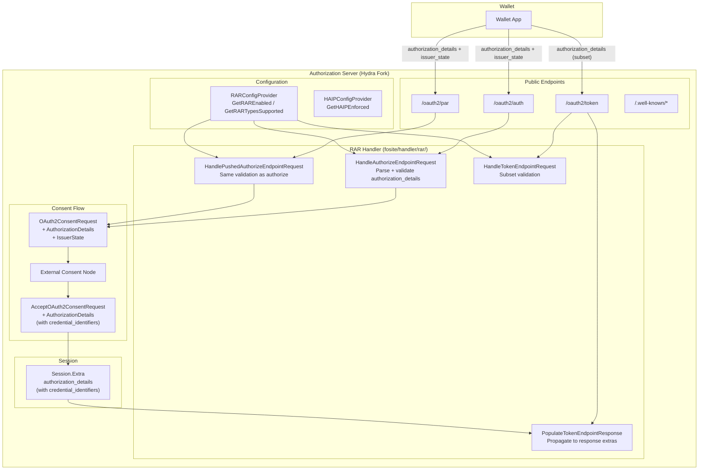

# Design Document: OIDC4VCI RAR & Consent Extensions

## Overview

This design implements the foundational OIDC4VCI infrastructure for the Hydra AS fork: Rich Authorization Requests (RFC 9396) handler, consent flow extensions for `authorization_details` propagation, `issuer_state` parameter support, scope-based credential request pass-through, and HAIP configuration infrastructure.

All other OIDC4VCI specs depend on the components built here. The RAR handler validates `authorization_details` on authorize/PAR/token endpoints. The consent type extensions carry RAR data through the consent challenge/accept cycle. Session propagation ensures `authorization_details` (with `credential_identifiers` set by the Consent Node) flows into token responses and introspection.

The scope is strictly the Authorization Server role. The Credential Issuer is a separate microservice that consumes access tokens via introspection — it is out of scope.

### Key Design Decisions

1. **Single handler, three interfaces**: `RARHandler` implements `AuthorizeEndpointHandler`, `PushedAuthorizeEndpointHandler`, and `TokenEndpointHandler`. The authorize/PAR methods validate `authorization_details`; the token methods handle subset validation and response propagation.
2. **Dual token endpoint behavior**: `CanHandleTokenEndpointRequest` gates subset validation (only when the token request contains `authorization_details`), while `PopulateTokenEndpointResponse` always runs to propagate session data into the response — these are independent concerns.
3. **Raw JSON propagation**: `authorization_details` is stored as `sqlxx.JSONRawMessage` / `json.RawMessage` throughout — the AS preserves the full structure without deserializing into typed structs. This keeps the AS agnostic to credential-type-specific fields.
4. **Consent Node owns `credential_identifiers`**: The AS never sets `credential_identifiers`. The Consent Node (or Token Hook) enriches `authorization_details` with identifiers. The AS propagates whatever the session contains and logs a warning if identifiers are missing.
5. **`issuer_state` is opaque**: Extracted from the request form, stored alongside the authorization session, forwarded to the Consent Node. No security decisions based on it.
6. **Config-gated registration**: `RARFactory` is registered in `ExtraFositeFactories()` only when `KeyRAREnabled` is true. `HAIPConfigProvider` is infrastructure-only in this spec — enforcement behavior is wired in a later spec.
7. **Additive upstream changes**: Consent type extensions and discovery metadata changes touch upstream files. All additions go at the end of structs/interfaces, marked with `// OIDC4VCI extension` comments, per fork maintenance strategy.

## Architecture



### Data Flow: authorization_details End-to-End

1. Wallet sends `authorization_details` parameter (JSON array) in PAR or Authorization request
2. `RARHandler.HandleAuthorizeEndpointRequest` / `HandlePushedAuthorizeEndpointRequest` parses and validates each object: checks `type` field against `GetRARTypesSupported()`, validates `credential_configuration_id` for `openid_credential` type
3. Validated `authorization_details` stored alongside the authorization session (in the request form for downstream consumption)
4. Consent challenge creation reads `authorization_details` from the authorization session → populates `OAuth2ConsentRequest.AuthorizationDetails`
5. Consent Node reads `authorization_details`, renders credential-specific consent UI, returns `AcceptOAuth2ConsentRequest.AuthorizationDetails` enriched with `credential_identifiers`
6. Consent accept processing merges `authorization_details` into `Session.Extra["authorization_details"]`
7. At token endpoint: `PopulateTokenEndpointResponse` copies `Session.Extra["authorization_details"]` into response extras
8. If token request also contains `authorization_details`: `HandleTokenEndpointRequest` validates the requested `credential_configuration_id` set is a subset of the authorized set
9. Introspection: Hydra's admin introspection endpoint (`oauth2/handler.go` → `introspectOAuth2Token`) maps `session.Extra` → `Introspection.Extra` (JSON key `"ext"`), so `authorization_details` appears at `ext.authorization_details` in the introspection response

### Data Flow: issuer_state

1. Wallet includes `issuer_state` as a form parameter in PAR or Authorization request
2. AS extracts `issuer_state` from the request form, stores alongside the authorization session
3. Consent challenge includes `issuer_state` in `OAuth2ConsentRequest.IssuerState`
4. Consent Node reads `issuer_state` for context binding (e.g., correlating with a Credential Offer)
5. `issuer_state` does not appear in the token response — it is consumed only by the Consent Node


## Components and Interfaces

### 1. RARHandler (`fosite/handler/rar/`)

The central component. A single struct implementing three Fosite handler interfaces.

**Struct:**
```go
type RARHandler struct {
    Config RARConfigProvider
}
```

**Interfaces implemented:**
- `fosite.AuthorizeEndpointHandler` — validates `authorization_details` on `/oauth2/auth`
- `fosite.PushedAuthorizeEndpointHandler` — validates `authorization_details` on `/oauth2/par`
- `fosite.TokenEndpointHandler` — subset validation + response propagation on `/oauth2/token`

**File layout:**
- `fosite/handler/rar/handler.go` — `RARHandler` struct, `HandleAuthorizeEndpointRequest`, `HandlePushedAuthorizeEndpointRequest`, shared `validateAuthorizationDetails` helper
- `fosite/handler/rar/token_handler.go` — `CanHandleTokenEndpointRequest`, `CanSkipClientAuth`, `HandleTokenEndpointRequest`, `PopulateTokenEndpointResponse`
- `fosite/handler/rar/handler_test.go` — unit tests and property-based tests
- `fosite/handler/rar/errors.go` — `ErrInvalidAuthorizationDetails` constant

#### AuthorizeEndpointHandler / PushedAuthorizeEndpointHandler

Both methods share the same validation logic via a private `validateAuthorizationDetails` function:

```
validateAuthorizationDetails(ctx, rawJSON string, config RARConfigProvider) ([]map[string]interface{}, error)
```

1. If `authorization_details` is empty/absent → return `nil, nil` (not responsible)
2. Parse JSON string as `[]map[string]interface{}`
3. If parse fails → return `ErrInvalidAuthorizationDetails.WithHint("malformed authorization_details JSON")`
4. For each object:
   a. Check `type` field exists → if missing: `ErrInvalidAuthorizationDetails.WithHint("missing type field")`
   b. Check `type` is in `config.GetRARTypesSupported(ctx)` → if not: `ErrInvalidAuthorizationDetails.WithHint("unsupported authorization_details type")`
   c. If `type == "openid_credential"`: check `credential_configuration_id` is present and non-empty → if missing: `ErrInvalidAuthorizationDetails.WithHint("credential_configuration_id required for openid_credential type")`
5. Return parsed array

The handler methods call `validateAuthorizationDetails`, and if the result is non-nil, store the original raw JSON string (not the re-serialized parsed array) in the request form for downstream consumption by the consent flow. The parsed array is used only for validation — the raw JSON is what gets propagated to avoid unnecessary serialization round-trips and potential field ordering changes.

#### TokenEndpointHandler

**`CanHandleTokenEndpointRequest(ctx, requester)`**
- Returns `true` when `requester.GetRequestForm().Get("authorization_details") != ""`
- This gates `HandleTokenEndpointRequest` for subset validation only

**`CanSkipClientAuth(ctx, requester)`**
- Always returns `false` — RAR never bypasses client authentication

**`HandleTokenEndpointRequest(ctx, requester)`**
1. Parse `authorization_details` from the token request form
2. Extract `credential_configuration_id` values from the token request's `authorization_details`
3. Read the authorized set from `session.Extra["authorization_details"]`
4. Extract `credential_configuration_id` values from the authorized set
5. Validate that every `credential_configuration_id` in the token request is present in the authorized set
6. If any ID is not in the authorized set → return `ErrInvalidAuthorizationDetails.WithHint("credential_configuration_id not previously authorized")`

**`PopulateTokenEndpointResponse(ctx, requester, responder)`**
1. Get session via `requester.GetSession()`, type-assert to `*oauth2.Session`
2. Read `session.Extra["authorization_details"]`
3. If present: `responder.SetExtra("authorization_details", authDetails)`
4. If present and any entry of type `openid_credential` is missing `credential_identifiers` or has an empty array: log a warning (the AS does not set these — the Consent Node or Token Hook is responsible)
5. If no `authorization_details` in session: return `fosite.ErrUnknownRequest` — handler is not responsible for this response. The response writer will skip this handler cleanly.

Note on Fosite pipeline behavior: In Fosite's token endpoint pipeline, `CanHandleTokenEndpointRequest` gates `HandleTokenEndpointRequest` only — it controls whether subset validation runs. `PopulateTokenEndpointResponse` is called on all registered `TokenEndpointHandler` implementations during the response phase (`NewAccessResponse` in `fosite/access_response_writer.go`), regardless of whether `CanHandleTokenEndpointRequest` returned `true` or `false` for the request phase. This means response propagation happens even when the token request itself did not contain `authorization_details`. When `PopulateTokenEndpointResponse` has nothing to propagate (no `authorization_details` in `Session.Extra`), it MUST return `fosite.ErrUnknownRequest` so the response writer skips it cleanly — returning `nil` would signal success without setting any tokens, which could interfere with other handlers.

### 2. ErrInvalidAuthorizationDetails (`fosite/handler/rar/errors.go`)

```go
var ErrInvalidAuthorizationDetails = &fosite.RFC6749Error{
    DescriptionField: "The authorization_details parameter is invalid.",
    ErrorField:       "invalid_authorization_details",
    CodeField:        http.StatusBadRequest,
}
```

Per RFC 9396 §5, the AS MUST use `invalid_authorization_details` (not `invalid_request`) for all RAR validation failures. Context is added via `.WithHint()` and `.WithDebugf()` at each call site.

### 3. Consent Type Extensions (`flow/consent_types.go`)

Additive fields on existing upstream structs. Added at the end of each struct before the closing brace, marked with `// OIDC4VCI extension` comments.

**`OAuth2ConsentRequest`** — new fields:
```go
// OIDC4VCI extension
AuthorizationDetails sqlxx.JSONRawMessage `json:"authorization_details,omitempty" db:"authorization_details"`
IssuerState          string               `json:"issuer_state,omitempty"          db:"issuer_state"`
```

**`AcceptOAuth2ConsentRequest`** — new field:
```go
// OIDC4VCI extension
AuthorizationDetails sqlxx.JSONRawMessage `json:"authorization_details,omitempty" db:"consent_authorization_details"`
```

These fields carry raw JSON arrays, preserving the full `authorization_details` structure without deserialization.

### 4. Session Propagation

After consent accept, the consent flow processing code merges `AcceptOAuth2ConsentRequest.AuthorizationDetails` into `Session.Extra["authorization_details"]`. This is an addition to the existing consent accept handler (likely in `consent/handler.go` or the consent strategy).

The merge logic:
1. If `AcceptOAuth2ConsentRequest.AuthorizationDetails` is non-nil and non-empty:
   - Unmarshal the JSON into `[]interface{}`
   - Set `session.Extra["authorization_details"] = unmarshaled`
2. If nil/empty: do not set the key (no `authorization_details` in session)

This ensures `authorization_details` flows through:
- Token issuance → response extras (via `PopulateTokenEndpointResponse`)
- Token introspection → `Session.Extra` is read by existing introspection code (see Introspection Path below)
- Refresh token exchange → `Session.Extra` is preserved across serialization/deserialization
- Token hook → `Session.Extra` is sent to the webhook, which can modify `credential_identifiers`

#### Introspection Response Structure

Hydra's admin introspection endpoint (`oauth2/handler.go` → `introspectOAuth2Token`) maps `session.Extra` → `Introspection.Extra`, which is serialized as `"ext"` in JSON. This means `authorization_details` appears at `ext.authorization_details` in the introspection response — NOT as a top-level `authorization_details` field.

The Credential Issuer (out of scope) must read `ext.authorization_details` from the introspection response. This is consistent with how all custom session data is exposed via Hydra's admin introspection endpoint (Path 1 from the introspection-context doc). No changes to the `Introspection` struct are needed — the existing `Extra map[string]interface{}` field handles this automatically.

If a future spec requires `authorization_details` as a top-level introspection field (per RFC 9396 §9), that would require adding an `AuthorizationDetails` field to the `oauth2.Introspection` struct and populating it in `introspectOAuth2Token()` (Option B from the introspection-context doc). This is explicitly out of scope for this spec.

### 5. issuer_state Extraction

The `issuer_state` parameter is extracted from the authorization/PAR request form and stored alongside the authorization session. This can be done:
- In the RAR handler's authorize/PAR methods (extract `issuer_state` from the request form and store it)
- Or in the consent challenge creation code (read from the request form when building `OAuth2ConsentRequest`)

The simpler approach is to extract it during consent challenge creation, since `issuer_state` is not part of RAR validation — it's a separate parameter that happens to travel alongside `authorization_details`. The consent challenge builder already reads the request form for other parameters.

### 5a. Consent API Handler Changes

The following existing functions require modification to wire the consent type extensions to the session:

**Consent challenge creation** (in `consent/strategy_default.go` or equivalent consent strategy):
- When building the `OAuth2ConsentRequest` from the authorization session, read `authorization_details` from the request form (stored by the RAR handler during authorize/PAR validation) and populate `OAuth2ConsentRequest.AuthorizationDetails`
- Read `issuer_state` from the request form and populate `OAuth2ConsentRequest.IssuerState`
- These fields are persisted to the `hydra_oauth2_flow` table via the existing consent request storage

**Consent accept processing** (in `consent/strategy_default.go` or equivalent):
- When processing `AcceptOAuth2ConsentRequest`, read `AcceptOAuth2ConsentRequest.AuthorizationDetails`
- If non-nil and non-empty: unmarshal the JSON into `[]interface{}` and set `session.Extra["authorization_details"] = unmarshaled`
- This is the merge point where Consent Node enrichments (including `credential_identifiers`) enter the token session

**Consent GET endpoint** (in `consent/handler.go`):
- The existing `getOAuth2ConsentRequest` handler already serializes the full `OAuth2ConsentRequest` struct to JSON — the new `AuthorizationDetails` and `IssuerState` fields will be included automatically via their `json:` tags

**Consent PUT/accept endpoint** (in `consent/handler.go`):
- The existing `acceptOAuth2ConsentRequest` handler already deserializes the request body into `AcceptOAuth2ConsentRequest` — the new `AuthorizationDetails` field will be parsed automatically via its `json:` tag

### 6. RARConfigProvider (`fosite/config.go`)

```go
// OIDC4VCI extension
type RARConfigProvider interface {
    GetRAREnabled(ctx context.Context) bool
    GetRARTypesSupported(ctx context.Context) []string
}
```

Embedded in `Configurator` interface in `fosite/fosite.go`. Implemented on `driver/config/DefaultProvider`. The runtime config adapter `fositex.Config` embeds `*config.DefaultProvider`, so it inherits the `RARConfigProvider` methods automatically — no separate delegation is needed.

### 7. HAIPConfigProvider (`fosite/config.go`)

```go
// OIDC4VCI extension
type HAIPConfigProvider interface {
    GetHAIPEnforced(ctx context.Context) bool
}
```

Infrastructure only in this spec. The config key is defined here; enforcement behavior (PAR required, PKCE S256 required) is wired in a later spec (`oidc4vci-haip-metadata`).

### 8. Config Keys (`driver/config/provider.go`)

| Key | Type | Default | Description |
|-----|------|---------|-------------|
| `KeyRAREnabled` | `bool` | `false` | Enable RAR handler registration |
| `KeyRARTypesSupported` | `[]string` | `["openid_credential"]` | Supported `authorization_details` type values |
| `KeyHAIPEnforced` | `bool` | `false` | HAIP enforcement flag (infrastructure only) |

Provider methods on `DefaultProvider`:
```go
func (p *DefaultProvider) GetRAREnabled(ctx context.Context) bool
func (p *DefaultProvider) GetRARTypesSupported(ctx context.Context) []string
func (p *DefaultProvider) GetHAIPEnforced(ctx context.Context) bool
```

Config schema properties added to `spec/config.json`:
- `rar.enabled` (boolean)
- `rar.types_supported` (array of strings)
- `haip.enforced` (boolean)

### 9. RARFactory (`fosite/compose/compose_rar.go`)

```go
func RARFactory(config fosite.Configurator, storage fosite.Storage, _ interface{}) interface{} {
    return &rar.RARHandler{
        Config: config.(rar.RARConfigProvider),
    }
}
```

Registered in `driver/registry_sql.go` via `ExtraFositeFactories()`, gated by `KeyRAREnabled`. `Compose()` type-asserts the returned `*rar.RARHandler` to `AuthorizeEndpointHandler`, `PushedAuthorizeEndpointHandler`, and `TokenEndpointHandler`, registering it in all three handler lists.

### 10. Registry Wiring (`driver/registry_sql.go`)

In `ExtraFositeFactories()`:
```go
if m.Config().GetRAREnabled(ctx) {
    factories = append(factories, compose.RARFactory)
}
```

No new storage accessors needed for RAR — the handler has no storage dependency (it reads from the request form and session).

### 11. Discovery Metadata (`oauth2/handler.go`)

New field on `oidcConfiguration` struct:
```go
// OIDC4VCI extension
AuthorizationDetailsTypesSupported []string `json:"authorization_details_types_supported,omitempty"`
```

Populated in `discoverOidcConfiguration()` when `GetRAREnabled(ctx)` returns true:
```go
if cfg.GetRAREnabled(ctx) {
    config.AuthorizationDetailsTypesSupported = cfg.GetRARTypesSupported(ctx)
}
```

### 12. Database Migration

A new migration adds columns to the existing flow table (Hydra uses `hydra_oauth2_flow` as the consolidated consent/flow table):

**Migration file:** `persistence/sql/migrations/YYYYMMDDHHMMSS_oidc4vci_consent_rar.up.sql`

```sql
-- Add authorization_details and issuer_state columns to the flow table
ALTER TABLE hydra_oauth2_flow ADD COLUMN authorization_details JSON NULL;
ALTER TABLE hydra_oauth2_flow ADD COLUMN issuer_state VARCHAR(4096) NULL DEFAULT '';
-- Add authorization_details column for consent accept data
ALTER TABLE hydra_oauth2_flow ADD COLUMN consent_authorization_details JSON NULL;
```

Down migration:
```sql
ALTER TABLE hydra_oauth2_flow DROP COLUMN authorization_details;
ALTER TABLE hydra_oauth2_flow DROP COLUMN issuer_state;
ALTER TABLE hydra_oauth2_flow DROP COLUMN consent_authorization_details;
```

Must support PostgreSQL, MySQL, CockroachDB, and SQLite. The `JSON` type maps to `TEXT` on SQLite and `JSONB` on PostgreSQL (handled by Pop migration framework).

### 13. Scope-Based Credential Request Pass-Through

The AS processes `scope` and `authorization_details` independently. No special handling is needed for scope-based credential requests at the AS level — the existing scope validation pipeline handles scope values. The AS:

- Does not reject requests containing both `scope` and `authorization_details`
- Does not interpret credential scope mappings (deferred to Credential Issuer integration spec)
- Silently ignores unknown scope values related to credential issuance (standard Hydra behavior with `WildcardScopeStrategy` or configured scope strategy)
- Passes both `scope` and `authorization_details` through to the consent flow and token response

The Credential Issuer applies the precedence rule (per OIDC4VCI §5.1.2) when consuming the introspection response.

### 14. PushedAuthorizeEndpointHandler Registration

`fositex.Config.LoadDefaultHandlers` currently handles type assertions for `AuthorizeEndpointHandler`, `TokenEndpointHandler`, `TokenIntrospector`, `RevocationHandler`, and `DeviceEndpointHandler` — but NOT `PushedAuthorizeEndpointHandler`. The RAR handler implements `PushedAuthorizeEndpointHandler`, so `LoadDefaultHandlers` must be extended to also check for this interface:

```go
if ph, ok := res.(fosite.PushedAuthorizeEndpointHandler); ok {
    c.pushedAuthorizeEndpointHandlers.Append(ph)
}
```

This requires adding a `pushedAuthorizeEndpointHandlers` field to `fositex.Config` and implementing `GetPushedAuthorizeEndpointHandlers(ctx) fosite.PushedAuthorizeEndpointHandlers` to satisfy `PushedAuthorizeRequestHandlersProvider`. Note: the existing PAR handler (`PushedAuthorizeHandlerFactory`) is NOT in `fositex.defaultFactories` — it's only in `compose.Compose()` defaults. If PAR is already working in Hydra without this, there may be a separate registration path. Verify during implementation whether the existing PAR handler is registered via a different mechanism before adding this.

### 15. Feature Documentation (`docs/features/rar-consent.md`)

A documentation file at `docs/features/rar-consent.md` describing:
- Feature overview: RAR handler, consent extensions, issuer_state, scope pass-through
- Configuration keys: `KeyRAREnabled`, `KeyRARTypesSupported`, `KeyHAIPEnforced` (infrastructure only)
- API surface: affected endpoints (`/oauth2/auth`, `/oauth2/par`, `/oauth2/token`, `/.well-known/openid-configuration`), new request/response parameters
- Error codes: `invalid_authorization_details` with all hint variants
- Consent flow changes: new fields on `OAuth2ConsentRequest` and `AcceptOAuth2ConsentRequest`
- Session propagation: `Session.Extra["authorization_details"]` lifecycle
- Introspection: `authorization_details` available at `ext.authorization_details`
- References: RFC 9396, OIDC4VCI spec sections, design docs in `docs/ai-context/`


## Data Models

### authorization_details JSON Structure

The `authorization_details` parameter is a JSON array of objects. Each object has at minimum a `type` field. For `type=openid_credential`, the `credential_configuration_id` field is required:

```json
[
  {
    "type": "openid_credential",
    "credential_configuration_id": "UniversityDegree_jwt_vc_json"
  },
  {
    "type": "openid_credential",
    "credential_configuration_id": "DriverLicense_mdoc",
    "credential_identifiers": ["cred-id-1", "cred-id-2"]
  }
]
```

The AS validates `type` and `credential_configuration_id`. All other fields (including `credential_identifiers`) are preserved as-is during propagation.

### Consent Type Extensions

**`OAuth2ConsentRequest`** (existing struct in `flow/consent_types.go`):

| Field (new) | Type | JSON | DB | Description |
|---|---|---|---|---|
| `AuthorizationDetails` | `sqlxx.JSONRawMessage` | `authorization_details,omitempty` | `authorization_details` | Raw `authorization_details` from the authorize request |
| `IssuerState` | `string` | `issuer_state,omitempty` | `issuer_state` | Opaque `issuer_state` from Credential Offer |

**`AcceptOAuth2ConsentRequest`** (existing struct in `flow/consent_types.go`):

| Field (new) | Type | JSON | DB | Description |
|---|---|---|---|---|
| `AuthorizationDetails` | `sqlxx.JSONRawMessage` | `authorization_details,omitempty` | `consent_authorization_details` | Enriched `authorization_details` with `credential_identifiers` |

### Session.Extra Layout

After consent accept, `Session.Extra` contains:

```go
session.Extra = map[string]interface{}{
    "authorization_details": []interface{}{
        map[string]interface{}{
            "type":                        "openid_credential",
            "credential_configuration_id": "UniversityDegree_jwt_vc_json",
            "credential_identifiers":      []interface{}{"cred-id-1", "cred-id-2"},
        },
    },
    // ... other extra claims (e.g., cnf.jkt from DPoP handler)
}
```

The `authorization_details` key holds the unmarshaled JSON array. This is the canonical location for `authorization_details` throughout the token lifecycle.

### Config Schema Properties (`spec/config.json`)

```json
{
  "rar": {
    "type": "object",
    "properties": {
      "enabled": {
        "type": "boolean",
        "default": false,
        "description": "Enable Rich Authorization Requests (RFC 9396) support."
      },
      "types_supported": {
        "type": "array",
        "items": { "type": "string" },
        "default": ["openid_credential"],
        "description": "Supported authorization_details type values."
      }
    }
  },
  "haip": {
    "type": "object",
    "properties": {
      "enforced": {
        "type": "boolean",
        "default": false,
        "description": "Enable HAIP enforcement (PAR required, PKCE S256 required). Infrastructure only — enforcement wired in oidc4vci-haip-metadata spec."
      }
    }
  }
}
```

### Token Response Extras

When `authorization_details` is present in `Session.Extra`, the token response includes:

```json
{
  "access_token": "...",
  "token_type": "Bearer",
  "authorization_details": [
    {
      "type": "openid_credential",
      "credential_configuration_id": "UniversityDegree_jwt_vc_json",
      "credential_identifiers": ["cred-id-1", "cred-id-2"]
    }
  ]
}
```

The `authorization_details` array is set via `responder.SetExtra("authorization_details", ...)` in `PopulateTokenEndpointResponse`.


## Correctness Properties

*A property is a characteristic or behavior that should hold true across all valid executions of a system — essentially, a formal statement about what the system should do. Properties serve as the bridge between human-readable specifications and machine-verifiable correctness guarantees.*

### Property 1: RAR Parsing and Validation

*For any* `authorization_details` JSON string, the `validateAuthorizationDetails` function should accept it if and only if it is a valid JSON array where every object has a `type` field in the configured `GetRARTypesSupported()` list and, for objects with `type=openid_credential`, a non-empty `credential_configuration_id` field. Malformed JSON, missing `type`, unsupported `type`, or missing `credential_configuration_id` should all produce an `invalid_authorization_details` error. The validation result must be identical whether invoked via `HandleAuthorizeEndpointRequest` or `HandlePushedAuthorizeEndpointRequest`.

**Validates: Requirements 1.1, 1.2, 1.3, 1.4, 1.5, 1.6, 1.7, 12.2**

### Property 2: RAR Token Request Subset Validation

*For any* token request containing `authorization_details` and any previously authorized set of `credential_configuration_id` values in the session, the handler should accept the request if and only if every `credential_configuration_id` in the token request is a member of the authorized set. A `credential_configuration_id` not in the authorized set should produce an `invalid_authorization_details` error. When the token request does not contain `authorization_details`, `CanHandleTokenEndpointRequest` should return `false` and no subset validation should occur.

**Validates: Requirements 2.1, 2.2, 2.3, 2.4, 2.5**

### Property 3: RAR Round-Trip Persistence

*For any* valid `authorization_details` array stored during the authorization phase, the same data should be retrievable in the consent challenge (`OAuth2ConsentRequest.AuthorizationDetails`), and after consent accept with enriched `authorization_details` (including `credential_identifiers`), the enriched data should be present in `Session.Extra["authorization_details"]` without loss or mutation.

**Validates: Requirements 1.9, 4.1, 4.2, 4.3, 8.1**

### Property 4: Token Response Contains authorization_details

*For any* session where `Session.Extra["authorization_details"]` is present, `PopulateTokenEndpointResponse` should copy the value into the access response extras under the `authorization_details` key. This should hold regardless of whether the token request itself contained an `authorization_details` parameter.

**Validates: Requirements 3.1, 3.2, 3.3**

### Property 5: RAR and Scope Independence

*For any* authorization request containing both `authorization_details` of type `openid_credential` and `scope` values, the AS should process each independently without conflict — both should be preserved through the consent flow and token response. Unknown scope values related to credential issuance should not cause an error.

**Validates: Requirements 7.1, 7.2, 7.3**

### Property 6: issuer_state Round-Trip

*For any* authorization or PAR request containing an `issuer_state` parameter, the value must be preserved through the consent flow and be available to the Consent Node in the `OAuth2ConsentRequest.IssuerState` field, identical to the original value.

**Validates: Requirements 6.1, 6.2**

### Property 7: Consent Node Can Enrich authorization_details

*For any* consent accept response that includes modified `authorization_details` (e.g., with added `credential_identifiers`), the AS must propagate the enriched data into `Session.Extra["authorization_details"]`, and the enriched data must appear in subsequent token responses and introspection responses.

**Validates: Requirements 4.2, 4.3, 8.1, 8.3, 8.4**

### Property 8: Refresh Token Preserves authorization_details

*For any* refresh token exchange where the original token was issued with `authorization_details` in `Session.Extra`, the new access token session must retain the same `authorization_details` data.

**Validates: Requirements 8.2**

### Property 9: credential_identifiers Warning Log

*For any* token response where `authorization_details` of type `openid_credential` is present but an entry is missing `credential_identifiers` (or has an empty array), the AS should log a warning message. The response should still be produced successfully — the warning is informational only.

**Validates: Requirements 3.4**

### Property 10: Discovery Metadata Reflects RAR Configuration

*For any* AS configuration where `GetRAREnabled()` returns `true`, the discovery metadata must include `authorization_details_types_supported` with the values from `GetRARTypesSupported()`. When `GetRAREnabled()` returns `false`, the field must be omitted.

**Validates: Requirements 13.1, 13.2**


## Error Handling

### RAR Validation Errors (RFC 9396 §5 — `invalid_authorization_details`)

All RAR validation failures use the `ErrInvalidAuthorizationDetails` error constant with contextual hints:

| Condition | Error Code | Hint |
|---|---|---|
| Malformed `authorization_details` JSON | `invalid_authorization_details` | "malformed authorization_details JSON" |
| Missing `type` field in object | `invalid_authorization_details` | "missing type field in authorization_details object" |
| Unsupported `type` value | `invalid_authorization_details` | "unsupported authorization_details type: {value}" |
| Missing `credential_configuration_id` for `openid_credential` | `invalid_authorization_details` | "credential_configuration_id required for openid_credential type" |
| Token request `credential_configuration_id` not in authorized set | `invalid_authorization_details` | "credential_configuration_id not previously authorized: {value}" |

All errors use HTTP 400 status code per RFC 9396. Debug information is only sent to clients when `GetSendDebugMessagesToClients()` returns true.

### Error Chaining Pattern

```go
return errors.WithStack(
    ErrInvalidAuthorizationDetails.
        WithHint("credential_configuration_id required for openid_credential type").
        WithDebugf("object at index %d missing credential_configuration_id", i),
)
```

### Non-Error Conditions

- Missing `authorization_details` parameter → handler returns `nil` (not responsible)
- Missing `credential_identifiers` in token response → warning log only, response still produced
- Unknown scope values → silently ignored (standard Hydra behavior)
- `issuer_state` parameter → opaque pass-through, no validation errors

## Testing Strategy

### Dual Testing Approach

Both unit tests and property-based tests are required for comprehensive coverage.

**Unit tests** cover:
- Specific examples: valid `authorization_details` with known credential configurations, subset validation with known sets
- Edge cases: malformed JSON, missing `type` field, empty `credential_configuration_id`, empty array, single-element array
- Integration points: consent flow round-trip with `authorization_details` enrichment, session merge, token response extras
- Error conditions: all error codes in the Error Handling section, `CanSkipClientAuth` always returns `false`
- Discovery metadata: `authorization_details_types_supported` present/absent based on config

**Property-based tests** cover:
- Properties 1–10 above, each implemented as a single property-based test
- Generators produce random valid/invalid `authorization_details` payloads, random `credential_configuration_id` sets, random `issuer_state` strings, random scope values

### Property-Based Testing Configuration

- **Library**: `pgregory.net/rapid` (Go property-based testing library)
- **Minimum iterations**: 100 per property test
- **Tag format**: Each test includes a comment referencing the design property:
  ```
  // Feature: oidc4vci-rar-consent, Property {N}: {property title}
  ```
- **Each correctness property is implemented by a single property-based test**

### Test Organization

- `fosite/handler/rar/handler_test.go` — Properties 1, 2, 4, 9 (RAR parsing, subset validation, response propagation, warning log)
- `flow/consent_rar_test.go` — Properties 3, 6, 7 (round-trip persistence, issuer_state, consent enrichment)
- `oauth2/rar_scope_test.go` — Property 5 (scope and RAR independence)
- `oauth2/rar_refresh_test.go` — Property 8 (refresh token preservation)
- `oauth2/handler_test.go` — Property 10 (discovery metadata)

### Generators

Property tests require generators for:

- **`authorization_details` JSON payloads** (valid): random arrays of objects with `type=openid_credential` and random `credential_configuration_id` strings. Generator ensures valid structure.
- **`authorization_details` JSON payloads** (invalid): random malformed JSON, objects missing `type`, objects with unsupported `type`, objects missing `credential_configuration_id`. Generator produces structurally invalid payloads.
- **`credential_configuration_id` sets**: random sets of non-empty strings for subset validation testing. Generator produces authorized sets and token request sets (subsets and non-subsets).
- **`issuer_state` strings**: random opaque strings (including empty, unicode, long strings).
- **Scope value sets**: random sets of scope strings, including known and unknown values.
- **`RARConfigProvider` mocks**: configurable `GetRAREnabled` and `GetRARTypesSupported` values for testing different configurations.

### Mapping to Parent Spec Properties

This spec implements the following properties from the parent spec (`oidc4vci-as-capabilities`):

| This Spec Property | Parent Spec Property | Description |
|---|---|---|
| Property 1 | Property 6 | RAR Parsing and Validation |
| Property 2 | Property 7 | RAR Token Request Subset Validation |
| Property 3 | Properties 8, 10 | RAR Round-Trip Persistence + RAR Flow-Through to Consent Node |
| Property 4 | Property 9 | Token Response Contains authorization_details |
| Property 5 | Properties 11, 16, 17 | RAR and Scope Precedence + Scope-Based Credential Request + Unknown Scope Tolerance |
| Property 6 | Property 15 | issuer_state Round-Trip |
| Property 7 | Property 23 | Consent Node Can Enrich authorization_details |

Properties 8 (refresh preservation), 9 (warning log), and 10 (discovery metadata) are additional properties specific to this spec's implementation scope.
