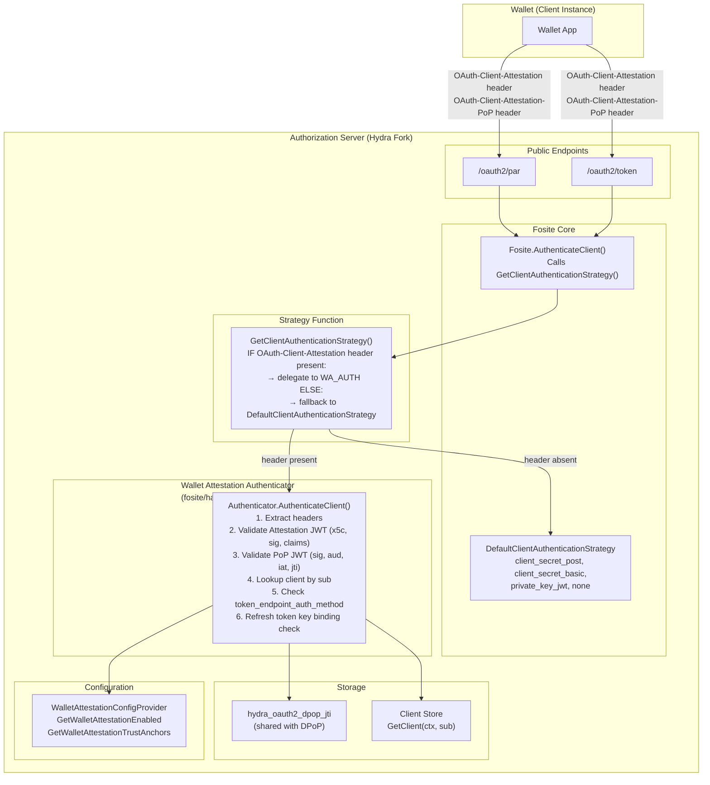

# Design Document: OIDC4VCI Wallet Attestation Client Authentication

## Overview

This design implements Wallet Attestation client authentication (`attest_jwt_client_auth`) for the Hydra AS fork per draft-ietf-oauth-attestation-based-client-auth-07, OIDC4VCI Appendix E, and HAIP §4.4.1. Wallet Attestation is a `ClientAuthenticationStrategy` — not a `TokenEndpointHandler` — that plugs into `Fosite.AuthenticateClient()` via `fositex.Config.GetClientAuthenticationStrategy()`. It validates two HTTP headers (`OAuth-Client-Attestation` and `OAuth-Client-Attestation-PoP`) containing JWTs, authenticates the Wallet instance, and returns the pre-registered `Wallet_Type_Client_Record`.

The authenticator lives in `fosite/handler/wallet_attestation/` following the handler package pattern from DPoP and Pre-Auth. It is NOT a handler — it does not implement `TokenEndpointHandler` or `PushedAuthorizeEndpointHandler`. It is a standalone authenticator struct whose `AuthenticateClient` method is called by the strategy function returned from `GetClientAuthenticationStrategy`.

This spec depends on Spec 1 (RAR) for config provider patterns, Spec 2 (DPoP) for `DPoPNonceStorage.IsJTIUsed/MarkJTIUsed` JTI replay detection and the `isPublicClient()` function that already treats `attest_jwt_client_auth` as public, and the existing `fosite/client_authentication.go` for `DefaultClientAuthenticationStrategy` fallback.

### Key Design Decisions

1. **ClientAuthenticationStrategy, not a handler**: The authenticator is a `ClientAuthenticationStrategy` function, not a Fosite handler. It receives `(ctx, *http.Request, url.Values)` and returns `(Client, error)`. This means it has direct access to HTTP headers — no form parameter injection needed (unlike DPoP).

2. **Circular dependency resolution via lazy setter**: `fositex.Config.GetClientAuthenticationStrategy()` needs access to the `*fosite.Fosite` instance for fallback to `DefaultClientAuthenticationStrategy`. The `Fosite` instance is created after `Config`. Resolution: add a `SetFositeInstance(*fosite.Fosite)` method on `fositex.Config`, called by `RegistrySQL.OAuth2Provider()` after creating the Fosite instance. The strategy closure captures the `Config` struct which holds the Fosite reference.

3. **JWT parsing with go-jose/v3**: Use `github.com/go-jose/go-jose/v3` (already used by the DPoP handler and fosite's JWT handling) for parsing JWTs without verification first (to extract headers/claims), then verify signature with the extracted key. The project currently uses v3 — the DPoP handler imports `github.com/go-jose/go-jose/v3` and `github.com/go-jose/go-jose/v3/jwt`.

4. **X.509 chain validation via Go stdlib**: Use `crypto/x509.Certificate.Verify()` with a `CertPool` containing configured trust anchors. The `x5c` chain from the JWT header is decoded from base64 DER, parsed into `*x509.Certificate` objects, and the leaf cert's public key is used for signature verification.

5. **JTI replay via DPoP's storage**: Reuse `DPoPNonceStorage.IsJTIUsed/MarkJTIUsed` for PoP JWT `jti` replay detection. The DPoP JTI table (`hydra_oauth2_dpop_jti`) stores JTI values with expiry — same table serves both DPoP and Wallet Attestation PoP JTIs. Collision between DPoP JTIs and PoP JTIs is negligible (both are cryptographically random UUIDs).

6. **Refresh token binding via session extra**: Store the Client Instance Key's JWK thumbprint (SHA-256, base64url) in `session.Extra["wallet_attestation_cnf_jkt"]` when a refresh token is issued via Wallet Attestation. On refresh, compare the current attestation's `cnf.jwk` thumbprint against the stored value.

7. **Error pattern**: All errors use `invalid_client` (HTTP 401) with specific `.WithHint()` messages, following OAuth 2.0 convention for client authentication failures. An optional `invalid_client_attestation` error is also defined per draft-07 §6.2.

## Architecture



### Authentication Flow

1. Wallet sends `POST /oauth2/token` (or `/oauth2/par`) with `OAuth-Client-Attestation` and `OAuth-Client-Attestation-PoP` HTTP headers
2. Fosite core calls `Fosite.AuthenticateClient(ctx, r, form)`
3. `AuthenticateClient` calls `Config.GetClientAuthenticationStrategy(ctx)` which returns a non-nil strategy function (when Wallet Attestation is enabled)
4. Strategy function checks `r.Header.Get("OAuth-Client-Attestation")`:
   - If present → delegates to `Authenticator.AuthenticateClient(ctx, r, form)`
   - If absent → falls back to `fositeInstance.DefaultClientAuthenticationStrategy(ctx, r, form)`
5. `Authenticator.AuthenticateClient` validates the Attestation JWT (x5c chain, signature, typ, claims), then validates the PoP JWT (signature with cnf key, typ, aud, iat, jti), then looks up the client by `sub`, verifies `token_endpoint_auth_method == "attest_jwt_client_auth"`, and returns the client
6. For refresh token requests, the authenticator additionally verifies the `cnf.jwk` thumbprint matches the stored binding

## Components and Interfaces

### 1. Wallet Attestation Authenticator (`fosite/handler/wallet_attestation/`)

The central component. A struct that validates Wallet Attestation headers and returns an authenticated client.

**Struct:**
```go
type Authenticator struct {
    Config     WalletAttestationConfigProvider
    Store      fosite.Storage
    JTIStore   JTIStorage
    IssuerURL  func(ctx context.Context) string
}
```

**File layout:**
- `fosite/handler/wallet_attestation/authenticator.go` — `Authenticator` struct, `AuthenticateClient` method, attestation JWT validation, PoP JWT validation
- `fosite/handler/wallet_attestation/errors.go` — `ErrInvalidWalletAttestation`, `ErrInvalidClientAttestation` error constants
- `fosite/handler/wallet_attestation/storage.go` — `JTIStorage` interface (type alias for the subset of `DPoPNonceStorage` needed)
- `fosite/handler/wallet_attestation/authenticator_test.go` — unit tests and property-based tests

**No compile-time handler interface checks** — this is not a handler. The authenticator is wired via the strategy function, not via `Compose()`.

#### `AuthenticateClient(ctx, r, form) (fosite.Client, error)`

Validation pipeline (order follows draft-07 §6.1 recommendation: attestation first, then PoP):

**Phase 1: Client Attestation JWT Validation (draft-07 §5.1, §9)**

1. Extract `OAuth-Client-Attestation` header from `r.Header.Get(...)`. If empty → return error (should not happen — strategy only calls when header present).
2. Parse the JWT using `jose.ParseSigned(attestationString)`. If parse fails → `invalid_client` with hint "Wallet Attestation is not a well-formed JWT".
3. Validate `typ` JOSE header == `oauth-client-attestation+jwt`. If wrong → `invalid_client`.
4. Validate `alg` JOSE header: not `none`, not symmetric (`HS*`), is a supported asymmetric algorithm. If unsupported → `invalid_client`.
5. Extract `x5c` JOSE header. If missing → `invalid_client` with hint "missing x5c JOSE header".
6. Decode `x5c` chain: base64-decode each entry, `x509.ParseCertificate()` each. If any fails → `invalid_client`.
7. **HAIP check**: Verify leaf cert is not self-signed (issuer != subject OR self-signature check fails). If self-signed → `invalid_client`.
8. **HAIP check**: Verify trust anchor is not in the `x5c` chain (compare raw cert bytes against each trust anchor). If found → `invalid_client`.
9. Build `x509.CertPool` with configured trust anchors. Call `leafCert.Verify(x509.VerifyOptions{Roots: trustPool, Intermediates: intermediatePool})`. If fails → `invalid_client` with hint "certificate chain is not trusted".
10. Verify JWT signature using leaf cert's public key: `parsedJWT.Claims(leafCert.PublicKey, &claims)`. If fails → `invalid_client`.
11. Validate `exp` claim: not expired (with clock skew tolerance). If expired → `invalid_client`.
12. Validate `nbf` claim (if present): current time >= nbf. If not yet valid → `invalid_client`.
13. Validate `iss` claim is present. If missing → `invalid_client`.
14. Extract `sub` claim — this is the `client_id`.
15. Extract `cnf` claim with `jwk` representation. If missing or invalid → `invalid_client`.
16. Validate `cnf.jwk` is a public key (no `d` parameter for EC, no private key type assertion). If private key → `invalid_client`.
17. If `form.Get("client_id")` is non-empty, verify it matches `sub`. If mismatch → `invalid_client`.

**Phase 2: Client Attestation PoP JWT Validation (draft-07 §5.2, §9)**

18. Extract `OAuth-Client-Attestation-PoP` header. If missing → `invalid_client` with hint "PoP header is required".
19. Parse the PoP JWT. If parse fails → `invalid_client`.
20. Validate `typ` JOSE header == `oauth-client-attestation-pop+jwt`. If wrong → `invalid_client`.
21. Validate `alg` JOSE header: same rules as attestation JWT. If unsupported → `invalid_client`.
22. Verify PoP JWT signature using the public key from `cnf.jwk` (extracted in step 15). If fails → `invalid_client`.
23. Validate `iss` claim matches `sub` from attestation JWT. If mismatch → `invalid_client`.
24. Validate `aud` claim matches AS Issuer Identifier (`Authenticator.IssuerURL(ctx)`). If mismatch → `invalid_client`.
25. Validate `iat` claim: present, recent (within configurable freshness window, default 60s), not too far in the future (5s tolerance). If stale/future → `invalid_client`.
26. Validate `jti` claim: present, unique via `JTIStore.IsJTIUsed(ctx, jti)`. If used → `invalid_client`. If unique → `JTIStore.MarkJTIUsed(ctx, jti, time.Now().Add(freshnessWindow))`.
27. Validate `nbf` claim (if present). If not yet valid → `invalid_client`.

**Phase 3: Client Lookup and Auth Method Check**

28. Look up client via `Store.GetClient(ctx, sub)`. If not found → `invalid_client` with hint "No client record found for wallet type".
29. Type-assert to `OpenIDConnectClient`, check `GetTokenEndpointAuthMethod() == "attest_jwt_client_auth"`. If mismatch → `invalid_client`.

**Phase 4: Refresh Token Key Binding Check (draft-07 §10.3)**

30. If `form.Get("grant_type") == "refresh_token"`, compute JWK thumbprint of `cnf.jwk` (SHA-256, base64url). Read stored binding from the session (via the access requester's session `Extra["wallet_attestation_cnf_jkt"]`). If stored binding exists and doesn't match → `invalid_client` with hint "Refresh token is bound to a different client instance key".

Note: The refresh token binding storage/comparison at step 30 requires access to the existing session, which is available through the access requester that Fosite passes to the token endpoint handlers. The `ClientAuthenticationStrategy` function itself does not have access to the session — the binding check is deferred to a lightweight `TokenEndpointHandler` (see Component 4 below) that runs after client authentication succeeds.

31. Return the client.

### 2. Strategy Function Integration (`fositex/config.go`)

**Problem**: `GetClientAuthenticationStrategy()` currently returns `nil`. It needs to return a strategy that checks for the attestation header and delegates accordingly. The strategy needs access to the `*fosite.Fosite` instance for fallback.

**Solution**: Lazy setter pattern.

```go
// In fositex/config.go
type Config struct {
    // ... existing fields ...
    fositeInstance *fosite.Fosite // set after Fosite creation
}

func (c *Config) SetFositeInstance(f *fosite.Fosite) {
    c.fositeInstance = f
}

func (c *Config) GetClientAuthenticationStrategy(ctx context.Context) fosite.ClientAuthenticationStrategy {
    if !c.GetWalletAttestationEnabled(ctx) {
        return nil
    }
    return func(ctx context.Context, r *http.Request, form url.Values) (fosite.Client, error) {
        if r.Header.Get("OAuth-Client-Attestation") != "" {
            return c.walletAttestationAuthenticator.AuthenticateClient(ctx, r, form)
        }
        return c.fositeInstance.DefaultClientAuthenticationStrategy(ctx, r, form)
    }
}
```

The `walletAttestationAuthenticator` is lazily initialized on `Config` (nil-check pattern) when `GetClientAuthenticationStrategy` is first called with Wallet Attestation enabled.

**Wiring in `driver/registry_sql.go`**:
```go
func (m *RegistrySQL) OAuth2Provider() fosite.OAuth2Provider {
    if m.fop == nil {
        // ... existing creation ...
        m.fop = fosite.NewOAuth2Provider(storage, config)
        config.SetFositeInstance(m.fop.(*fosite.Fosite))
    }
    return m.fop
}
```

### 3. JTI Storage Interface (`fosite/handler/wallet_attestation/storage.go`)

```go
// JTIStorage provides JTI replay detection for Wallet Attestation PoP JWTs.
// This is a subset of dpop.DPoPNonceStorage — the same table and methods
// serve both DPoP proof JTI and Wallet Attestation PoP JTI replay detection.
type JTIStorage interface {
    IsJTIUsed(ctx context.Context, jti string) (bool, error)
    MarkJTIUsed(ctx context.Context, jti string, expiry time.Time) error
}
```

This is satisfied by `persistence/sql/Persister` which already implements these methods for DPoP. No new storage interface or table needed.

### 4. Refresh Token Binding Handler (`fosite/handler/wallet_attestation/`)

A lightweight `TokenEndpointHandler` that stores the Client Instance Key thumbprint in the session when a refresh token is issued via Wallet Attestation, and verifies it on refresh.

This is needed because the `ClientAuthenticationStrategy` function does not have access to the session — it only returns a `Client`. The binding storage and comparison must happen in the token endpoint handler lifecycle.

```go
type RefreshBindingHandler struct {
    Config WalletAttestationConfigProvider
}

var _ fosite.TokenEndpointHandler = (*RefreshBindingHandler)(nil)
```

**`CanHandleTokenEndpointRequest`**: Returns `true` when the client's `token_endpoint_auth_method` is `attest_jwt_client_auth`.

**`CanSkipClientAuth`**: Returns `false`.

**`HandleTokenEndpointRequest`**: For `grant_type=refresh_token`, reads the stored `wallet_attestation_cnf_jkt` from the session and compares it against the current request's `cnf.jwk` thumbprint (stored in the request context by the authenticator). If mismatch → `invalid_client`.

**`PopulateTokenEndpointResponse`**: Computes the JWK thumbprint of the current `cnf.jwk` and stores it in `session.Extra["wallet_attestation_cnf_jkt"]` for future refresh token binding checks.

The authenticator stores the validated `cnf.jwk` in the request context (via a context key) so the handler can access it without re-parsing.

### 5. WalletAttestationConfigProvider (`fosite/config.go`)

```go
// OIDC4VCI extension
type WalletAttestationConfigProvider interface {
    GetWalletAttestationEnabled(ctx context.Context) bool
    GetWalletAttestationTrustAnchors(ctx context.Context) []*x509.Certificate
}
```

Embedded in `Configurator` interface in `fosite/fosite.go`. Implemented on `driver/config/DefaultProvider`. `fositex.Config` inherits via embedded `*config.DefaultProvider`. Compile-time check in `fositex/config.go`.

### 6. Config Keys (`driver/config/provider.go`)

| Key | Type | Default | Description |
|-----|------|---------|-------------|
| `KeyWalletAttestationEnabled` | `bool` | `false` | Enable Wallet Attestation authenticator |
| `KeyWalletAttestationTrustAnchors` | `[]string` | `[]` | PEM-encoded trust anchor certificates |

Config schema properties in `spec/config.json`:
- `wallet_attestation.enabled` (boolean)
- `wallet_attestation.trust_anchors` (array of strings, PEM-encoded)

`GetWalletAttestationTrustAnchors` parses PEM strings into `[]*x509.Certificate` on each call (or with caching). Malformed PEM entries are logged and skipped.

### 7. Error Constants (`fosite/handler/wallet_attestation/errors.go`)

```go
var ErrInvalidWalletAttestation = &fosite.RFC6749Error{
    DescriptionField: "The wallet attestation is invalid.",
    ErrorField:       "invalid_client",
    CodeField:        http.StatusUnauthorized,
}

var ErrInvalidClientAttestation = &fosite.RFC6749Error{
    DescriptionField: "The client attestation could not be verified.",
    ErrorField:       "invalid_client_attestation",
    CodeField:        http.StatusUnauthorized,
}
```

Context is added via `.WithHint()` and `.WithDebugf()` at each call site.

### 8. Wallet Attestation Factory and Registry Wiring

**Factory** (`fosite/compose/compose_wallet_attestation.go`):
```go
func WalletAttestationRefreshBindingFactory(config fosite.Configurator, storage fosite.Storage, _ interface{}) interface{} {
    return &wallet_attestation.RefreshBindingHandler{
        Config: config.(wallet_attestation.WalletAttestationConfigProvider),
    }
}
```

Registered in `driver/registry_sql.go` via `ExtraFositeFactories()`, gated by `KeyWalletAttestationEnabled`. `LoadDefaultHandlers` type-asserts to `TokenEndpointHandler`.

The `Authenticator` itself is NOT registered via the factory pattern — it is created lazily on `fositex.Config` and used by the strategy function.

### 9. Endpoint Handler Changes

**None required for header access.** Unlike DPoP (which needs form injection because handlers receive `AccessRequester`), the `ClientAuthenticationStrategy` receives the raw `*http.Request` directly. The authenticator reads headers via `r.Header.Get(...)`.

### 10. Context Key for cnf.jwk Propagation

```go
type contextKey string
const WalletAttestationCNFContextKey contextKey = "wallet_attestation_cnf_jwk"
```

The authenticator stores the validated `cnf.jwk` (`*jose.JSONWebKey`) in the context after successful authentication. The `RefreshBindingHandler` reads it to compute the JWK thumbprint for session storage and binding checks.

## Data Models

### Session.Extra Layout After Wallet Attestation Authentication

```go
session.Extra = map[string]interface{}{
    // Stored by RefreshBindingHandler.PopulateTokenEndpointResponse:
    "wallet_attestation_cnf_jkt": "0ZcOCORZNYy-DWpqq30jZyJGHTN0d2HglBV3uiguA4I",
    // ... other extras from DPoP, authorization_details, etc.
}
```

The `wallet_attestation_cnf_jkt` is the base64url-encoded SHA-256 JWK Thumbprint (RFC 7638) of the Client Instance Key from the `cnf` claim. This is compared on refresh token requests per draft-07 §10.3.

### Files Created/Modified

**New files:**
- `fosite/handler/wallet_attestation/authenticator.go` — Authenticator struct and validation logic
- `fosite/handler/wallet_attestation/errors.go` — Error constants
- `fosite/handler/wallet_attestation/storage.go` — JTIStorage interface
- `fosite/handler/wallet_attestation/authenticator_test.go` — Tests
- `fosite/compose/compose_wallet_attestation.go` — Factory for RefreshBindingHandler
- `docs/features/wallet-attestation.md` — Feature documentation

**Modified files:**
- `fosite/config.go` — Add `WalletAttestationConfigProvider` interface
- `fosite/fosite.go` — Embed `WalletAttestationConfigProvider` in `Configurator`
- `fositex/config.go` — Add `fositeInstance` field, `SetFositeInstance()`, update `GetClientAuthenticationStrategy()`, add compile-time check, lazy init authenticator
- `driver/config/provider.go` — Add `KeyWalletAttestationEnabled`, `KeyWalletAttestationTrustAnchors`, getter methods
- `driver/registry_sql.go` — Add `WalletAttestationRefreshBindingFactory` to `ExtraFositeFactories()` (gated), call `SetFositeInstance()`
- `spec/config.json` — Add `wallet_attestation.enabled`, `wallet_attestation.trust_anchors` properties


## Correctness Properties

*A property is a characteristic or behavior that should hold true across all valid executions of a system — essentially, a formal statement about what the system should do. Properties serve as the bridge between human-readable specifications and machine-verifiable correctness guarantees.*

### Property 1: End-to-end Wallet Attestation Authentication

*For any* valid Client Attestation JWT (signed by a trusted Wallet Provider with a valid x5c chain, correct typ, non-expired, with valid cnf) and any valid PoP JWT (signed by the cnf key, correct typ, matching iss/sub/aud, fresh iat, unique jti), when a pre-registered client exists with `token_endpoint_auth_method=attest_jwt_client_auth` and `client_id` matching the attestation `sub`, the authenticator should return that client without error.

**Validates: Requirements 1.1, 1.3, 1.4, 1.5, 1.7, 1.9, 1.11, 1.13, 1.14, 1.15, 3.1, 3.2, 3.3, 3.4, 3.5, 3.6, 3.7, 3.8, 5.4, 5.5**

### Property 2: X.509 Certificate Chain Validation with HAIP Rules

*For any* x5c certificate chain and any set of trust anchors, the authenticator should: (a) accept chains that terminate at a configured trust anchor with no trust anchor in the chain and a non-self-signed leaf, (b) reject chains where the trust anchor appears in the x5c array, (c) reject chains where the leaf certificate is self-signed, and (d) reject chains that do not terminate at any configured trust anchor.

**Validates: Requirements 1.7, 1.8, 2.1, 2.2**

### Property 3: Signature Verification Binds Attestation to Wallet Provider and PoP to Client Instance

*For any* Client Attestation JWT and PoP JWT pair, the attestation signature should verify only with the leaf certificate's public key from the x5c chain, and the PoP signature should verify only with the public key from the attestation's cnf.jwk claim. Signing with any other key should cause rejection.

**Validates: Requirements 1.9, 1.10, 3.4**

### Property 4: Cross-JWT Claim Consistency

*For any* combination of attestation `sub`, PoP `iss`, and form `client_id` (when present), the authenticator should accept only when all present values are equal. Any mismatch among the three should cause rejection with `invalid_client`.

**Validates: Requirements 1.14, 3.5, 5.8**

### Property 5: Temporal Claim Validation

*For any* attestation JWT with `exp` and optional `nbf`, and any PoP JWT with `iat` and optional `nbf`, the authenticator should: (a) reject expired attestations (exp < now - skew), (b) reject not-yet-valid attestations (now < nbf - skew), (c) reject stale PoP JWTs (iat < now - freshness_window), (d) reject future PoP JWTs (iat > now + 5s), and (e) reject not-yet-valid PoP JWTs (now < nbf - skew). All other temporal combinations should be accepted.

**Validates: Requirements 1.11, 1.12, 3.7, 3.10**

### Property 6: PoP JTI Replay Detection

*For any* sequence of PoP JWTs, the authenticator should accept the first occurrence of each unique `jti` value and reject any subsequent occurrence of the same `jti` within the replay detection window. After the window expires, the same `jti` may be accepted again.

**Validates: Requirements 3.8, 3.9**

### Property 7: Strategy Routing — Header Presence Determines Authentication Path

*For any* HTTP request, when Wallet Attestation is enabled: (a) if the `OAuth-Client-Attestation` header is present, the strategy delegates to the Wallet Attestation authenticator, (b) if the header is absent, the strategy delegates to `DefaultClientAuthenticationStrategy`. When Wallet Attestation is disabled, the strategy returns nil (Fosite uses default directly).

**Validates: Requirements 5.1, 5.2, 5.7, 6.1**

### Property 8: Refresh Token Binding Round-Trip

*For any* token request authenticated via Wallet Attestation that produces a refresh token, the Client Instance Key thumbprint stored in the session should equal the JWK Thumbprint (SHA-256) of the `cnf.jwk` from the attestation. On a subsequent refresh request, the authenticator should accept only when the new attestation's `cnf.jwk` thumbprint matches the stored value, and reject when a different key is used.

**Validates: Requirements 7.1, 7.3**

### Property 9: Public Key Only in cnf Claim

*For any* JWK in the attestation's `cnf.jwk`, the authenticator should accept only public keys (EC public key, RSA public key) and reject any JWK containing private key material (EC private key with `d` parameter, RSA private key).

**Validates: Requirements 1.17**

### Property 10: Attestation JWT Reuse with Fresh PoP

*For any* valid Client Attestation JWT, presenting it in multiple consecutive requests with distinct PoP JWTs (each with a unique `jti`) should succeed for all requests. The replay protection applies only to the PoP JWT's `jti`, not to the attestation JWT itself.

**Validates: Requirements 12.1**

### Property 11: Unknown Claims Tolerance

*For any* valid Client Attestation JWT containing additional unknown claims beyond the required set (`iss`, `sub`, `exp`, `cnf`), the authenticator should accept the JWT without error. Unknown claims must be ignored per draft-07 §5.1 rule 1.

**Validates: Requirements 1.18**

## Error Handling

All Wallet Attestation validation errors use the `invalid_client` OAuth 2.0 error code (HTTP 401) with specific `.WithHint()` messages. This follows OAuth 2.0 convention — client authentication failures always use `invalid_client`. The optional `invalid_client_attestation` error code from draft-07 §6.2 is available for more specific error reporting.

Error hints are descriptive and actionable:
- "Wallet Attestation is not a well-formed JWT"
- "Wallet Attestation typ must be oauth-client-attestation+jwt"
- "Wallet Attestation uses unsupported signing algorithm"
- "Wallet Attestation is missing the x5c JOSE header"
- "Wallet Attestation signing certificate must not be self-signed"
- "Trust anchor must not be included in x5c chain"
- "Wallet Attestation certificate chain is not trusted"
- "Wallet Attestation signature verification failed"
- "Wallet Attestation is expired"
- "Wallet Attestation is not yet valid"
- "Wallet Attestation is missing iss claim"
- "Wallet Attestation sub does not match client_id"
- "Wallet Attestation is missing the cnf claim"
- "Wallet Attestation cnf must contain a public key only"
- "OAuth-Client-Attestation-PoP header is required"
- "PoP JWT typ must be oauth-client-attestation-pop+jwt"
- "PoP JWT uses unsupported signing algorithm"
- "PoP JWT signature verification failed"
- "PoP JWT iss does not match client_id"
- "PoP JWT aud does not match AS issuer"
- "PoP JWT iat is not recent"
- "PoP JWT jti has already been used"
- "PoP JWT is not yet valid"
- "No client record found for wallet type"
- "Client is not configured for attestation-based authentication"
- "Refresh token is bound to a different client instance key"

Debug details (via `.WithDebugf()`) are only sent when `GetSendDebugMessagesToClients()` returns true.

## Testing Strategy

**Dual Testing Approach:**

- Unit tests: specific examples, edge cases, error conditions for each validation step
- Property tests: universal properties across all inputs using `pgregory.net/rapid`

**Property Test Configuration:**
- Minimum 100 iterations per property test
- Each property test references its design document property
- Tag format: `Feature: oidc4vci-wallet-attestation, Property {number}: {property_text}`

**Unit tests focus on:**
- Specific error messages for each validation failure
- HAIP-specific edge cases (self-signed leaf, trust anchor in chain)
- ES256 algorithm support verification
- Integration with mock storage for JTI replay
- Fallback behavior when headers are absent
- Client lookup with various `token_endpoint_auth_method` values

**Property tests focus on:**
- End-to-end authentication with generated valid/invalid JWT pairs (Property 1)
- X.509 chain validation with generated certificate hierarchies (Property 2)
- Signature verification with generated key pairs (Property 3)
- Cross-JWT claim consistency with generated claim combinations (Property 4)
- Temporal claim validation with generated timestamps (Property 5)
- JTI replay detection with generated jti sequences (Property 6)
- Strategy routing with generated request configurations (Property 7)
- Refresh token binding round-trip with generated key pairs (Property 8)
- Public/private key discrimination (Property 9)
- Attestation reuse with fresh PoP JWTs (Property 10)
- Unknown claims tolerance (Property 11)

**Test helpers:**
- `generateTestCA()` — creates a test CA certificate and key
- `generateTestLeafCert(ca)` — creates a leaf cert signed by the CA
- `generateTestAttestationJWT(leafKey, claims)` — creates a signed attestation JWT
- `generateTestPoPJWT(cnfKey, claims)` — creates a signed PoP JWT
- `newMockJTIStore()` — in-memory JTI store for testing

**PBT library:** `pgregory.net/rapid` per coding rules.
