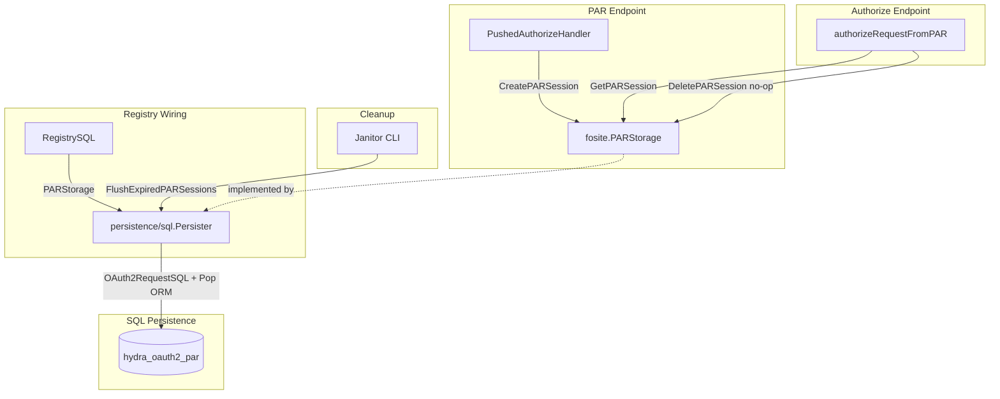

# Design Document: Persisted PAR Storage

## Overview

This design replaces the in-memory `inMemoryPARStorage` in `driver/registry_par.go` with a SQL-backed implementation that persists PAR sessions in a new `hydra_oauth2_par` table. The SQL persister implements the existing `fosite.PARStorage` interface (`CreatePARSession`, `GetPARSession`, `DeletePARSession`) plus a `FlushExpiredPARSessions` method for TTL-based cleanup.

The key insight is that PAR sessions can reuse the existing `OAuth2RequestSQL` model and `createSession`/`findSessionBySignature` infrastructure — the same pattern used for authorization codes, access tokens, refresh tokens, OIDC sessions, and PKCE sessions. This avoids defining a new model struct and custom serialization/deserialization logic. The `hydra_oauth2_par` table has the same schema as `hydra_oauth2_code` and friends, and the `OAuth2RequestSQL.TableName()` method dynamically generates the table name from a `tableName` constant (`sqlTablePAR = "par"` → `"hydra_oauth2_par"`).

The key challenge is preserving the behavioral semantics of the in-memory implementation:
- `DeletePARSession` remains a no-op (consent flow calls `/oauth2/auth` three times, each re-resolving the `request_uri`).
- `GetPARSession` enriches the stored request with `response_type` from the current HTTP request context.
- Sessions expire via TTL (`expires_at`), not explicit deletion.

## Architecture



The `RegistrySQL.PARStorage()` method returns `m.Persister().(fosite.PARStorage)`, following the same pattern as `PreAuthorizedCodeStorage()`. The `inMemoryPARStorage` struct, `newInMemoryPARStorage()`, and the `parStore` field on `RegistrySQL` are removed.

## Components and Interfaces

### Reusing OAuth2RequestSQL (No Custom Model)

Instead of defining a new `PARSessionSQL` struct, the implementation reuses the existing `OAuth2RequestSQL` model from `persistence/sql/persister_oauth2.go`. A new `sqlTablePAR` constant is added:

```go
const (
    sqlTableOpenID  tableName = "oidc"
    sqlTableAccess  tableName = "access"
    sqlTableRefresh tableName = "refresh"
    sqlTableCode    tableName = "code"
    sqlTablePKCE    tableName = "pkce"
    sqlTablePAR     tableName = "par"    // NEW
)
```

This means `OAuth2RequestSQL{Table: sqlTablePAR}.TableName()` returns `"hydra_oauth2_par"`, and all existing serialization/deserialization infrastructure (`sqlSchemaFromRequest`, `toRequest`, `createSession`, `findSessionBySignature`) works out of the box.

### Provided Source Code

The user has provided working source code for the PAR persister methods. This code is the basis for the implementation in `persistence/sql/persister_par.go`:

```go
func (p *Persister) CreatePARSession(ctx context.Context, requestURI string, requester fosite.AuthorizeRequester) (err error) {
    ctx, span := p.r.Tracer(ctx).Tracer().Start(ctx, "persistence.sql.CreatePARSession")
    defer otelx.End(span, &err)
    return p.createSession(ctx, requestURI, requester, sqlTablePAR, requester.GetSession().GetExpiresAt(fosite.PushedAuthorizeRequestContext))
}

func (p *Persister) GetPARSession(ctx context.Context, requestURI string) (request fosite.AuthorizeRequester, err error) {
    ctx, span := p.r.Tracer(ctx).Tracer().Start(ctx, "persistence.sql.GetPARSession")
    defer otelx.End(span, &err)
    req, err := p.findSessionBySignature(ctx, requestURI, &oauth2.Session{}, sqlTablePAR)
    if err != nil {
        return nil, err
    }
    r, ok := req.(*fosite.Request)
    if !ok {
        return nil, fosite.ErrServerError.WithDebugf("Expected request to be of type *fosite.Request but got %T", req)
    }
    ar := &fosite.AuthorizeRequest{Request: *r}
    // Populate AuthorizeRequest specific fields from Form
    if r.Form != nil {
        ar.ResponseTypes = fosite.RemoveEmpty(strings.Split(r.Form.Get("response_type"), " "))
        if ruri := r.Form.Get("redirect_uri"); ruri != "" {
            if u, err := url.Parse(ruri); err == nil {
                ar.RedirectURI = u
            }
        }
        ar.State = r.Form.Get("state")
        ar.ResponseMode = fosite.ResponseModeType(r.Form.Get("response_mode"))
    }
    return ar, nil
}

func (p *Persister) DeletePARSession(ctx context.Context, requestURI string) (err error) {
    ctx, span := p.r.Tracer(ctx).Tracer().Start(ctx, "persistence.sql.DeletePARSession")
    defer otelx.End(span, &err)
    // No-op: Hydra's consent flow calls /oauth2/auth multiple times (login → consent → final),
    // and each call re-resolves the request_uri. The PAR session must survive across these calls.
    // Sessions expire naturally via the expires_at TTL.
    return nil
}
```

### Required Additions to Provided Code

The provided code is mostly complete but needs two additions:

1. **Response type enrichment from HTTP context** — The in-memory implementation enriches `response_type` from `ctx.Value(fosite.RequestContextKey)`. This must be added to `GetPARSession` after reconstructing the `AuthorizeRequest`:

```go
// Enrich response_type from HTTP request context (consent flow compatibility)
if httpReq, ok := ctx.Value(fosite.RequestContextKey).(*http.Request); ok && httpReq != nil {
    if rt := httpReq.Form.Get("response_type"); rt != "" {
        ar.GetRequestForm().Set("response_type", rt)
        ar.ResponseTypes = fosite.RemoveEmpty(strings.Split(rt, " "))
    }
}
```

2. **`FlushExpiredPARSessions` method** — TTL-based cleanup for expired PAR sessions:

```go
func (p *Persister) FlushExpiredPARSessions(ctx context.Context) (err error) {
    ctx, span := p.r.Tracer(ctx).Tracer().Start(ctx, "persistence.sql.FlushExpiredPARSessions")
    defer otelx.End(span, &err)
    _, err = p.Connection(ctx).RawQuery(
        "DELETE FROM hydra_oauth2_par WHERE expires_at < CURRENT_TIMESTAMP AND nid = ?",
        p.NetworkID(ctx),
    ).ExecWithCount()
    return sqlcon.HandleError(err)
}
```

3. **Remove debug logging** — The `p.l.Infof` calls in `CreatePARSession` and `GetPARSession` should be removed (the tracing spans provide observability).

### SQL Persister Methods

Implemented on `*Persister` in `persistence/sql/persister_par.go`:

| Method | Behavior |
|---|---|
| `CreatePARSession(ctx, requestURI, request)` | Delegates to `p.createSession(ctx, requestURI, requester, sqlTablePAR, expiresAt)` — reuses existing `OAuth2RequestSQL` serialization |
| `GetPARSession(ctx, requestURI)` | Delegates to `p.findSessionBySignature(ctx, requestURI, &oauth2.Session{}, sqlTablePAR)`, then reconstructs `AuthorizeRequest` from `fosite.Request` + Form fields, enriches `response_type` from HTTP context |
| `DeletePARSession(ctx, requestURI)` | No-op (returns `nil`). Comment explains consent flow requirement. |
| `FlushExpiredPARSessions(ctx)` | `DELETE FROM hydra_oauth2_par WHERE expires_at < CURRENT_TIMESTAMP AND nid = ?` |

### Registry Wiring

`RegistrySQL.PARStorage()` changes from:
```go
func (m *RegistrySQL) PARStorage() fosite.PARStorage {
    if m.parStore == nil {
        m.parStore = newInMemoryPARStorage()
    }
    return m.parStore
}
```
To:
```go
func (m *RegistrySQL) PARStorage() fosite.PARStorage {
    return m.Persister().(fosite.PARStorage)
}
```

The `parStore` field is removed from `RegistrySQL`. The `inMemoryPARStorage` struct and `newInMemoryPARStorage()` are deleted from `driver/registry_par.go`.

### Persister Interface Composition

`persistence/definitions.go` adds `fosite.PARStorage` to the `Persister` interface:

```go
type Persister interface {
    // ... existing interfaces ...
    fosite.PARStorage // PAR session persistence
    // ...
}
```

This ensures compile-time verification that `persistence/sql.Persister` implements all PAR storage methods.

## Data Models

### hydra_oauth2_par Table

The table reuses the same schema as `hydra_oauth2_code` and other OAuth2 session tables, since it stores data via the shared `OAuth2RequestSQL` model:

| Column | Type | Constraints | Description |
|---|---|---|---|
| `signature` | VARCHAR(255) | NOT NULL, PK | The `request_uri` (used as the signature/lookup key) |
| `nid` | CHAR(36) | NOT NULL | Network ID for multi-tenancy |
| `request_id` | VARCHAR(40) | NOT NULL | Request ID from the `AuthorizeRequester` |
| `challenge_id` | VARCHAR(40) | NULL | Consent challenge ID (nullable, may be empty for PAR) |
| `requested_at` | TIMESTAMP | NOT NULL | When the PAR request was made |
| `client_id` | VARCHAR(255) | NOT NULL | OAuth 2.0 client ID |
| `scope` | TEXT | NOT NULL | Pipe-delimited requested scopes |
| `granted_scope` | TEXT | NOT NULL | Pipe-delimited granted scopes |
| `form_data` | TEXT | NOT NULL | URL-encoded form data (contains response_type, redirect_uri, state, response_mode, etc.) |
| `session_data` | TEXT | NOT NULL | JSON-serialized session (optionally encrypted) |
| `subject` | VARCHAR(255) | NOT NULL, DEFAULT '' | Subject identifier |
| `active` | BOOLEAN | NOT NULL, DEFAULT true | Active flag |
| `requested_audience` | TEXT | NULL, DEFAULT '' | Pipe-delimited requested audience |
| `granted_audience` | TEXT | NULL, DEFAULT '' | Pipe-delimited granted audience |
| `expires_at` | TIMESTAMP | NULL | TTL expiry (from `PushedAuthorizeRequestContext` session expiry) |

**Indexes:**
- `idx_par_nid` on `(nid)` — tenant-scoped queries
- `idx_par_expires_at` on `(nid, expires_at)` — TTL cleanup

### Migration Files

- `persistence/sql/migrations/20260418120000000000_oidc4vci_create_par_session.up.sql`
- `persistence/sql/migrations/20260418120000000000_oidc4vci_create_par_session.down.sql`

Uses `CREATE TABLE IF NOT EXISTS` for idempotency. Schema matches the existing `hydra_oauth2_code` table structure. No foreign key to `hydra_client` (PAR sessions are short-lived and client deletion cascading is not needed). No foreign key to `hydra_oauth2_flow` (PAR sessions are created before the consent flow starts).

## Correctness Properties

*A property is a characteristic or behavior that should hold true across all valid executions of a system — essentially, a formal statement about what the system should do. Properties serve as the bridge between human-readable specifications and machine-verifiable correctness guarantees.*

### Property 1: PAR Session Serialization Round-Trip

*For any* valid `AuthorizeRequester` with non-empty Form, Client, Session, ResponseTypes, RedirectURI, Scopes, Audience, State, and ResponseMode, serializing it via `CreatePARSession` and deserializing via `GetPARSession` SHALL produce an equivalent `AuthorizeRequester` — all Form values, Client ID, Session data, ResponseTypes, RedirectURI, Scopes, Audience, State, and ResponseMode are preserved.

**Validates: Requirements 1.4, 1.5, 3.1, 3.2, 3.3, 4.1, 4.4, 12.1, 12.2, 12.3**

### Property 2: Expired Sessions Are Not Returned

*For any* PAR session whose `expires_at` is in the past, `GetPARSession` SHALL return `fosite.ErrNotFound`, treating expired sessions as non-existent regardless of the request URI or other stored data.

**Validates: Requirements 4.3**

### Property 3: Response Type Enrichment from HTTP Context

*For any* stored PAR session and any `response_type` value present in the HTTP request context, `GetPARSession` SHALL set that `response_type` on the returned `AuthorizeRequester`'s Form, overriding whatever `response_type` was stored in the PAR session's Form.

**Validates: Requirements 4.5**

### Property 4: DeletePARSession Preserves Sessions

*For any* PAR session, calling `DeletePARSession` SHALL not affect subsequent `GetPARSession` calls — the session remains retrievable until it expires.

**Validates: Requirements 5.1**

### Property 5: Flush Removes Only Expired Sessions

*For any* set of PAR sessions with varying expiry times, calling `FlushExpiredPARSessions` SHALL delete all sessions with `expires_at` in the past and preserve all sessions with `expires_at` in the future.

**Validates: Requirements 6.1**

## Error Handling

| Scenario | Error | Source |
|---|---|---|
| `GetPARSession` — no matching row | `fosite.ErrNotFound` | Via `findSessionBySignature` |
| `GetPARSession` — inactive row | `fosite.ErrInactiveToken` | Via `findSessionBySignature` |
| `GetPARSession` — client not found | Propagated from `GetClient` | Via `toRequest` in `findSessionBySignature` |
| `GetPARSession` — session decryption failure | Propagated from `KeyCipher.Decrypt` | Via `toRequest` |
| `GetPARSession` — unexpected request type | `fosite.ErrServerError` | Type assertion failure |
| `CreatePARSession` — duplicate `request_uri` | `sqlcon.ErrUniqueViolation` | Via `createSession` → `CreateWithNetwork` |
| `CreatePARSession` — session encryption failure | Propagated from `KeyCipher.Encrypt` | Via `sqlSchemaFromRequest` |
| `CreatePARSession` — DB error | `sqlcon.HandleError(err)` | Via `createSession` |
| `DeletePARSession` — always | `nil` (no-op) | — |
| `FlushExpiredPARSessions` — DB error | `sqlcon.HandleError(err)` | Database error |

All errors are wrapped with `errors.WithStack()` per project conventions. Database errors are normalized through `sqlcon.HandleError`.

## Testing Strategy

### Property-Based Tests

Using `pgregory.net/rapid` (the project's PBT library). Each property test runs a minimum of 100 iterations.

Generators needed:
- `AuthorizeRequester` generator: random Form (url.Values with varied keys/values including special characters), random scopes (including empty), random audience, random response types, random redirect URIs, random state strings, random response modes, random `oauth2.Session` with nested `openid.DefaultSession`

Tests:
1. **Round-trip property** (Property 1): Generate random `AuthorizeRequester`, `CreatePARSession`, `GetPARSession`, assert field-by-field equivalence. Tag: `Feature: persisted-par-storage, Property 1: PAR Session Serialization Round-Trip`
2. **Expired session property** (Property 2): Generate random sessions with past `expires_at`, verify `GetPARSession` returns `ErrNotFound`. Tag: `Feature: persisted-par-storage, Property 2: Expired Sessions Are Not Returned`
3. **Response type enrichment** (Property 3): Generate random stored sessions and random `response_type` values in HTTP context, verify enrichment on returned `AuthorizeRequester`'s Form. Tag: `Feature: persisted-par-storage, Property 3: Response Type Enrichment from HTTP Context`
4. **Delete no-op property** (Property 4): Generate random sessions, call `DeletePARSession`, verify `GetPARSession` still returns the session. Tag: `Feature: persisted-par-storage, Property 4: DeletePARSession Preserves Sessions`
5. **Flush property** (Property 5): Generate mixed expired/non-expired sessions, call `FlushExpiredPARSessions`, verify only expired are removed. Tag: `Feature: persisted-par-storage, Property 5: Flush Removes Only Expired Sessions`

### Unit Tests (Example-Based)

- `CreatePARSession` with duplicate `request_uri` returns error
- `GetPARSession` with non-existent `request_uri` returns `fosite.ErrNotFound`
- `DeletePARSession` returns `nil` without DB modification

### Integration Tests

- Existing e2e test `TestAuthCodeFlow_PAR_RAR_DPoP` passes without modification
- Migration up/down on SQLite (via test helper schema dump)
- Janitor integration includes PAR session cleanup

### Test Infrastructure

Tests use `internal/testhelpers.NewRegistryMemory(t)` for in-memory SQLite with auto-migration. The SQLite schema dump at `internal/testhelpers/sql_schemas/sqlite3_dump.sql` must be updated to include the `hydra_oauth2_par` table.
