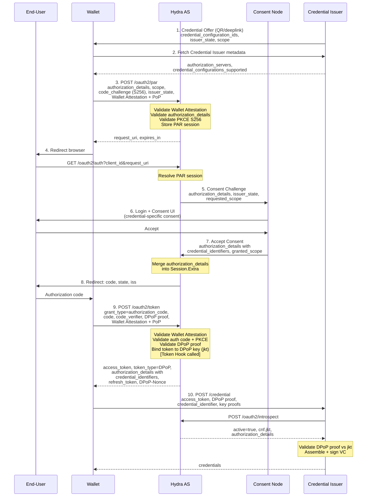
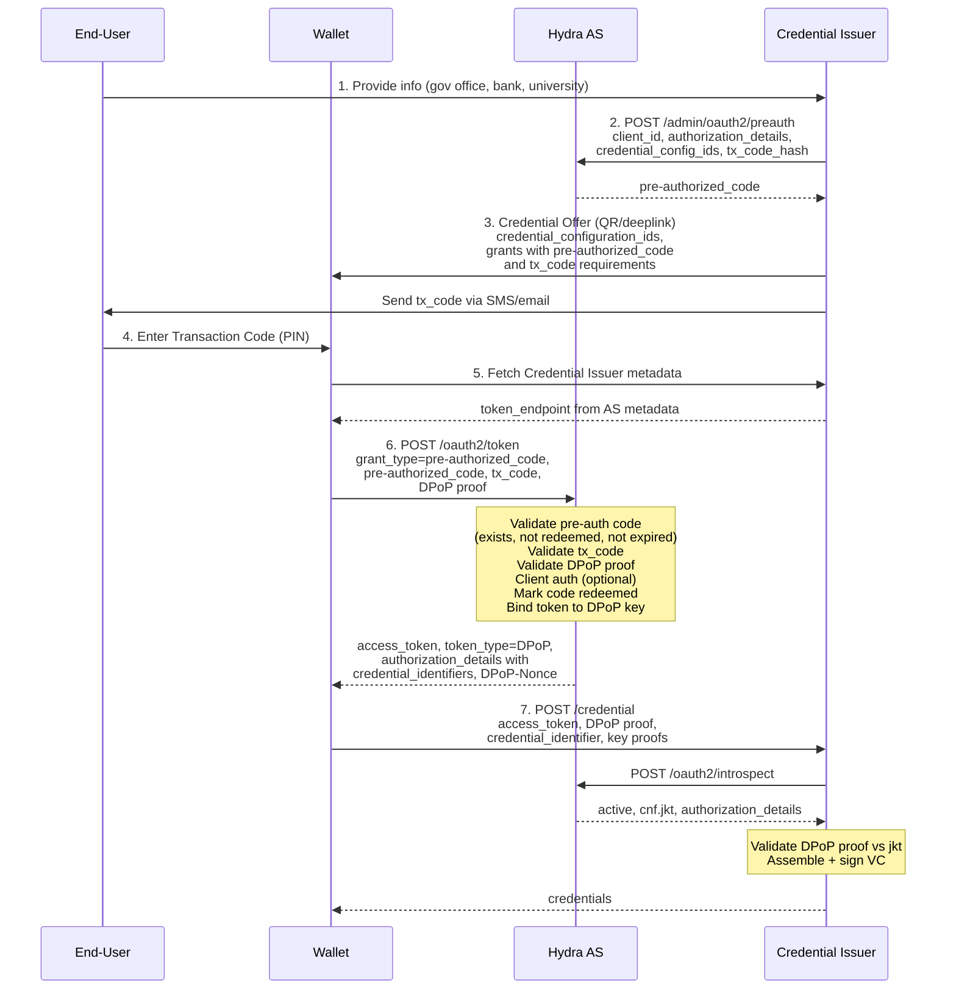
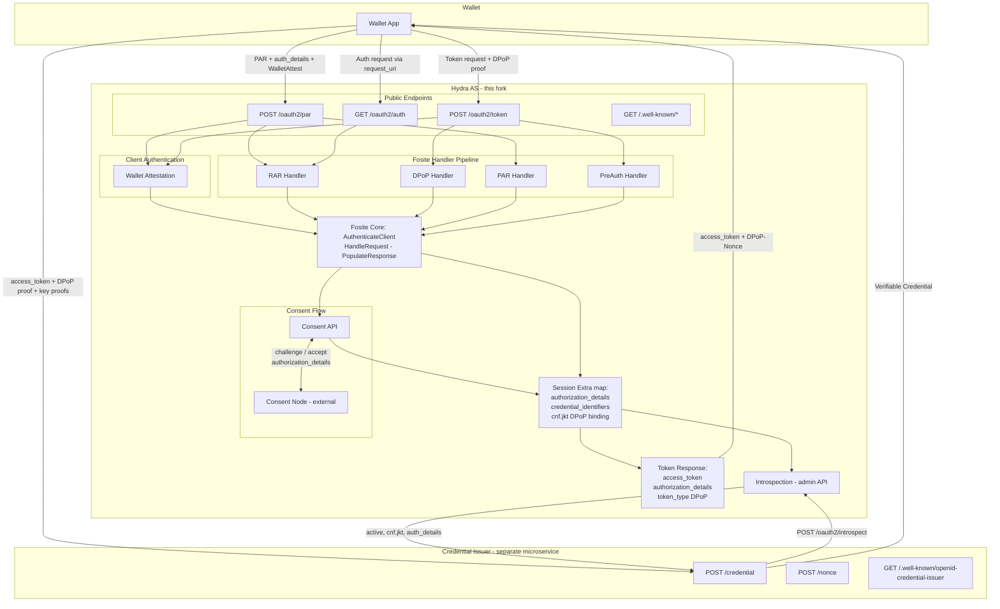

# OIDC4VCI High-Level Architecture with Hydra

## Purpose

High-level architecture for Verifiable Credential Issuance using the Hydra fork as Authorization Server. Describes all key components, their responsibilities, and how they interact across both the Authorization Code flow and the Pre-Authorized Code flow.

## Components

### 1. Wallet (OAuth 2.0 Client)

The end-user's mobile or web application that requests, receives, stores, and presents Verifiable Credentials.

- Acts as an OAuth 2.0 Client toward the AS
- Authenticates to the AS using Wallet Attestation (`OAuth-Client-Attestation` + PoP headers)
- Sends DPoP proofs to bind access tokens to its key material
- Uses `authorization_details` (RFC 9396) or `scope` to specify which credentials to request
- Exchanges authorization codes or pre-authorized codes for access tokens at the Token Endpoint
- Presents access tokens (with DPoP proof) to the Credential Issuer to obtain VCs

### 2. Authorization Server — Hydra Fork

The OAuth 2.0 / OIDC Authorization Server. Issues access tokens that authorize the Wallet to obtain credentials from the Credential Issuer.

Endpoints:
- `POST /oauth2/par` — Pushed Authorization Requests (stores authorization parameters, returns `request_uri`)
- `GET /oauth2/auth` — Authorization Endpoint (redirects user to Consent Node for login/consent)
- `POST /oauth2/token` — Token Endpoint (issues access tokens, refresh tokens)
- `POST /oauth2/introspect` — Token Introspection (admin-only, used by Credential Issuer to validate tokens)
- `GET /.well-known/openid-configuration` — AS Discovery Metadata

Key responsibilities:
- Validates Wallet Attestation client authentication
- Parses and validates `authorization_details` (type `openid_credential`)
- Validates DPoP proofs and binds tokens to Wallet's public key (`cnf.jkt`)
- Orchestrates the consent flow (delegates login/consent to the Consent Node)
- Issues DPoP-bound access tokens with `authorization_details` and `credential_identifiers`
- Supports the Pre-Authorized Code grant type for issuer-initiated flows
- Enforces HAIP security profile (PAR, PKCE S256, DPoP, RFC 9207 `iss`)

Does NOT:
- Issue Verifiable Credentials
- Host the Credential Endpoint, Nonce Endpoint, or Deferred Credential Endpoint
- Serve Credential Issuer metadata (`/.well-known/openid-credential-issuer`)

### 3. Consent Node (Login/Consent Application)

An external web application that Hydra delegates user authentication and consent decisions to. This is a standard Hydra pattern — not OIDC4VCI-specific.

- Receives consent challenges from Hydra containing `authorization_details`, `issuer_state`, requested scopes
- Authenticates the end-user (login)
- Renders credential-specific consent UI based on `authorization_details` (e.g., "University wants to issue your Degree credential")
- Returns consent accept with `credential_identifiers` — the specific credential instances to bind to this authorization
- Can use `issuer_state` to correlate the consent with a previously issued Credential Offer

### 4. Credential Issuer (External Microservice)

A separate microservice that assembles, signs, and delivers Verifiable Credentials. Acts as an OAuth 2.0 Resource Server protected by the AS.

Endpoints:
- `POST /credential` — Credential Endpoint (issues VCs upon valid access token + key proof)
- `POST /batch_credential` — Batch Credential Endpoint (issues multiple VCs in a single request)
- `POST /nonce` — Nonce Endpoint (provides `c_nonce` for key proof freshness)
- `POST /deferred_credential` — Deferred Credential Endpoint (for async issuance)
- `POST /notification` — Notification Endpoint (Wallet reports credential status)
- `GET /.well-known/openid-credential-issuer` — Credential Issuer Metadata

Key responsibilities:
- Validates access tokens via AS introspection (`/oauth2/introspect`)
- Reads `authorization_details` and `credential_identifiers` from introspection response
- Validates DPoP proof from Wallet against `cnf.jkt` from the access token
- Assembles and signs VCs (SD-JWT VC, mdoc, etc.)
- Generates Credential Offers (including Pre-Authorized Codes via AS admin API)
- Manages credential lifecycle (revocation, status lists)

### 5. End-User

The human who authenticates, consents, and receives credentials in their Wallet.

### 6. Verifier (Out of Scope)

Receives and validates Verifiable Presentations from the Wallet. Not part of the issuance architecture.

## Sequence Diagrams

### Flow 1: Authorization Code Flow (Issuer-Initiated with Credential Offer)

The most complete flow — issuer sends a Credential Offer, Wallet uses PAR + authorization code + DPoP to obtain an access token, then requests credentials.

### Flow 2: Pre-Authorized Code Flow (Issuer-Initiated, No Authorization Endpoint)

Simpler flow — the Credential Issuer prepares everything upfront, sends a Pre-Authorized Code to the Wallet. No user-agent redirect, no consent UI. The Wallet goes directly to the Token Endpoint.

## Component Interaction Summary

## Data Flow Through Hydra

Key data elements and how they traverse the AS:

| Data Element | Entry Point | Stored In | Exits Via |
|---|---|---|---|
| `authorization_details` | PAR / Auth request | Authorize session > Consent challenge > `Session.Extra` | Token response + Introspection |
| `credential_identifiers` | Consent Node accept response | `Session.Extra["authorization_details"]` | Token response + Introspection |
| `issuer_state` | PAR / Auth request | Authorize session > Consent challenge | Consent Node reads it (not in token) |
| DPoP `jkt` | Token request (DPoP proof header) | `Session.Extra["cnf"]["jkt"]` | Access token claims + Introspection |
| `token_type: DPoP` | DPoP handler | Token response | Token response |
| Wallet Attestation | PAR / Token request headers | Not stored (validated per-request) | N/A (auth only) |
| Pre-Authorized Code | Token request form param | `hydra_oauth2_preauth_code` table | Redeemed > access token issued |
| `tx_code` | Token request form param | Validated against `tx_code_hash` in DB | N/A (validated and discarded) |

## Security Layers (HAIP Profile)

| Layer | Mechanism | Enforced By |
|---|---|---|
| Request integrity | PAR (RFC 9126) | `fosite/handler/par/` + HAIP enforcement config |
| Code interception prevention | PKCE S256 (RFC 7636) | `fosite/handler/pkce/` + HAIP enforcement config |
| Token sender-constraining | DPoP (RFC 9449) | `fosite/handler/dpop/` |
| Client authentication | Wallet Attestation | `fosite/handler/wallet_attestation/` |
| Mix-up attack prevention | `iss` in auth response (RFC 9207) | `fosite/authorize_write.go` modification |
| Replay prevention (Pre-Auth) | Transaction Code (`tx_code`) | `fosite/handler/preauth/` |
| Algorithm baseline | ES256 (P-256 + SHA-256) | All handlers validate against supported alg list |

## Metadata Landscape

Two separate metadata documents serve different purposes:

| Metadata | URL | Served By | Contains |
|---|---|---|---|
| AS Metadata (RFC 8414) | `/.well-known/openid-configuration` | Hydra AS | Token endpoint, auth endpoint, PAR endpoint, grant types, DPoP algs, auth methods, PKCE methods |
| Credential Issuer Metadata (OIDC4VCI) | `/.well-known/openid-credential-issuer` | Credential Issuer | Credential endpoint, nonce endpoint, credential configurations, `authorization_servers` reference |

The Wallet discovers the AS by reading the Credential Issuer metadata's `authorization_servers` field, then fetches the AS metadata to learn endpoints and capabilities.
